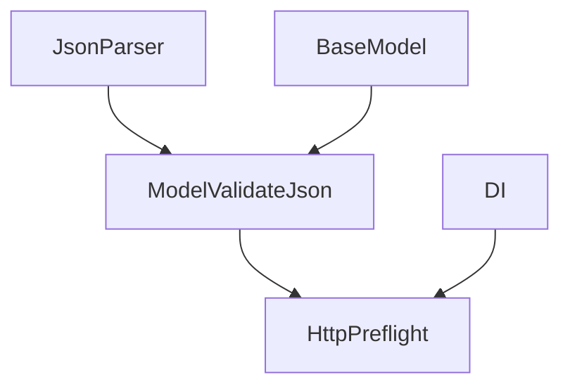
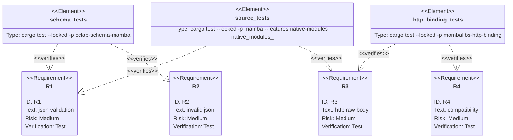

## Scenarios
<!-- type: scenarios lang: yaml -->

```yaml
scenarios:
  - id: model-validate-json
    given:
      - a mambalibs.dataclasses BaseModel with typed fields and defaults.
    when:
      - model_validate_json receives a JSON object string.
    then:
      - the return value is a normalized model dict.
      - lax coercion, defaults, aliases, and nested validation match model_validate.

  - id: parse-raw-compat
    given:
      - callers use Pydantic v1 style parse_raw.
    when:
      - parse_raw receives a JSON object string.
    then:
      - it aliases model_validate_json.

  - id: invalid-json
    given:
      - malformed JSON text.
    when:
      - model_validate_json or HTTP preflight validates the body.
    then:
      - the result is a ValidationError-style string/detail, not a panic.

  - id: http-raw-json-body
    given:
      - an HTTP route has request_model and DI dependencies.
    when:
      - app.preflight or TestClient receives a raw JSON body string.
    then:
      - the body is parsed, normalized through the request model, and DI still resolves.

  - id: compatibility-boundary
    given:
      - existing dict-based schema validation and CPython stdlib dataclasses behavior.
    when:
      - JSON body validation support is added.
    then:
      - existing behavior remains compatible.
```

## Dependency Graph
<!-- type: dependency lang: mermaid -->



## Schema
<!-- type: schema lang: yaml -->

```yaml
definitions:
  JsonTextValidationInput:
    type: string
    description: "JSON object text accepted by model_validate_json and parse_raw."
  ValidationDetail:
    type: object
    required: [loc, msg, type]
    properties:
      loc:
        type: array
        items: {}
      msg: { type: string }
      type: { type: string }
```

## Manifest
<!-- type: manifest lang: yaml -->

```yaml
packages:
  - name: cclab-schema-mamba
    path: crates/cclab-schema-mamba
    kind: rust-library
  - name: mambalibs-http-binding
    path: projects/mamba/mambalibs/httpkit/binding
    kind: rust-library
  - name: mamba
    path: projects/mamba
    kind: rust-binary
    features: [native-modules]
```

## Verification
<!-- type: test-plan lang: mermaid -->



## Changes
<!-- type: changes lang: yaml -->

```yaml
files:
  - path: .aw/tech-design/projects/mamba/specs/4028.md
    action: create
    section: changes
    note: "Source of truth for #4028."
  - path: crates/cclab-schema-mamba/src/methods.rs
    action: update
    section: changes
    note: "Add JSON text validation helpers and public/bound methods."
  - path: crates/cclab-schema-mamba/src/lib.rs
    action: update
    section: changes
    note: "Register model_validate_json and parse_raw symbols/getters."
  - path: crates/cclab-schema-mamba/tests/test_binding.rs
    action: update
    section: tests
    note: "Cover JSON text validation, parse_raw, and invalid JSON."
  - path: projects/mamba/mambalibs/httpkit/binding/src/app.rs
    action: update
    section: changes
    note: "Parse JSON string bodies through request_model preflight."
  - path: projects/mamba/mambalibs/httpkit/binding/tests/mamba_registry_test.rs
    action: update
    section: tests
    note: "Cover TestClient raw JSON body validation plus DI."
  - path: projects/mamba/src/driver/mod.rs
    action: update
    section: tests
    note: "Cover source-level dataclasses JSON validation and HTTP raw body preflight."
```

## Tests
<!-- type: tests lang: yaml -->

```yaml
tests:
  - name: mb_schema_model_validate_json_and_parse_raw_normalize_payloads
    verifies: [R1, R2]
  - name: test_client_dispatches_preflight_with_di_and_schema
    verifies: [R3, R4]
  - name: native_modules_dataclasses_json_validation_source
    verifies: [R1, R2]
  - name: native_modules_http_di_dataclasses_preflight_source
    verifies: [R3, R4]
```
