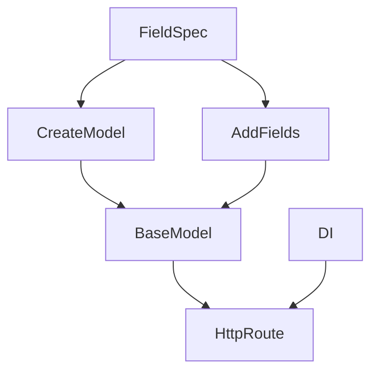

## Scenarios
<!-- type: scenarios lang: yaml -->

```yaml
scenarios:
  - id: create-model-field-map
    given:
      - a caller imports create_model and Field from mambalibs.dataclasses.
    when:
      - create_model receives a model name and a map of field names to specs.
    then:
      - it returns a BaseModel handle with fields named from the map keys.
      - existing BaseModel(name) construction remains unchanged.

  - id: flexible-field-specs
    given:
      - field map values may already be Field handles, raw kwargs dicts, type strings, or nested BaseModel handles.
    when:
      - create_model or add_fields registers them.
    then:
      - each supported spec is converted into the same FieldDescriptor shape used by add_field.

  - id: unnamed-field-helper
    given:
      - Field is used inside a create_model field map.
    when:
      - callers write Field({"type": "int", "minimum": 1}).
    then:
      - Field produces an unnamed descriptor and create_model assigns the map key as the field name.

  - id: batch-add-fields
    given:
      - an existing BaseModel is constructed incrementally.
    when:
      - model.add_fields receives the same field map shape.
    then:
      - the fields are registered without changing add_field behavior.

  - id: http-di-schema-composition
    given:
      - an HTTP route uses a create_model result as request_model and response_model with DI dependencies.
    when:
      - TestClient posts a body to that route.
    then:
      - the body is normalized by the schema and DI still resolves.
```

## Dependency Graph
<!-- type: dependency lang: mermaid -->



## Schema
<!-- type: schema lang: yaml -->

```yaml
definitions:
  CreateModelInput:
    type: object
    required: [name, fields]
    properties:
      name: { type: string }
      fields:
        type: object
        additionalProperties:
          anyOf:
            - type: object
              description: "raw Field kwargs dict"
            - type: string
              description: "type-name shorthand"
            - type: object
              description: "native Field or BaseModel handle"
  BatchFieldMap:
    type: object
    additionalProperties: {}
```

## Manifest
<!-- type: manifest lang: yaml -->

```yaml
packages:
  - name: cclab-schema-mamba
    path: crates/cclab-schema-mamba
    kind: rust-library
  - name: mamba
    path: projects/mamba
    kind: rust-binary
    features: [native-modules]
  - name: mambalibs-http-binding
    path: projects/mamba/mambalibs/httpkit/binding
    kind: rust-library
```

## Verification

```mermaid
---
id: mambalibs_dataclasses_create_model_builder_verification
requirements:
  create_model:
    id: R1
    text: "create_model builds a BaseModel from a field map"
    kind: integration
    risk: medium
    verify: test
  field_specs:
    id: R2
    text: "Field handles, raw kwargs dicts, type strings, and nested models are accepted"
    kind: compatibility
    risk: medium
    verify: test
  add_fields:
    id: R3
    text: "BaseModel.add_fields reuses the same batch field map behavior"
    kind: integration
    risk: medium
    verify: test
  http_di:
    id: R4
    text: "create_model output composes with mambalibs.http and mambalibs.di"
    kind: integration
    risk: medium
    verify: test
  compatibility:
    id: R5
    text: "Existing BaseModel, Field(name, kwargs), validation, and dump APIs remain compatible"
    kind: regression
    risk: medium
    verify: test
elements:
  schema_tests:
    kind: test
    type: "cargo test --locked -p cclab-schema-mamba"
  http_binding_tests:
    kind: test
    type: "cargo test --locked -p mambalibs-http-binding"
  source_tests:
    kind: test
    type: "cargo test --locked -p mamba --features native-modules native_modules_"
relations:
  - { from: schema_tests, verifies: create_model }
  - { from: schema_tests, verifies: field_specs }
  - { from: schema_tests, verifies: add_fields }
  - { from: schema_tests, verifies: compatibility }
  - { from: http_binding_tests, verifies: http_di }
  - { from: source_tests, verifies: create_model }
  - { from: source_tests, verifies: http_di }
---
requirementDiagram
  requirement R1 {
    id: R1
    text: "create_model"
    risk: medium
    verifymethod: test
  }
  requirement R2 {
    id: R2
    text: "field specs"
    risk: medium
    verifymethod: test
  }
  requirement R3 {
    id: R3
    text: "add_fields"
    risk: medium
    verifymethod: test
  }
  requirement R4 {
    id: R4
    text: "http di"
    risk: medium
    verifymethod: test
  }
  requirement R5 {
    id: R5
    text: "compatibility"
    risk: medium
    verifymethod: test
  }
  element schema_tests {
    type: "cargo test --locked -p cclab-schema-mamba"
  }
  element http_binding_tests {
    type: "cargo test --locked -p mambalibs-http-binding"
  }
  element source_tests {
    type: "cargo test --locked -p mamba --features native-modules native_modules_"
  }
  schema_tests - verifies -> R1
  schema_tests - verifies -> R2
  schema_tests - verifies -> R3
  schema_tests - verifies -> R5
  http_binding_tests - verifies -> R4
  source_tests - verifies -> R1
  source_tests - verifies -> R4
```

<!-- type: test-plan lang: mermaid -->



## Changes
<!-- type: changes lang: yaml -->

```yaml
files:
  - path: .aw/tech-design/projects/mamba/specs/4031.md
    action: create
    section: changes
    note: "Source of truth for #4031."
  - path: crates/cclab-schema-mamba/src/lib.rs
    action: update
    section: changes
    note: "Register create_model, add_fields, and the bound add_fields getter."
  - path: crates/cclab-schema-mamba/src/types.rs
    action: update
    section: changes
    note: "Convert field-map values into FieldDescriptor instances."
  - path: crates/cclab-schema-mamba/src/methods.rs
    action: update
    section: changes
    note: "Implement create_model and BaseModel.add_fields."
  - path: crates/cclab-schema-mamba/tests/test_binding.rs
    action: update
    section: tests
    note: "Cover create_model, Field(dict), raw dict specs, type shorthands, nested models, and add_fields."
  - path: projects/mamba/src/driver/mod.rs
    action: update
    section: tests
    note: "Cover source-level create_model usage with HTTP request/response models and DI."
```

## Tests
<!-- type: tests lang: yaml -->

```yaml
tests:
  - name: mb_schema_create_model_builds_from_flexible_field_map
    verifies: [R1, R2, R5]
  - name: mb_schema_model_add_fields_registers_batch_specs
    verifies: [R2, R3, R5]
  - name: native_modules_dataclasses_create_model_source
    verifies: [R1, R2]
  - name: native_modules_http_testclient_di_create_model_source
    verifies: [R4]
```
