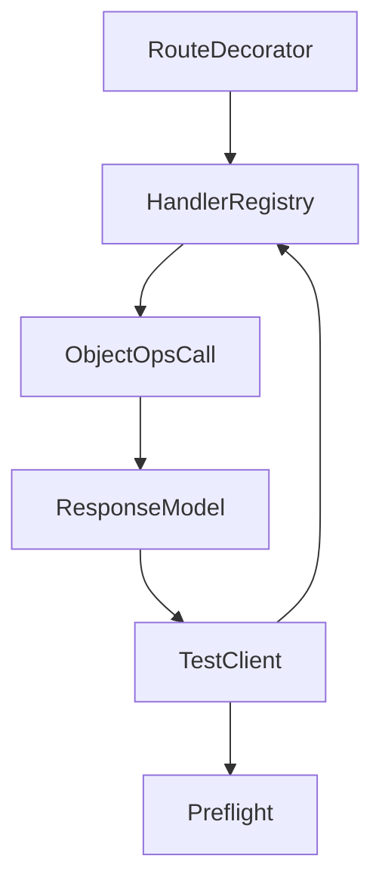
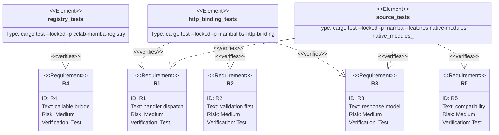

## Scenarios
<!-- type: scenarios lang: yaml -->

```yaml
scenarios:
  - id: handler-dispatch-ok
    given:
      - an App route is registered with a Mamba handler.
    when:
      - TestClient sends a matching request and preflight validation succeeds.
    then:
      - TestClient executes the handler and returns the handler's response body.

  - id: validation-still-first
    given:
      - a route has request_model and required query/header parameters.
    when:
      - TestClient receives invalid request input.
    then:
      - the existing structured 422 preflight report is returned and the handler is not executed.

  - id: response-model-normalization
    given:
      - a route declares response_model as a native mambalibs.dataclasses BaseModel.
    when:
      - the handler returns a dict with coercible values.
    then:
      - response.json() contains the normalized response_model output.

  - id: no-runtime-coupling
    given:
      - mambalibs-http-binding is a separate binding crate.
    when:
      - it invokes a handler.
    then:
      - it uses cclab-mamba-registry ObjectOps call callbacks instead of depending on mamba runtime internals.

  - id: compatibility-boundary
    given:
      - existing OpenAPI, preflight, DI, request validation, and dataclasses tests.
    when:
      - TestClient handler dispatch is added.
    then:
      - preflight APIs and missing/invalid request reports remain compatible.
```

## Dependency Graph
<!-- type: dependency lang: mermaid -->



## Schema
<!-- type: schema lang: yaml -->

```yaml
definitions:
  HandlerRouteKey:
    type: object
    required: [receiver_bits, method, path]
    properties:
      receiver_bits: { type: integer }
      method: { type: string }
      path: { type: string }
  TestClientResponse:
    type: object
    description: "Response body is handler output on success, existing preflight report on validation or route errors."
```

## Manifest
<!-- type: manifest lang: yaml -->

```yaml
packages:
  - name: cclab-mamba-registry
    path: crates/cclab-mamba-registry
    kind: rust-library
  - name: mambalibs-http-binding
    path: projects/mamba/mambalibs/httpkit/binding
    kind: rust-library
  - name: mamba
    path: projects/mamba
    kind: rust-binary
    features: [native-modules]
```

## Verification
<!-- type: test-plan lang: mermaid -->



## Changes
<!-- type: changes lang: yaml -->

```yaml
files:
  - path: .aw/tech-design/projects/mamba/specs/4033.md
    action: create
    section: changes
    note: "Source of truth for #4033."
  - path: crates/cclab-mamba-registry/src/ops.rs
    action: update
    section: changes
    note: "Add ObjectOps call0 callback for binding crates."
  - path: crates/cclab-mamba-registry/src/test_ops.rs
    action: update
    section: tests
    note: "Provide test call0 behavior for native binding tests."
  - path: projects/mamba/src/runtime/registry_bridge.rs
    action: update
    section: changes
    note: "Wire ObjectOps.call0 to mamba runtime mb_call0."
  - path: projects/mamba/mambalibs/httpkit/binding/src/app.rs
    action: update
    section: changes
    note: "Record route handlers and response_model handles for dispatch."
  - path: projects/mamba/mambalibs/httpkit/binding/src/client/test_client.rs
    action: update
    section: changes
    note: "Return handler output after successful preflight, with response_model normalization."
  - path: projects/mamba/mambalibs/httpkit/binding/tests/mamba_registry_test.rs
    action: update
    section: tests
    note: "Cover handler dispatch, validation-first behavior, and response_model normalization."
  - path: projects/mamba/src/driver/mod.rs
    action: update
    section: tests
    note: "Cover source-level TestClient handler response behavior."
```

## Tests
<!-- type: tests lang: yaml -->

```yaml
tests:
  - name: object_ops_call0_invokes_test_callback
    verifies: [R4]
  - name: test_client_dispatches_handler_and_response_model
    verifies: [R1, R2, R3]
  - name: native_modules_http_testclient_di_dataclasses_source
    verifies: [R1, R3, R5]
  - name: native_modules_http_testclient_di_create_model_source
    verifies: [R1, R3, R5]
```
