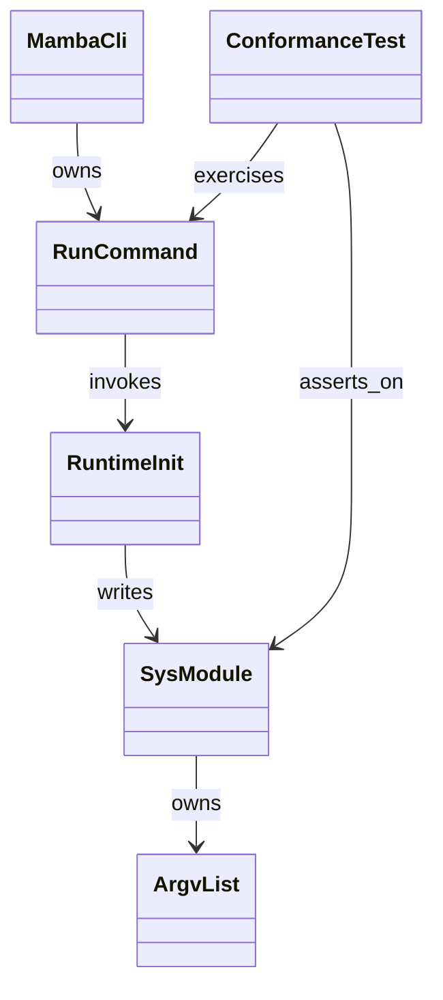
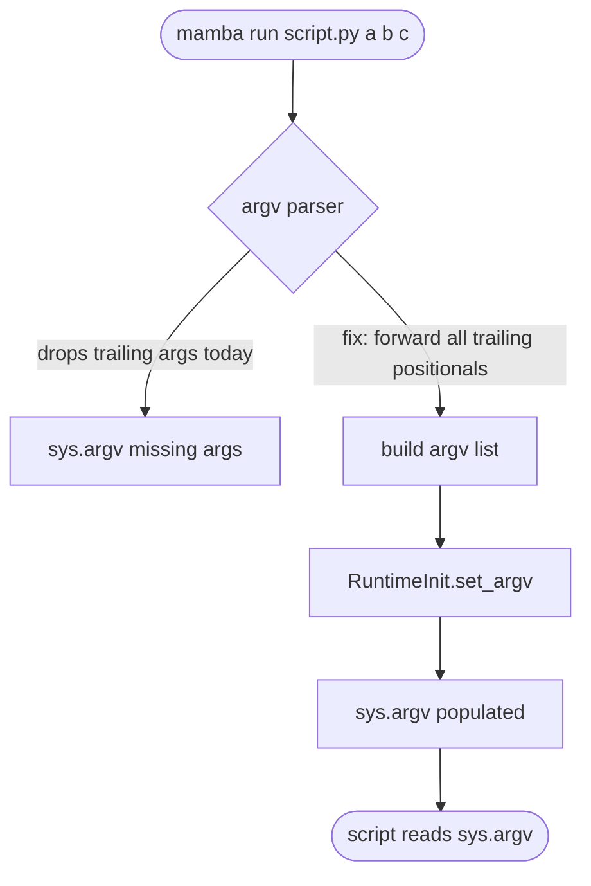

# `mamba run` argv → `sys.argv` forwarding

## Dependency
<!-- type: dependency lang: mermaid -->


## Logic
<!-- type: logic lang: mermaid -->



## Changes
<!-- type: changes lang: yaml -->

```yaml
changes:
  - path: projects/mamba/src/cli/run.rs
    action: modify
    impl_mode: hand-written
    description: Stop dropping trailing positional args. Collect everything after the `<script>` token (including the script path itself as element 0) into a `Vec<String>` and pass it to the runtime init call. Today the runtime only sees the script path.
  - path: projects/mamba/src/runtime/init.rs
    action: modify
    impl_mode: hand-written
    description: Accept the argv vector in the runtime-init entry point and install it onto the `sys` module's `argv` attribute before user code runs. Today this slot is set to `["<script>"]` regardless of CLI input.
  - path: projects/mamba/tests/conformance/argv_forwarding.rs
    action: create
    impl_mode: hand-written
    description: New conformance test that spawns `mamba run` against a fixture script (`fixtures/argv_print.py`) which prints `sys.argv` as JSON; the test asserts the captured stdout matches the expected list across R1–R4 (zero args, multi args, whitespace-preserved args, script path identity).
  - path: projects/mamba/tests/conformance/fixtures/argv_print.py
    action: create
    impl_mode: hand-written
    description: One-liner fixture script — `import sys, json; print(json.dumps(sys.argv))` — used by the conformance test to capture the runtime's `sys.argv`.
```

## Test Plan
<!-- type: test-plan lang: mermaid -->

```mermaid
---
id: mamba-bug-run-argv-forward-verification
requirements:
  argv_multi:        { id: R1, text: "mamba run script.py a b c yields sys.argv == [script.py, a, b, c]",       kind: functional,  risk: high,   verify: test }
  argv_zero:         { id: R2, text: "mamba run script.py with zero extra args yields sys.argv == [script.py]", kind: functional,  risk: medium, verify: test }
  argv_whitespace:   { id: R3, text: "Whitespace-quoted argv element preserved as single sys.argv entry",       kind: functional,  risk: medium, verify: test }
  argv_zero_is_path: { id: R4, text: "sys.argv[0] is the user-typed script path (no canonicalization)",         kind: functional,  risk: high,   verify: test }
  argv_repl_safe:    { id: R6, text: "REPL and -c modes keep their existing argv shape (no regression)",        kind: functional,  risk: medium, verify: test }
elements:
  test_argv_forwarding_multi_arg:    { kind: test, type: "rs/#[test]" }
  test_argv_forwarding_zero_arg:     { kind: test, type: "rs/#[test]" }
  test_argv_forwarding_whitespace:   { kind: test, type: "rs/#[test]" }
  test_argv_zero_is_script_path:     { kind: test, type: "rs/#[test]" }
  test_repl_argv_unchanged:          { kind: test, type: "rs/#[test]" }
relations:
  - { from: test_argv_forwarding_multi_arg,    verifies: argv_multi }
  - { from: test_argv_forwarding_zero_arg,     verifies: argv_zero }
  - { from: test_argv_forwarding_whitespace,   verifies: argv_whitespace }
  - { from: test_argv_zero_is_script_path,     verifies: argv_zero_is_path }
  - { from: test_repl_argv_unchanged,          verifies: argv_repl_safe }
---
requirementDiagram
    requirement R1 {
      id: R1
      text: "mamba run script.py a b c yields sys.argv == [script.py, a, b, c]"
      risk: high
      verifymethod: test
    }
    requirement R2 {
      id: R2
      text: "mamba run script.py with zero extra args yields sys.argv == [script.py]"
      risk: medium
      verifymethod: test
    }
    requirement R3 {
      id: R3
      text: "Whitespace-quoted argv element preserved as single sys.argv entry"
      risk: medium
      verifymethod: test
    }
    requirement R4 {
      id: R4
      text: "sys.argv[0] is the user-typed script path (no canonicalization, no binary-name leak)"
      risk: high
      verifymethod: test
    }
    requirement R6 {
      id: R6
      text: "REPL and -c modes keep their existing argv shape (no regression)"
      risk: medium
      verifymethod: test
    }
    element test_argv_forwarding_multi_arg { type: "rs/#[test]" }
    element test_argv_forwarding_zero_arg { type: "rs/#[test]" }
    element test_argv_forwarding_whitespace { type: "rs/#[test]" }
    element test_argv_zero_is_script_path { type: "rs/#[test]" }
    element test_repl_argv_unchanged { type: "rs/#[test]" }
    test_argv_forwarding_multi_arg - verifies -> R1
    test_argv_forwarding_zero_arg - verifies -> R2
    test_argv_forwarding_whitespace - verifies -> R3
    test_argv_zero_is_script_path - verifies -> R4
    test_repl_argv_unchanged - verifies -> R6
```

# Reviews

### Review 1
**Verdict:** approved

- [dependency] Six-type class diagram cleanly captures the data flow MambaCli → RunCommand → RuntimeInit → SysModule → ArgvList plus the ConformanceTest cross-cutting concern; edges are typed (owns/invokes/writes/asserts_on) so codegen has unambiguous relationships.
- [logic] Flowchart distinguishes the current-buggy path (parser drops trailing args → terminal `sys.argv missing args`) from the fix path (build full argv list → RuntimeInit.set_argv → sys.argv populated); decision/terminal/process node kinds match Mermaid Plus contract.
- [changes] Four-file change list is minimal and targeted — two `modify` (CLI run.rs + runtime init.rs) plus two `create` (conformance test + argv_print.py fixture); each entry names the today-state and the post-fix invariant, no incidental refactoring leaks in.
- [test-plan] R1–R4 + R6 covered by five `rs/#[test]` elements with verifies edges; R5 (indirect sys.argv read parity) is intentionally elided because it's a CPython invariant — acceptable per scope.
