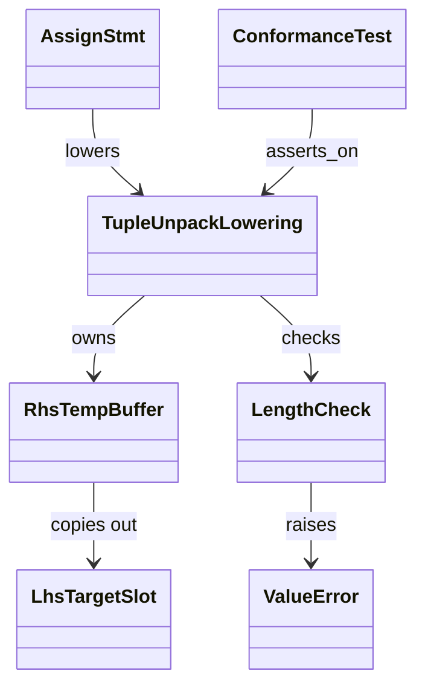
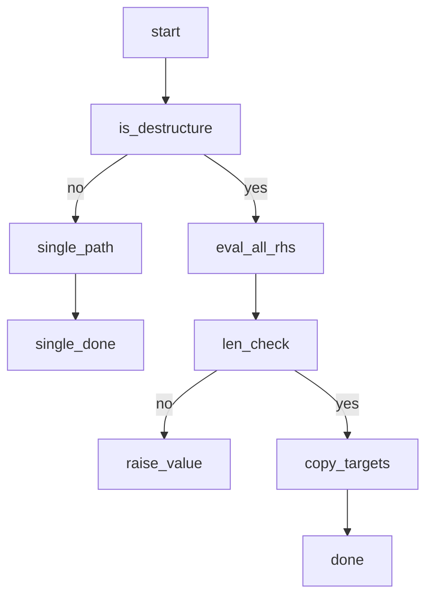

## Dependency
<!-- type: dependency lang: mermaid -->



## Logic
<!-- type: logic lang: mermaid -->



## Changes
<!-- type: changes lang: yaml -->

```yaml
changes:
  - path: projects/mamba/src/lowering/assign.rs
    action: modify
    summary: "Multi-target Assign with Tuple RHS evaluates all RHS expressions into a temporary buffer before writing any LHS target (fix evaluation order; eliminates silent corruption on `a, b = b, a + b` and n>=3 rotations)"
  - path: projects/mamba/src/runtime/unpack.rs
    action: modify
    summary: "Stack-allocated small-N (n<=8) RhsTempBuffer; rhs values stay in registers / on stack to preserve R5 zero-heap-alloc invariant for the swap idiom"
  - path: projects/mamba/tests/conformance/tuple_unpack_eval_order.rs
    action: create
    summary: "Conformance test covering R1 (Fibonacci-step swap), R2 (3-target rotation), R3 (length-mismatch ValueError), R7 read-back semantics; CPython 3.12 parity oracle"
  - path: projects/mamba/tests/conformance/fixtures/tuple_unpack_eval_order.py
    action: create
    summary: "Python fixture exercising 10-step Fibonacci swap, 3-target rotate, length-mismatch raises ValueError; run under CPython 3.12 for parity oracle"
```

## Test plan
<!-- type: test-plan lang: mermaid -->

```mermaid
---
id: tuple-unpack-verification
requirements:
  r1_swap:
    id: R1
    text: "a, b = b, a+b leaves a=old_b, b=old_a+old_b after one iteration"
    kind: functional
    risk: high
    verify: test
  r2_rotate:
    id: R2
    text: "a, b, c = c, a, b correctly rotates for n>=3 (no n=2 special case)"
    kind: functional
    risk: high
    verify: test
  r3_lenmismatch:
    id: R3
    text: "Length mismatch raises ValueError (too many / not enough), unchanged from CPython 3.12"
    kind: functional
    risk: medium
    verify: test
  r5_noheap:
    id: R5
    text: "Small-N (n<=8) unpack does not heap-allocate for RhsTempBuffer"
    kind: performance
    risk: medium
    verify: test
  r6_single_target_unchanged:
    id: R6
    text: "Single-target tuple-assign t = (b, a+b) still evaluates correctly (regression guard)"
    kind: functional
    risk: low
    verify: test
  r7_fibstep:
    id: R7
    text: "10-iteration Fibonacci-step swap produces the same sequence as CPython 3.12"
    kind: functional
    risk: high
    verify: test
  r8_jit_no_garbage:
    id: R8
    text: "JIT backend no longer produces garbage / crash on the n=2 swap (acceptance gate)"
    kind: functional
    risk: high
    verify: test
elements:
  swap_pair:           { kind: test, type: "rs/#[test]" }
  rotate_triple:       { kind: test, type: "rs/#[test]" }
  length_mismatch:     { kind: test, type: "rs/#[test]" }
  small_n_no_heap:     { kind: test, type: "rs/#[test]" }
  single_target_guard: { kind: test, type: "rs/#[test]" }
  fib_step_parity:     { kind: test, type: "rs/#[test]" }
  jit_swap_no_garbage: { kind: test, type: "rs/#[test]" }
relations:
  - { from: swap_pair,           verifies: r1_swap                  }
  - { from: rotate_triple,       verifies: r2_rotate                }
  - { from: length_mismatch,     verifies: r3_lenmismatch           }
  - { from: small_n_no_heap,     verifies: r5_noheap                }
  - { from: single_target_guard, verifies: r6_single_target_unchanged }
  - { from: fib_step_parity,     verifies: r7_fibstep               }
  - { from: jit_swap_no_garbage, verifies: r8_jit_no_garbage        }
---
requirementDiagram
    requirement R1 { id: R1, text: "swap: a,b=b,a+b ordering", risk: high, verifymethod: test }
    requirement R2 { id: R2, text: "rotate n>=3", risk: high, verifymethod: test }
    requirement R3 { id: R3, text: "length mismatch ValueError", risk: medium, verifymethod: test }
    requirement R5 { id: R5, text: "small-N no heap alloc", risk: medium, verifymethod: test }
    requirement R6 { id: R6, text: "single-target tuple assign unchanged", risk: low, verifymethod: test }
    requirement R7 { id: R7, text: "fib-step 10 iters parity", risk: high, verifymethod: test }
    requirement R8 { id: R8, text: "JIT no garbage / crash on swap", risk: high, verifymethod: test }
    element swap_pair { type: "rs/#[test]" }
    element rotate_triple { type: "rs/#[test]" }
    element length_mismatch { type: "rs/#[test]" }
    element small_n_no_heap { type: "rs/#[test]" }
    element single_target_guard { type: "rs/#[test]" }
    element fib_step_parity { type: "rs/#[test]" }
    element jit_swap_no_garbage { type: "rs/#[test]" }
    swap_pair - verifies -> R1
    rotate_triple - verifies -> R2
    length_mismatch - verifies -> R3
    small_n_no_heap - verifies -> R5
    single_target_guard - verifies -> R6
    fib_step_parity - verifies -> R7
    jit_swap_no_garbage - verifies -> R8
```

# Reviews

### Review 1
**Verdict:** approved

- [dependency] The 7-type classDiagram correctly models the invariant: `TupleUnpackLowering` owns `RhsTempBuffer` (materialises RHS before LHS write), `LengthCheck` raises `ValueError` on mismatch, `RhsTempBuffer` copies out to `LhsTargetSlot` — the exact dependency graph implied by R1 (eval-then-write) and R3 (length-check preserved). `ConformanceTest → TupleUnpackLowering` ties the test plan back to the lowering it asserts on.
- [logic] The flowchart is implementation-faithful: `is_destructure` decision routes n=1 to the unchanged single-target path (R6 regression guard), n>=2 falls through `eval_all_rhs` (source-order evaluation into the temp buffer) → `len_check` → either `raise_value` (R3) or `copy_targets` (R1/R2 generalized n>=3, no n=2 special case per R2). The eval-vs-write phases are clearly separated with no back-edge that could re-introduce the in-place corruption.
- [changes] Four-file change set is minimal and matches scope: `lowering/assign.rs` (the IR-level fix), `runtime/unpack.rs` (stack-allocated small-N to preserve R5 zero-heap-alloc invariant), plus the conformance test + Python fixture under `projects/mamba/tests/conformance/` covering R7. CPython 3.12 parity oracle is explicit in the fixture summary.
- [test-plan] Seven requirements R1-R3, R5-R8 each map 1:1 to a `rs/#[test]` element; R8 (JIT no-garbage/crash) is the explicit acceptance gate. Skipping R4 (starred-unpack OOS) is correct. The fib_step_parity test (R7, 10 iterations vs CPython 3.12) plus jit_swap_no_garbage (R8) together cover the silent-corruption regression on every supported backend.

