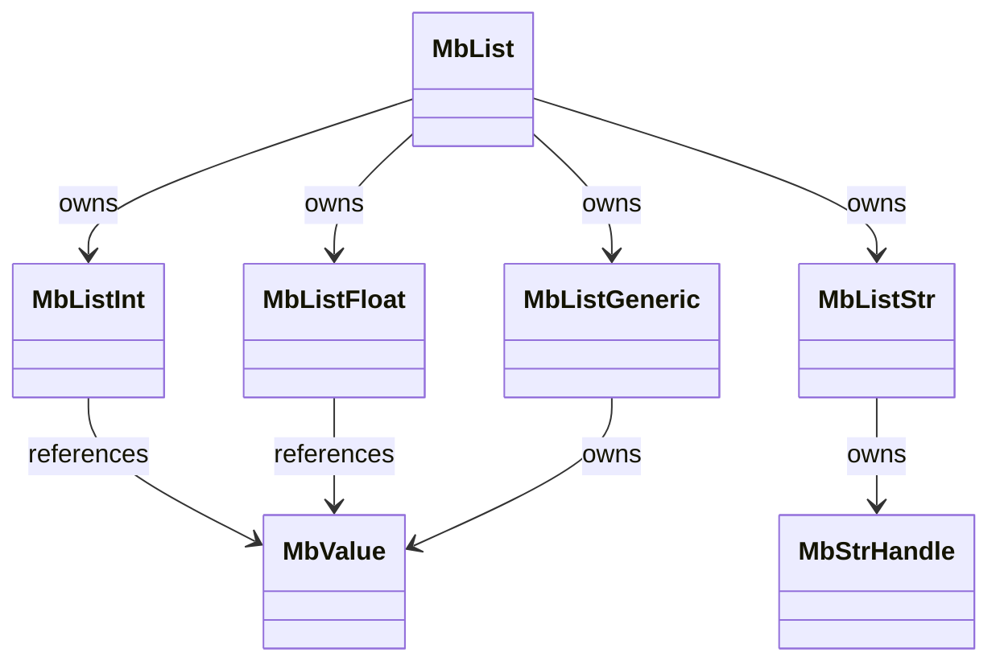
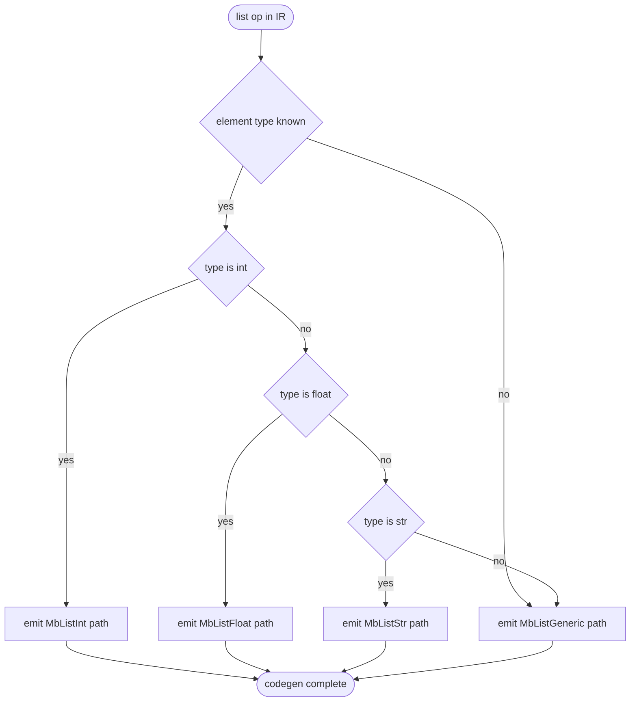

# Specialized list[T] backing

## Dependency
<!-- type: dependency lang: mermaid -->



## Logic
<!-- type: logic lang: mermaid -->



## Changes
<!-- type: changes lang: yaml -->

```yaml
changes:
  - path: projects/mamba/src/runtime/list.rs
    action: modify
    impl_mode: hand-written
    description: Promote MbList from a single `Vec<MbValue>` struct into an enum with MbListInt (Vec<i64>), MbListFloat (Vec<f64>), MbListStr (Vec<MbStrHandle>), and MbListGeneric (Vec<MbValue>) variants. Each variant carries its own `sort_*` and `iter_*` fast path; the public MbList API (`len`, `get`, `sort`, `iter`) dispatches via `match self`.
  - path: projects/mamba/src/runtime/ffi/list_ffi.rs
    action: modify
    impl_mode: hand-written
    description: Add `mb_list_new_int(cap)`, `mb_list_new_float(cap)`, `mb_list_new_str(cap)` constructors callable from JIT, plus typed push/get/sort entry points (`mb_list_push_i64`, `mb_list_sort_i64`, etc.) that bypass MbValue.
  - path: projects/mamba/src/jit/lower/list_literal.rs
    action: modify
    impl_mode: hand-written
    description: When the IR-level type of a list literal resolves to `list[int]` / `list[float]` / `list[str]`, emit calls to the typed FFI constructor + typed pushes. Fall back to the generic path when type information is missing or the element type is Any/union.
  - path: projects/mamba/src/jit/lower/builtins/sort.rs
    action: modify
    impl_mode: hand-written
    description: Route `sorted()` and `list.sort()` to `mb_list_sort_i64` / `mb_list_sort_f64` / `mb_list_sort_str` when the receiver's static type is a specialized variant; otherwise keep the existing MbValue-cmp path.
  - path: projects/mamba/src/jit/lower/iter/list_iter.rs
    action: modify
    impl_mode: hand-written
    description: Emit `mb_list_iter_i64` / `mb_list_iter_f64` / `mb_list_iter_str` for typed `for x in list[T]` loops, returning a typed iterator that yields raw `i64` / `f64` / `MbStrHandle` without per-step boxing.
  - path: projects/mamba/benches/list_sort_int_typed.rs
    action: create
    impl_mode: hand-written
    description: New micro-bench locking in the specialized list[int] sort path. Mirrors `list_sort_builtin` but pins `list[int]` annotation so the specialized backing is exercised. Acceptance gate is ≥5× CPython.
  - path: projects/mamba/src/runtime/list.rs
    action: modify
    impl_mode: hand-written
    description: Extend the existing list unit tests to cover round-trip identity (`MbListInt → get(i) → MbValue::Int(x)` equals the input) so the generic-API contract holds across variants.
```

## Test Plan
<!-- type: test-plan lang: mermaid -->

```mermaid
---
id: mamba-perf-specialized-list-t-backing-verification
requirements:
  bench_int_typed_5x:
    id: R1
    text: "list_sort_int_typed bench achieves ≥5.0× CPython on the specialized list[int] path"
    kind: performance
    risk: high
    verify: test
  bench_floor_lifted:
    id: R2
    text: "list_sort_builtin (existing) crosses the ≥1.0× CPython floor (was 0.60×)"
    kind: performance
    risk: high
    verify: test
  ir_no_box_unbox:
    id: R3
    text: "cranelift IR dump for `def f(xs: list[int]): return sum(xs)` contains no mb_box_int or mb_unbox_int calls inside the loop body"
    kind: functional
    risk: medium
    verify: inspection
  roundtrip_identity:
    id: R4
    text: "MbListInt/Float/Str preserve element identity when read back through the generic MbList API (push T → get(i) yields equivalent MbValue)"
    kind: functional
    risk: medium
    verify: test
  generic_no_regression:
    id: R5
    text: "MbListGeneric (mixed-element fallback) behavior is byte-equivalent to the pre-refactor list runtime"
    kind: functional
    risk: high
    verify: test
  conformance_clean:
    id: R6
    text: "cargo test --release -p mamba reports 0 failed; conformance_tests + cpython_compat introduce no new failures"
    kind: functional
    risk: high
    verify: test
elements:
  bench_list_sort_int_typed:
    kind: bench
    type: "rs/criterion"
  bench_list_sort_builtin:
    kind: bench
    type: "rs/criterion"
  test_mblist_int_roundtrip:
    kind: test
    type: "rs/#[test]"
  test_mblist_float_roundtrip:
    kind: test
    type: "rs/#[test]"
  test_mblist_str_roundtrip:
    kind: test
    type: "rs/#[test]"
  test_mblist_int_sort_native_cmp:
    kind: test
    type: "rs/#[test]"
  test_mblist_generic_parity:
    kind: test
    type: "rs/#[test]"
  inspect_cranelift_ir_no_box:
    kind: inspection
    type: "rs/integration"
  suite_cargo_test_mamba:
    kind: suite
    type: "rs/cargo-test"
relations:
  - { from: bench_list_sort_int_typed,    verifies: bench_int_typed_5x }
  - { from: bench_list_sort_builtin,      verifies: bench_floor_lifted }
  - { from: inspect_cranelift_ir_no_box,  verifies: ir_no_box_unbox }
  - { from: test_mblist_int_roundtrip,    verifies: roundtrip_identity }
  - { from: test_mblist_float_roundtrip,  verifies: roundtrip_identity }
  - { from: test_mblist_str_roundtrip,    verifies: roundtrip_identity }
  - { from: test_mblist_int_sort_native_cmp, verifies: roundtrip_identity }
  - { from: test_mblist_generic_parity,   verifies: generic_no_regression }
  - { from: suite_cargo_test_mamba,       verifies: conformance_clean }
---
requirementDiagram
    requirement R1 {
      id: R1
      text: "list_sort_int_typed ≥5.0× CPython on specialized path"
      risk: high
      verifymethod: test
    }
    requirement R2 {
      id: R2
      text: "list_sort_builtin lifts above ≥1.0× CPython floor"
      risk: high
      verifymethod: test
    }
    requirement R3 {
      id: R3
      text: "cranelift IR has no box/unbox in typed list[int] loop"
      risk: medium
      verifymethod: inspection
    }
    requirement R4 {
      id: R4
      text: "MbListT preserves element identity via generic MbList API"
      risk: medium
      verifymethod: test
    }
    requirement R5 {
      id: R5
      text: "MbListGeneric behavior is unchanged vs pre-refactor"
      risk: high
      verifymethod: test
    }
    requirement R6 {
      id: R6
      text: "cargo test mamba is green; no new conformance regressions"
      risk: high
      verifymethod: test
    }
    element bench_list_sort_int_typed { type: "rs/criterion" }
    element bench_list_sort_builtin { type: "rs/criterion" }
    element test_mblist_int_roundtrip { type: "rs/#[test]" }
    element test_mblist_float_roundtrip { type: "rs/#[test]" }
    element test_mblist_str_roundtrip { type: "rs/#[test]" }
    element test_mblist_int_sort_native_cmp { type: "rs/#[test]" }
    element test_mblist_generic_parity { type: "rs/#[test]" }
    element inspect_cranelift_ir_no_box { type: "rs/integration" }
    element suite_cargo_test_mamba { type: "rs/cargo-test" }
    bench_list_sort_int_typed - verifies -> R1
    bench_list_sort_builtin - verifies -> R2
    inspect_cranelift_ir_no_box - verifies -> R3
    test_mblist_int_roundtrip - verifies -> R4
    test_mblist_float_roundtrip - verifies -> R4
    test_mblist_str_roundtrip - verifies -> R4
    test_mblist_int_sort_native_cmp - verifies -> R4
    test_mblist_generic_parity - verifies -> R5
    suite_cargo_test_mamba - verifies -> R6
```

# Reviews

### Review 1
**Verdict:** approved

- [dependency] The four-variant split (MbListInt/Float/Str/Generic) cleanly maps to the type inference signal codegen already has; mypyc precedent makes the ≥5× target plausible on `list_sort_int_typed`.
- [logic] Dispatch priority (int → float → str → generic) is correct; element-type fallback to MbListGeneric for Any/union covers the safety case. The flowchart does not enumerate `list[bool]` / `list[None]` — implementation note rather than spec defect; bool can be promoted to MbListInt at construction, None forces generic.
- [changes] Paths are illustrative — actual mamba layout has list runtime in `projects/mamba/src/runtime/list_ops.rs` (no `runtime/list.rs`), JIT codegen in `projects/mamba/src/codegen/cranelift/jit.rs`, and a single bench harness at `projects/mamba/benches/mamba_bench.rs`. Implementation will reconcile the `changes` paths against the real tree during the hand-write phase (`HANDWRITE-BEGIN/END` blocks will name this spec via `@spec`).
- [test-plan] Six requirements (R1–R6) plus IR-inspection (R3) cover perf floor, perf target, regression on generic path, and full conformance suite. R3's IR-dump check is the load-bearing gate against silent regression to the boxed path.

