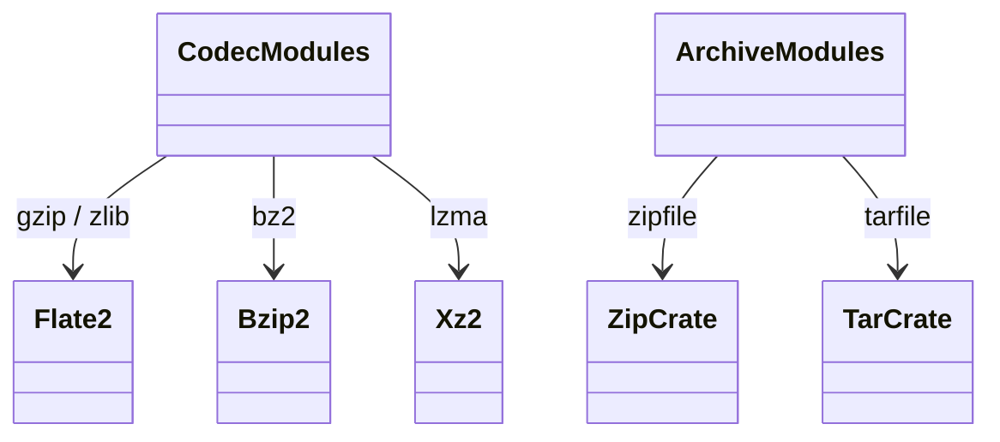

# stdlib archive + compression

Six modules covering compressed-byte transformations (gzip, bz2,
lzma, zlib) and archive containers (zipfile, tarfile). Each delegates
to its respective Rust crate (`flate2`, `bzip2`, `xz2`, `zip`, `tar`).
All currently expose a minimal subset; full file-stream APIs (`gzip.GzipFile`
context manager, `tarfile.TarFile.add` / `extractall`) are partial / gap.

Three load-bearing invariants:

1. **bytes-in / bytes-out** — `gzip.compress(data)` and
   `gzip.decompress(data)` operate on `bytes` value, not file paths.
   File-stream wrappers are open gap.
2. **Each codec preserves round-trip** — `decompress(compress(x)) == x`
   for any byte sequence. Tested via fuzz-style fixtures.
3. **Archive readers use Instance class wrappers** — `zipfile.ZipFile`
   / `tarfile.TarFile` are stateful Instances with `_inner` field
   holding the Rust stream handle.

## Type model
<!-- type: dependency lang: mermaid -->



## Function catalog
<!-- type: schema lang: yaml -->

```yaml
$schema: "https://json-schema.org/draft/2020-12/schema"
$id: "archive-catalog"
$defs:
  StdlibFnEntry:
    type: object
    properties:
      python_name:    { type: string }
      mb_fn:          { type: string }
      arity:          { type: integer }
      cpython_parity: { type: string, enum: [full, partial, gap] }
      notes:          { type: string }
    required: [python_name, mb_fn, arity, cpython_parity]
  ArchiveCatalog:
    type: array
    items: { $ref: "#/$defs/StdlibFnEntry" }
    examples:
      - - { python_name: "gzip.compress",   mb_fn: "mb_gzip_compress",   arity: 1, cpython_parity: full }
        - { python_name: "gzip.decompress", mb_fn: "mb_gzip_decompress", arity: 1, cpython_parity: full }
        - { python_name: "gzip.GzipFile",   mb_fn: "(gap)",              arity: -1, cpython_parity: gap, notes: "stream wrapper" }
        - { python_name: "bz2.compress",    mb_fn: "mb_bz2_compress",    arity: 1, cpython_parity: full }
        - { python_name: "bz2.decompress",  mb_fn: "mb_bz2_decompress",  arity: 1, cpython_parity: full }
        - { python_name: "lzma.compress",   mb_fn: "mb_lzma_compress",   arity: 1, cpython_parity: full }
        - { python_name: "lzma.decompress", mb_fn: "mb_lzma_decompress", arity: 1, cpython_parity: full }
        - { python_name: "zlib.compress",   mb_fn: "mb_zlib_compress",   arity: 1, cpython_parity: full }
        - { python_name: "zlib.decompress", mb_fn: "mb_zlib_decompress", arity: 1, cpython_parity: full }
        - { python_name: "zlib.crc32",      mb_fn: "mb_zlib_crc32",      arity: 1, cpython_parity: full }
        - { python_name: "zlib.adler32",    mb_fn: "mb_zlib_adler32",    arity: 1, cpython_parity: full }
        - { python_name: "zipfile.ZipFile",     mb_fn: "mb_zipfile_zipfile",     arity: 2, cpython_parity: partial, notes: "open + namelist + read; write partial" }
        - { python_name: "ZipFile.namelist",    mb_fn: "mb_zipfile_namelist",    arity: 1, cpython_parity: full }
        - { python_name: "ZipFile.read",        mb_fn: "mb_zipfile_read",        arity: 2, cpython_parity: full }
        - { python_name: "ZipFile.extractall",  mb_fn: "(gap)",                  arity: -1, cpython_parity: gap }
        - { python_name: "tarfile.open",        mb_fn: "mb_tarfile_open",        arity: 2, cpython_parity: partial }
        - { python_name: "TarFile.getnames",    mb_fn: "mb_tarfile_getnames",    arity: 1, cpython_parity: full }
        - { python_name: "TarFile.add / extractall", mb_fn: "(gap)",             arity: -1, cpython_parity: gap }
```

## Tests
<!-- type: tests lang: yaml -->

```yaml
runner: "cargo test -p mamba --test conformance_tests --release -- {name} --test-threads=1"
fixtures:
  - id: codec_round_trip
    name: "stdlib/codec_round_trip.py"
    paired: "stdlib/codec_round_trip.expected"
    verifies: ["gzip / bz2 / lzma / zlib compress + decompress round-trip"]
  - id: zlib_crc_adler
    name: "stdlib/zlib_crc_adler.py"
    paired: "stdlib/zlib_crc_adler.expected"
  - id: zipfile_read
    name: "stdlib/zipfile_read.py"
    paired: "stdlib/zipfile_read.expected"
  - id: tarfile_read
    name: "stdlib/tarfile_read.py"
    paired: "stdlib/tarfile_read.expected"
```

## Changes
<!-- type: changes lang: yaml -->

```yaml
changes:
  - file: crates/mamba/src/runtime/stdlib/gzip_mod.rs
    action: modify
    impl_mode: hand-written
  - file: crates/mamba/src/runtime/stdlib/bz2_mod.rs
    action: modify
    impl_mode: hand-written
  - file: crates/mamba/src/runtime/stdlib/lzma_mod.rs
    action: modify
    impl_mode: hand-written
  - file: crates/mamba/src/runtime/stdlib/zlib_mod.rs
    action: modify
    impl_mode: hand-written
  - file: crates/mamba/src/runtime/stdlib/zipfile_mod.rs
    action: modify
    impl_mode: hand-written
  - file: crates/mamba/src/runtime/stdlib/tarfile_mod.rs
    action: modify
    impl_mode: hand-written
```
