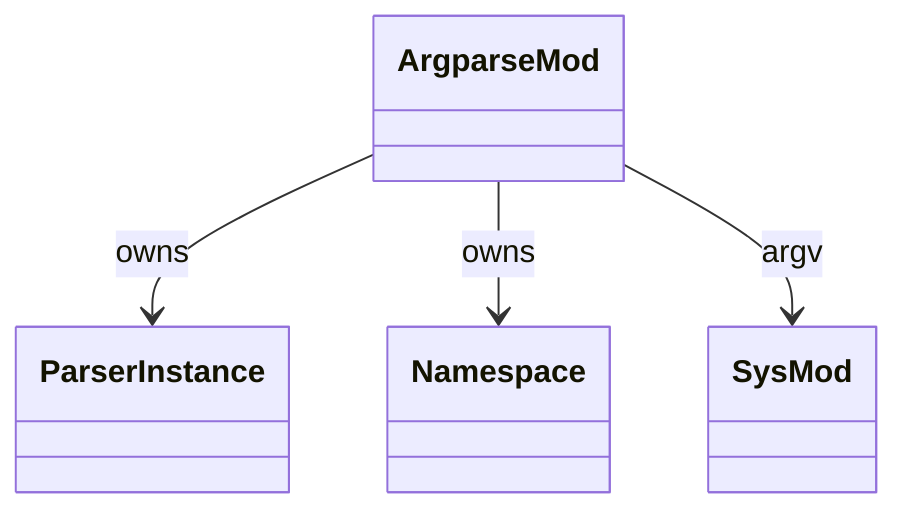

# stdlib `argparse`

Command-line argument parser. Currently a minimal shape: `ArgumentParser`
ctor + `add_argument` + `parse_args`. Full CPython behavior (subparsers,
mutually-exclusive groups, action types, `nargs='*'`, type converters,
custom error formatting) is open gap.

Three load-bearing invariants:

1. **`ArgumentParser` is an Instance** with `class_name = "argparse.ArgumentParser"`
   carrying `_args` field — a list of registered argument specs.
2. **`add_argument` mutates the parser** — appends to `_args`. Does
   NOT take action / nargs / type kwargs today.
3. **`parse_args` reads from `sys.argv`** — but `sys.argv` itself is
   a gap (per `stdlib/sys.md`); current impl always returns empty
   namespace. Feature-gated until argv lands.

## Type model
<!-- type: dependency lang: mermaid -->



## Function catalog
<!-- type: schema lang: yaml -->

```yaml
$schema: "https://json-schema.org/draft/2020-12/schema"
$id: "argparse-catalog"
$defs:
  StdlibFnEntry:
    type: object
    properties:
      python_name:    { type: string }
      mb_fn:          { type: string }
      arity:          { type: integer }
      cpython_parity: { type: string, enum: [full, partial, gap] }
      notes:          { type: string }
    required: [python_name, mb_fn, arity, cpython_parity]
  ArgparseCatalog:
    type: array
    items: { $ref: "#/$defs/StdlibFnEntry" }
    examples:
      - - { python_name: "argparse.ArgumentParser",         mb_fn: "mb_argparse_new",          arity: 1, cpython_parity: partial, notes: "(description=...) — most ctor kwargs gap" }
        - { python_name: "ArgumentParser.add_argument",     mb_fn: "mb_argparse_add_argument", arity: 2, cpython_parity: gap,     notes: "name only; action / nargs / type / default / help / required all gaps" }
        - { python_name: "ArgumentParser.parse_args",        mb_fn: "mb_argparse_parse_args",   arity: 1, cpython_parity: gap,     notes: "blocked on sys.argv gap" }
        - { python_name: "subparsers / groups / actions",   mb_fn: "(gap)", arity: -1, cpython_parity: gap }
```

## Tests
<!-- type: tests lang: yaml -->

```yaml
runner: "cargo test -p mamba --test conformance_tests --release -- {name} --test-threads=1"
fixtures:
  - id: argparse_skeleton
    name: "stdlib/argparse_skeleton.py"
    paired: "stdlib/argparse_skeleton.expected"
    description: "ArgumentParser + add_argument + parse_args — happy-path smoke once sys.argv lands"
```

## Changes
<!-- type: changes lang: yaml -->

```yaml
changes:
  - file: crates/mamba/src/runtime/stdlib/argparse_mod.rs
    action: modify
    impl_mode: hand-written
    description: "Skeleton parser; full action/nargs/type DSL is open gap. Hand-written; depends on sys.argv landing."
```
