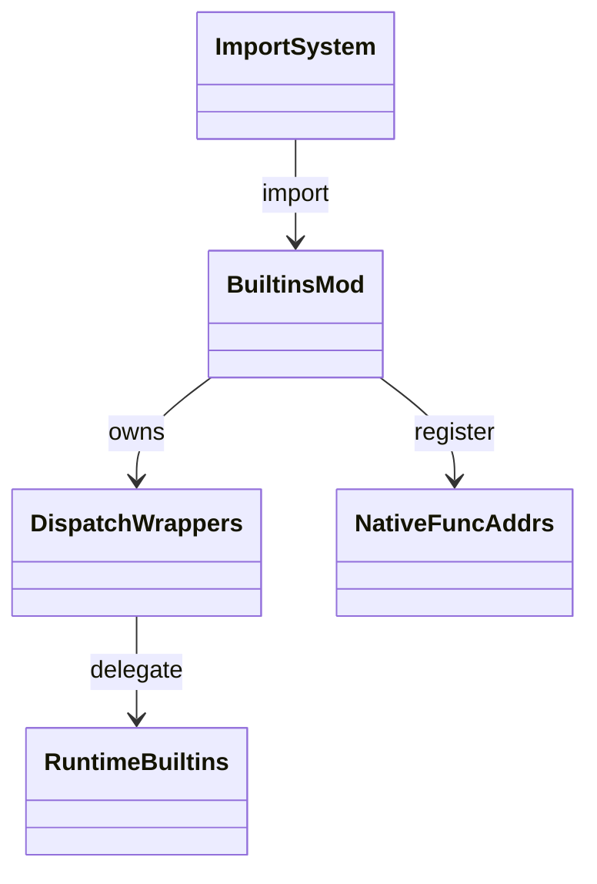
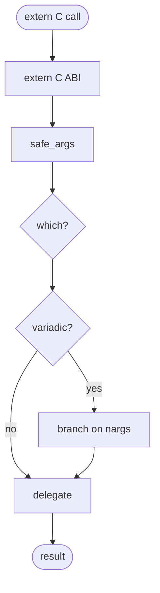
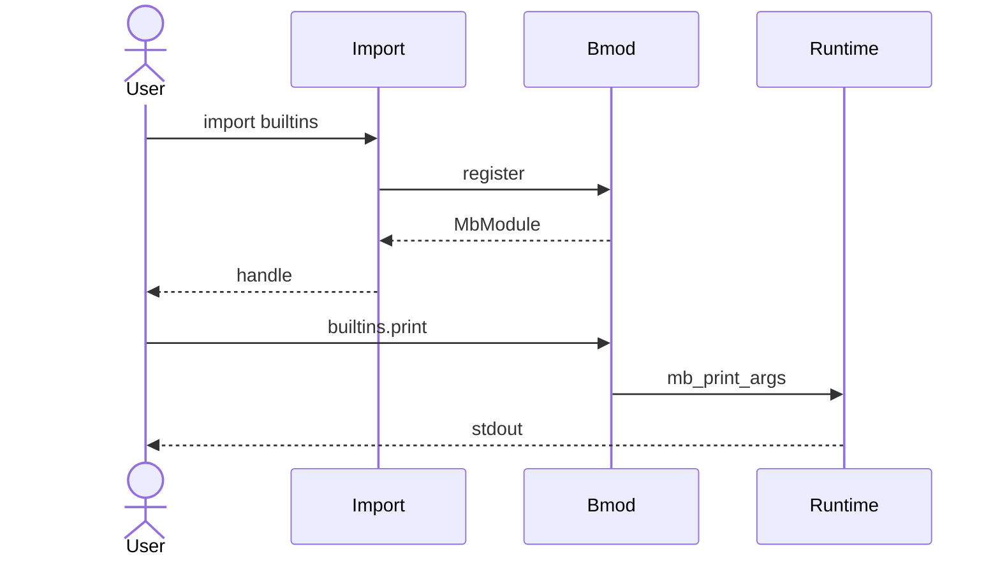

# stdlib `builtins`

Per CPython, `import builtins` exposes the built-in namespace
(`print`, `len`, `range`, `type`, `int`, `str`, etc.) as a regular
importable module. Mamba's `builtins_mod.rs` provides this as a thin
re-export of `runtime/builtins.md`'s API, wrapped in
`(args_ptr, nargs)` extern-C ABI dispatchers (per
`runtime/module.md` `NATIVE_FUNC_ADDRS`).

This module is mostly a registration manifest — every entry is a
`dispatch_X` wrapper that converts the native ABI into a typed call
on `runtime::builtins::mb_X`. Entirely codegen-friendly Phase 1
target: each line is a one-row catalog entry mapping
`builtins.X` → `mb_X` → arity.

Three load-bearing invariants:

1. **Every entry uses the `(args_ptr, nargs)` ABI** — required by
   `mb_call_spread` (per `runtime/module.md`) so that user code
   doing `f = print; f('hi')` resolves through the same call path.
   Adding a new builtin = `dispatch_X` wrapper + register in
   `register()`.
2. **`type()` is dispatch-arity-discriminated** — 1-arg returns
   class name (delegates to `mb_type`); 3-arg constructs a class
   (delegates to `mb_type3`). The dispatcher inspects `nargs` rather
   than building two separate names.
3. **Re-export contract is one-way** — `import builtins; builtins.X`
   sees the same fn addresses that the bare `X` reference does. No
   forking of behavior between the bare-name namespace and the
   builtins module.

## Type model
<!-- type: dependency lang: mermaid -->



## Function catalog
<!-- type: schema lang: yaml -->

```yaml
$schema: "https://json-schema.org/draft/2020-12/schema"
$id: "stdlib-builtins-catalog"
$defs:
  StdlibFnEntry:
    type: object
    properties:
      python_name:    { type: string }
      mb_fn:          { type: string }
      arity:          { type: integer }
      kwargs:         { type: array, items: { type: string } }
      cpython_parity: { type: string, enum: [full, partial, gap] }
      delegates_to:   { type: string }
      notes:          { type: string }
    required: [python_name, mb_fn, arity, cpython_parity]
  BuiltinsCatalog:
    type: object
    properties:
      io:
        type: array
        items: { $ref: "#/$defs/StdlibFnEntry" }
        examples:
          - - { python_name: "print",  mb_fn: "dispatch_print", arity: -1, kwargs: [sep, end, file], delegates_to: "mb_print_args", cpython_parity: partial, notes: "file kwarg gap" }
            - { python_name: "input",  mb_fn: "dispatch_input", arity: 1,  delegates_to: "mb_input",                                cpython_parity: full }
      conversions:
        type: array
        items: { $ref: "#/$defs/StdlibFnEntry" }
        examples:
          - - { python_name: "int",   mb_fn: "dispatch_int",   arity: 1, delegates_to: "mb_int",   cpython_parity: full }
            - { python_name: "float", mb_fn: "dispatch_float", arity: 1, delegates_to: "mb_float", cpython_parity: full }
            - { python_name: "bool",  mb_fn: "dispatch_bool",  arity: 1, delegates_to: "mb_bool",  cpython_parity: full }
            - { python_name: "str",   mb_fn: "dispatch_str",   arity: 1, delegates_to: "mb_str",   cpython_parity: full }
            - { python_name: "list",  mb_fn: "dispatch_list",  arity: 1, delegates_to: "mb_list_from_iterable", cpython_parity: full }
            - { python_name: "tuple", mb_fn: "dispatch_tuple", arity: 1, delegates_to: "mb_tuple_from_iterable", cpython_parity: full }
            - { python_name: "dict",  mb_fn: "dispatch_dict",  arity: 1, delegates_to: "mb_dict_from_pairs", cpython_parity: partial, notes: "iterable-of-pairs form; kwargs form gap" }
            - { python_name: "set",   mb_fn: "dispatch_set",   arity: 1, delegates_to: "mb_set_from_iterable", cpython_parity: full }
      iteration:
        type: array
        items: { $ref: "#/$defs/StdlibFnEntry" }
        examples:
          - - { python_name: "range",     mb_fn: "dispatch_range",     arity: -1, delegates_to: "mb_range",     cpython_parity: full, notes: "1/2/3-arg" }
            - { python_name: "len",       mb_fn: "dispatch_len",       arity: 1,  delegates_to: "mb_len",       cpython_parity: full }
            - { python_name: "iter",      mb_fn: "dispatch_iter",      arity: -1, delegates_to: "mb_iter / mb_iter_sentinel", cpython_parity: full, notes: "1-arg / 2-arg sentinel form" }
            - { python_name: "next",      mb_fn: "dispatch_next",      arity: -1, delegates_to: "mb_next_raise / mb_next_default", cpython_parity: full }
            - { python_name: "enumerate", mb_fn: "dispatch_enumerate", arity: -1, delegates_to: "mb_enumerate", cpython_parity: full }
            - { python_name: "zip",       mb_fn: "dispatch_zip",       arity: -1, delegates_to: "mb_zip / mb_zip_n", cpython_parity: full }
            - { python_name: "map",       mb_fn: "dispatch_map",       arity: 2,  delegates_to: "mb_map",       cpython_parity: partial, notes: "2-arg only; CPython varargs" }
            - { python_name: "filter",    mb_fn: "dispatch_filter",    arity: 2,  delegates_to: "mb_filter",    cpython_parity: full }
            - { python_name: "reversed",  mb_fn: "dispatch_reversed",  arity: 1,  delegates_to: "mb_reversed",  cpython_parity: full }
            - { python_name: "sorted",    mb_fn: "dispatch_sorted",    arity: -1, kwargs: [key, reverse], delegates_to: "mb_sorted_kwargs", cpython_parity: full }
            - { python_name: "sum",       mb_fn: "dispatch_sum",       arity: -1, delegates_to: "mb_sum",       cpython_parity: full }
            - { python_name: "min",       mb_fn: "dispatch_min",       arity: -1, delegates_to: "mb_min",       cpython_parity: partial, notes: "key kwarg gap" }
            - { python_name: "max",       mb_fn: "dispatch_max",       arity: -1, delegates_to: "mb_max",       cpython_parity: partial, notes: "key kwarg gap" }
            - { python_name: "any",       mb_fn: "dispatch_any",       arity: 1,  delegates_to: "mb_any",       cpython_parity: full }
            - { python_name: "all",       mb_fn: "dispatch_all",       arity: 1,  delegates_to: "mb_all",       cpython_parity: full }
      introspection:
        type: array
        items: { $ref: "#/$defs/StdlibFnEntry" }
        examples:
          - - { python_name: "type",       mb_fn: "dispatch_type",       arity: -1, delegates_to: "mb_type / mb_type3", cpython_parity: full, notes: "1-arg name; 3-arg ctor" }
            - { python_name: "isinstance", mb_fn: "dispatch_isinstance", arity: 2,  delegates_to: "mb_isinstance",      cpython_parity: full }
            - { python_name: "issubclass", mb_fn: "dispatch_issubclass", arity: 2,  delegates_to: "mb_issubclass",      cpython_parity: full }
            - { python_name: "callable",   mb_fn: "dispatch_callable",   arity: 1,  delegates_to: "mb_callable",        cpython_parity: full }
            - { python_name: "hasattr",    mb_fn: "dispatch_hasattr",    arity: 2,  delegates_to: "mb_hasattr",         cpython_parity: full }
            - { python_name: "getattr",    mb_fn: "dispatch_getattr",    arity: -1, delegates_to: "mb_getattr / mb_getattr_default", cpython_parity: full }
            - { python_name: "setattr",    mb_fn: "dispatch_setattr",    arity: 3,  delegates_to: "mb_setattr",         cpython_parity: full }
            - { python_name: "delattr",    mb_fn: "dispatch_delattr",    arity: 2,  delegates_to: "mb_delattr",         cpython_parity: full }
            - { python_name: "vars",       mb_fn: "dispatch_vars",       arity: 1,  delegates_to: "mb_vars",            cpython_parity: full }
            - { python_name: "dir",        mb_fn: "dispatch_dir",        arity: 1,  delegates_to: "mb_dir",             cpython_parity: full }
            - { python_name: "id",         mb_fn: "dispatch_id",         arity: 1,  delegates_to: "mb_id",              cpython_parity: full }
            - { python_name: "hash",       mb_fn: "dispatch_hash",       arity: 1,  delegates_to: "mb_hash",            cpython_parity: full }
            - { python_name: "repr",       mb_fn: "dispatch_repr",       arity: 1,  delegates_to: "mb_repr",            cpython_parity: full }
      formatting:
        type: array
        items: { $ref: "#/$defs/StdlibFnEntry" }
        examples:
          - - { python_name: "format", mb_fn: "dispatch_format", arity: 2, delegates_to: "mb_format", cpython_parity: partial, notes: "format spec mini-DSL coverage gaps" }
            - { python_name: "abs",    mb_fn: "dispatch_abs",    arity: 1, delegates_to: "mb_abs",    cpython_parity: full }
            - { python_name: "round",  mb_fn: "dispatch_round",  arity: -1, delegates_to: "mb_round", cpython_parity: full }
            - { python_name: "pow",    mb_fn: "dispatch_pow",    arity: -1, delegates_to: "mb_pow",   cpython_parity: partial, notes: "3-arg modular pow gap" }
            - { python_name: "chr",    mb_fn: "dispatch_chr",    arity: 1, delegates_to: "mb_chr",    cpython_parity: full }
            - { python_name: "ord",    mb_fn: "dispatch_ord",    arity: 1, delegates_to: "mb_ord",    cpython_parity: full }
            - { python_name: "hex",    mb_fn: "dispatch_hex",    arity: 1, delegates_to: "mb_hex",    cpython_parity: full }
            - { python_name: "oct",    mb_fn: "dispatch_oct",    arity: 1, delegates_to: "mb_oct",    cpython_parity: full }
            - { python_name: "bin",    mb_fn: "dispatch_bin",    arity: 1, delegates_to: "mb_bin",    cpython_parity: full }
```

## Dispatch ABI logic
<!-- type: logic lang: mermaid -->



## Import flow interaction
<!-- type: interaction lang: mermaid -->



## Acceptance scenarios
<!-- type: overview lang: markdown -->

```mermaid
---
id: builtins-mod-acceptance
actors:
  - { id: User,    kind: actor }
  - { id: Mamba,   kind: system }
  - { id: Fixture, kind: system }
messages:
  - { from: User,    to: Mamba,   name: "run stdlib/builtins_module.py" }
  - { from: Mamba,   to: Fixture, name: "import builtins; builtins.print(builtins.len([1,2,3]))" }
  - { from: Fixture, to: Mamba,   name: "stdout 3 (re-export contract)" }
  - { from: User,    to: Mamba,   name: "run stdlib/builtins_alias.py" }
  - { from: Mamba,   to: Fixture, name: "p = print; p('hi')" }
  - { from: Fixture, to: Mamba,   name: "alias resolves through dispatch_print" }
  - { from: User,    to: Mamba,   name: "run stdlib/builtins_type_3arg.py" }
  - { from: Mamba,   to: Fixture, name: "type('Foo', (), {'x': 1})" }
  - { from: Fixture, to: Mamba,   name: "dispatch_type 3-arg branch dispatches to mb_type3 builds class" }
---
sequenceDiagram
    actor User
    participant Mamba
    participant Fixture
    User->>Mamba: import builtins
    Mamba->>Fixture: builtins.print/len
    Fixture-->>Mamba: matches bare-name
    User->>Mamba: alias
    Mamba->>Fixture: p = print; p('hi')
    Fixture-->>Mamba: ok
    User->>Mamba: type 3-arg
    Mamba->>Fixture: dynamic class
    Fixture-->>Mamba: registered
```

## Tests
<!-- type: tests lang: yaml -->

```yaml
runner: "cargo test -p mamba --test conformance_tests --release -- {name} --test-threads=1"
fixtures:
  - id: builtins_module
    name: "stdlib/builtins_module.py"
    paired: "stdlib/builtins_module.expected"
    verifies: ["import builtins; attr access"]
  - id: builtins_alias
    name: "stdlib/builtins_alias.py"
    paired: "stdlib/builtins_alias.expected"
    verifies: ["bare-name alias dispatches through extern C wrapper"]
  - id: builtins_type_3arg
    name: "stdlib/builtins_type_3arg.py"
    paired: "stdlib/builtins_type_3arg.expected"
    verifies: ["type(name, bases, dict) builds class via mb_type3"]
  - id: builtins_iter_sentinel
    name: "stdlib/builtins_iter_sentinel.py"
    paired: "stdlib/builtins_iter_sentinel.expected"
    verifies: ["iter(callable, sentinel) PEP 234 form"]
  - id: builtins_sorted_kwargs
    name: "stdlib/builtins_sorted_kwargs.py"
    paired: "stdlib/builtins_sorted_kwargs.expected"
    verifies: ["sorted(iter, key=fn, reverse=True)"]
```

## Changes
<!-- type: changes lang: yaml -->

```yaml
changes:
  - file: crates/mamba/src/runtime/stdlib/builtins_mod.rs
    action: modify
    impl_mode: hand-written
    description: "Importable 'builtins' module — extern C ABI dispatchers wrapping runtime::builtins API; register() pushes addrs to NATIVE_FUNC_ADDRS. Hand-written; the dispatch wrappers are the most codegen-friendly part of the stdlib (each is a 1-row catalog entry → mechanical wrapper) — Phase-1 codegen target."
```
