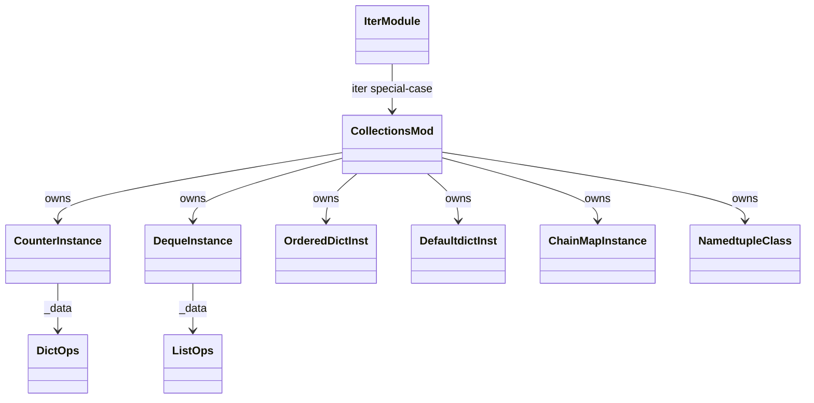
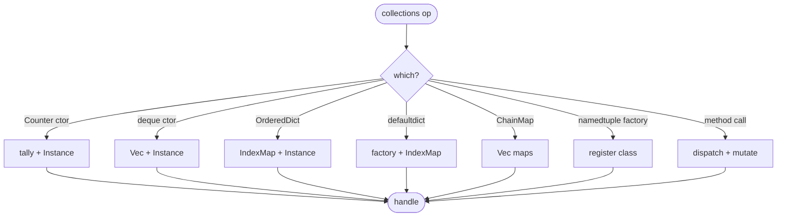
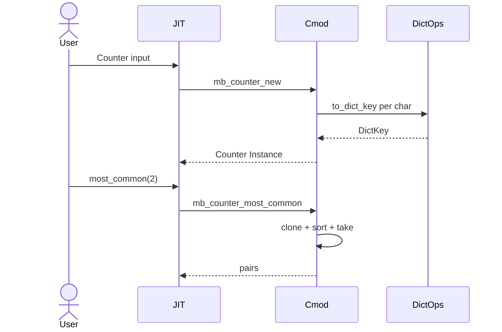

# stdlib `collections`

Container subclasses + factories. Six families:

- `Counter` — dict subclass for counting hashables; `most_common(n)`
  returns sorted (key, count) tuples
- `deque` — double-ended queue with O(1) appendleft / popleft / rotate
- `OrderedDict` — dict that remembers insertion order (vacuous in
  Mamba since base `dict` is already insertion-ordered via IndexMap;
  exists for API parity)
- `defaultdict(factory)` — dict that calls factory on missing key
- `namedtuple(name, fields)` — class factory producing tuple subclass
  with named field access
- `ChainMap` — view over multiple dicts; lookup walks the chain

Three load-bearing invariants:

1. **Counter / deque / OrderedDict / defaultdict / ChainMap are
   Instance-class wrappers, NOT new ObjData variants** — each carries
   `class_name = "collections.<X>"` with a `_data` field holding the
   backing storage (Dict / List / etc.). `mb_iter` (per `iter.md`)
   special-cases these class names to walk `_data`.
2. **`Counter.most_common` keeps DictKey identity** — commit
   `80b05cb81` fixed the regression where `most_common` rebuilt
   entries as `(String, i64)` pairs instead of preserving the
   `DictKey` variant (Int / Str / Bool / Instance / Other). Required
   for user-class instances as Counter keys.
3. **`namedtuple` produces a real class registered in
   `runtime::class::CLASS_REGISTRY`** — instances of the namedtuple
   are normal `ObjData::Instance` with the registered class name; the
   class has methods `_make`, `_replace`, `_asdict`, plus per-field
   accessors generated at registration time.

## Type model
<!-- type: dependency lang: mermaid -->



## Function catalog
<!-- type: schema lang: yaml -->

```yaml
$schema: "https://json-schema.org/draft/2020-12/schema"
$id: "collections-catalog"
$defs:
  StdlibFnEntry:
    type: object
    properties:
      python_name:    { type: string }
      mb_fn:          { type: string }
      arity:          { type: integer }
      kwargs:         { type: array, items: { type: string } }
      cpython_parity: { type: string, enum: [full, partial, gap] }
      notes:          { type: string }
    required: [python_name, mb_fn, arity, cpython_parity]
  CollectionsCatalog:
    type: object
    properties:
      counter:
        type: array
        items: { $ref: "#/$defs/StdlibFnEntry" }
        examples:
          - - { python_name: "collections.Counter",            mb_fn: "mb_counter_new",         arity: 1, cpython_parity: full,    notes: "iterable input; tally each element" }
            - { python_name: "collections.Counter.most_common", mb_fn: "mb_counter_most_common", arity: 2, cpython_parity: full,    notes: "preserves DictKey (commit 80b05cb81)" }
      deque:
        type: array
        items: { $ref: "#/$defs/StdlibFnEntry" }
        examples:
          - - { python_name: "collections.deque",          mb_fn: "mb_deque_new",        arity: 0, cpython_parity: partial, notes: "no maxlen kwarg yet" }
            - { python_name: "deque.append",               mb_fn: "mb_deque_append",     arity: 2, cpython_parity: full }
            - { python_name: "deque.appendleft",           mb_fn: "mb_deque_appendleft", arity: 2, cpython_parity: full }
            - { python_name: "deque.pop",                  mb_fn: "mb_deque_pop",        arity: 1, cpython_parity: full }
            - { python_name: "deque.popleft",              mb_fn: "mb_deque_popleft",    arity: 1, cpython_parity: full }
            - { python_name: "deque.rotate",               mb_fn: "mb_deque_rotate",     arity: 2, cpython_parity: full,    notes: "(deque, n); negative n rotates right" }
      ordereddict:
        type: array
        items: { $ref: "#/$defs/StdlibFnEntry" }
        examples:
          - - { python_name: "collections.OrderedDict", mb_fn: "mb_ordereddict_new", arity: 0, cpython_parity: full, notes: "Mamba dict already insertion-ordered; this is API parity" }
      defaultdict:
        type: array
        items: { $ref: "#/$defs/StdlibFnEntry" }
        examples:
          - - { python_name: "collections.defaultdict", mb_fn: "mb_defaultdict_new", arity: 1, cpython_parity: full, notes: "factory called on missing key during __getitem__" }
      namedtuple:
        type: array
        items: { $ref: "#/$defs/StdlibFnEntry" }
        examples:
          - - { python_name: "collections.namedtuple", mb_fn: "mb_namedtuple", arity: 2, cpython_parity: partial, notes: "(name, fields); __match_args__ default; rename / defaults kwargs gap" }
      chainmap:
        type: array
        items: { $ref: "#/$defs/StdlibFnEntry" }
        examples:
          - - { python_name: "collections.ChainMap", mb_fn: "mb_chainmap_new", arity: -1, cpython_parity: partial, notes: "*maps; lookup walks chain in order" }
```

## Class instance lifecycle

```mermaid
---
id: collections-instance-lifecycle
initial: Constructed
nodes:
  Constructed: { kind: initial, label: "mb_counter_new / mb_deque_new / etc. — Instance with _data field" }
  Mutated:     { kind: normal,  label: "append / appendleft / setitem / delitem updates _data" }
  Iterated:    { kind: normal,  label: "for x in obj — iter.rs special-case class_name" }
  Released:    { kind: terminal, label: "rc → 0; release_contained_values_pub walks _data" }
edges:
  - { from: Constructed, to: Mutated,  event: "any mutating method" }
  - { from: Constructed, to: Iterated, event: "iter() special-case dispatch" }
  - { from: Mutated,     to: Mutated,  event: "more mutations" }
  - { from: Mutated,     to: Iterated }
  - { from: Iterated,    to: Mutated }
  - { from: Constructed, to: Released, event: "rc drop" }
  - { from: Mutated,     to: Released }
---
stateDiagram-v2
    [*] --> Constructed
    Constructed --> Mutated: mutation
    Constructed --> Iterated: iter()
    Mutated --> Mutated: more
    Mutated --> Iterated: iter()
    Iterated --> Mutated: mutation
    Constructed --> Released: rc drop
    Mutated --> Released: rc drop
    Released --> [*]
```

<!-- type: state-machine lang: mermaid -->



## Counter / deque / namedtuple dispatch
<!-- type: logic lang: mermaid -->



## Counter creation interaction
<!-- type: interaction lang: mermaid -->



## Acceptance scenarios
<!-- type: overview lang: markdown -->

```mermaid
---
id: collections-acceptance
actors:
  - { id: User,    kind: actor }
  - { id: Mamba,   kind: system }
  - { id: Fixture, kind: system }
messages:
  - { from: User,    to: Mamba,   name: "run stdlib/collections_counter.py" }
  - { from: Mamba,   to: Fixture, name: "Counter('aabbc'); .most_common(2)" }
  - { from: Fixture, to: Mamba,   name: "preserves DictKey identity (commit 80b05cb81)" }
  - { from: User,    to: Mamba,   name: "run stdlib/collections_deque.py" }
  - { from: Mamba,   to: Fixture, name: "deque(); appendleft(1); append(2); rotate(1); list" }
  - { from: Fixture, to: Mamba,   name: "[2, 1] after rotate" }
  - { from: User,    to: Mamba,   name: "run stdlib/collections_defaultdict.py" }
  - { from: Mamba,   to: Fixture, name: "d = defaultdict(list); d['x'].append(1)" }
  - { from: Fixture, to: Mamba,   name: "factory creates list on miss" }
  - { from: User,    to: Mamba,   name: "run stdlib/collections_namedtuple.py" }
  - { from: Mamba,   to: Fixture, name: "Pt = namedtuple('Pt', ['x','y']); p = Pt(1, 2); p.x; match p..." }
  - { from: Fixture, to: Mamba,   name: "field access + match-args" }
---
sequenceDiagram
    actor User
    participant Mamba
    participant Fixture
    User->>Mamba: counter
    Mamba->>Fixture: Counter + most_common
    Fixture-->>Mamba: DictKey preserved
    User->>Mamba: deque
    Mamba->>Fixture: append + rotate
    Fixture-->>Mamba: rotated
    User->>Mamba: defaultdict
    Mamba->>Fixture: factory on miss
    Fixture-->>Mamba: list created
    User->>Mamba: namedtuple
    Mamba->>Fixture: Pt(1,2); .x
    Fixture-->>Mamba: field access
```

## Tests
<!-- type: tests lang: yaml -->

```yaml
runner: "cargo test -p mamba --test conformance_tests --release -- {name} --test-threads=1"
fixtures:
  - id: counter_basic
    name: "stdlib/collections_counter.py"
    paired: "stdlib/collections_counter.expected"
  - id: deque_basic
    name: "stdlib/collections_deque.py"
    paired: "stdlib/collections_deque.expected"
  - id: defaultdict_basic
    name: "stdlib/collections_defaultdict.py"
    paired: "stdlib/collections_defaultdict.expected"
  - id: namedtuple_basic
    name: "stdlib/collections_namedtuple.py"
    paired: "stdlib/collections_namedtuple.expected"
  - id: ordereddict_parity
    name: "stdlib/collections_ordereddict.py"
    paired: "stdlib/collections_ordereddict.expected"
  - id: chainmap_basic
    name: "stdlib/collections_chainmap.py"
    paired: "stdlib/collections_chainmap.expected"
  - id: counter_dictkey_identity
    name: "class_system/instance_counter_key.py"
    paired: "class_system/instance_counter_key.expected"
    verifies: ["Counter with user-class instance keys preserves DictKey (commit 80b05cb81)"]
```

## Changes
<!-- type: changes lang: yaml -->

```yaml
changes:
  - file: crates/mamba/src/runtime/stdlib/collections_mod.rs
    action: modify
    impl_mode: hand-written
    description: "Counter / deque / OrderedDict / defaultdict / namedtuple / ChainMap as Instance-class wrappers around runtime primitives. Hand-written; namedtuple registers a real class — the most algorithmic of the family. Counter / deque / OrderedDict are Phase-1 codegen targets; namedtuple is Phase 4 (compiler-compiler-shaped class registration)."
```
