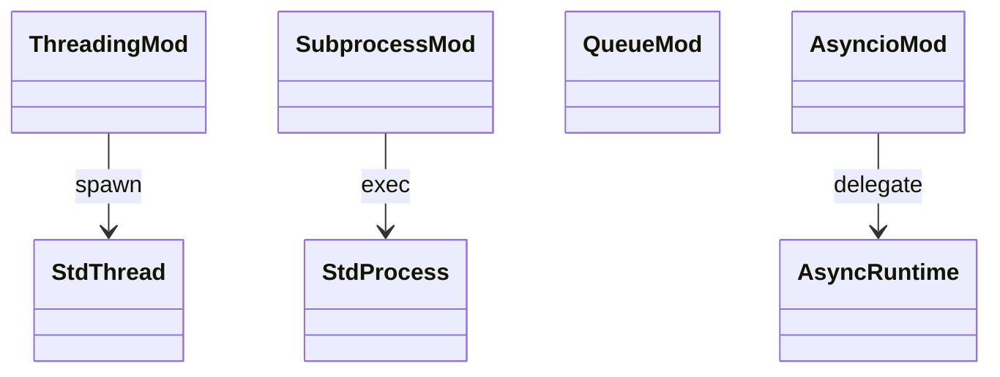

# stdlib threading + subprocess + queue + asyncio

Concurrency primitives. `threading` and `queue` are minimal —
threads spawn but lack much CPython API surface. `subprocess` runs
external processes via `std::process::Command`. `asyncio` exposes a
thin Python-side facade over Mamba's async runtime (per
`runtime/async.md`).

Three load-bearing invariants:

1. **`threading.Thread` spawns a real OS thread** — `std::thread::spawn`
   under the hood; per-thread runtime state (per `runtime/thread-safe-runtime.md`)
   is allocated fresh on first use.
2. **`subprocess.run` is blocking** — returns `CompletedProcess`-like
   Instance after process exit. async / non-blocking gap.
3. **`asyncio.run` / `gather` / `sleep` are facades** — they delegate
   to `runtime/async.md` `mb_run_until_complete` / `mb_gather` /
   `mb_sleep`. No additional logic at this layer.

## Type model
<!-- type: dependency lang: mermaid -->



## Function catalog
<!-- type: schema lang: yaml -->

```yaml
$schema: "https://json-schema.org/draft/2020-12/schema"
$id: "concurrency-catalog"
$defs:
  StdlibFnEntry:
    type: object
    properties:
      python_name:    { type: string }
      mb_fn:          { type: string }
      arity:          { type: integer }
      cpython_parity: { type: string, enum: [full, partial, gap] }
      notes:          { type: string }
    required: [python_name, mb_fn, arity, cpython_parity]
  ConcurrencyCatalog:
    type: array
    items: { $ref: "#/$defs/StdlibFnEntry" }
    examples:
      - - { python_name: "threading.Thread",     mb_fn: "mb_threading_thread",  arity: 1, cpython_parity: partial, notes: "ctor + start + join" }
        - { python_name: "threading.Lock",       mb_fn: "mb_threading_lock",    arity: 0, cpython_parity: partial }
        - { python_name: "threading.current_thread", mb_fn: "(gap)",            arity: 0, cpython_parity: gap }
        - { python_name: "subprocess.run",       mb_fn: "mb_subprocess_run",    arity: -1, cpython_parity: partial, notes: "blocking; returns CompletedProcess Instance" }
        - { python_name: "subprocess.Popen",     mb_fn: "(gap)",                arity: -1, cpython_parity: gap }
        - { python_name: "queue.Queue",          mb_fn: "mb_queue_queue",       arity: 0, cpython_parity: partial }
        - { python_name: "Queue.put / get",      mb_fn: "mb_queue_put / get",   arity: 2, cpython_parity: partial, notes: "block / timeout kwargs partial" }
        - { python_name: "asyncio.run",          mb_fn: "mb_asyncio_run",       arity: 1, cpython_parity: full,    notes: "delegates to mb_run_until_complete" }
        - { python_name: "asyncio.gather",       mb_fn: "mb_asyncio_gather",    arity: -1, cpython_parity: full }
        - { python_name: "asyncio.sleep",        mb_fn: "mb_asyncio_sleep",     arity: 1, cpython_parity: full }
        - { python_name: "asyncio.create_task",  mb_fn: "mb_asyncio_create_task", arity: 1, cpython_parity: full }
```

## Tests
<!-- type: tests lang: yaml -->

```yaml
runner: "cargo test -p mamba --test conformance_tests --release -- {name} --test-threads=1"
fixtures:
  - id: threading_basic
    name: "stdlib/threading_basic.py"
    paired: "stdlib/threading_basic.expected"
  - id: subprocess_run
    name: "stdlib/subprocess_run.py"
    paired: "stdlib/subprocess_run.expected"
  - id: queue_basic
    name: "stdlib/queue_basic.py"
    paired: "stdlib/queue_basic.expected"
  - id: asyncio_facade
    name: "stdlib/asyncio_facade.py"
    paired: "stdlib/asyncio_facade.expected"
```

## Changes
<!-- type: changes lang: yaml -->

```yaml
changes:
  - file: crates/mamba/src/runtime/stdlib/threading_mod.rs
    action: modify
    impl_mode: hand-written
  - file: crates/mamba/src/runtime/stdlib/subprocess_mod.rs
    action: modify
    impl_mode: hand-written
  - file: crates/mamba/src/runtime/stdlib/queue_mod.rs
    action: modify
    impl_mode: hand-written
  - file: crates/mamba/src/runtime/stdlib/asyncio_mod.rs
    action: modify
    impl_mode: hand-written
    description: "Facade over runtime::async (per runtime/async.md). Hand-written; thin layer."
```
