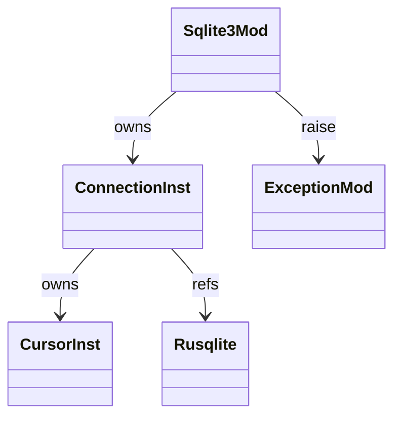

# stdlib `sqlite3`

SQLite via `rusqlite` crate. Connection / Cursor as Instance
wrappers. Subset of CPython API today; advanced features (custom
types, row_factory, isolation_level) are gaps.

Three load-bearing invariants:

1. **`sqlite3.connect(":memory:")` returns a Connection Instance**
   carrying `_conn` field with the rusqlite Connection. Mutations
   stay on the Instance.
2. **`Cursor.execute(sql, params)` is positional or named** —
   `?`-placeholders take a tuple; `:name`-placeholders take a dict.
   Mixed in one query is invalid (CPython matches).
3. **Errors raise `sqlite3.OperationalError`** — subclass of
   Exception. Specific error codes (lock / busy / corrupt) are
   collapsed to OperationalError today; finer-grained Mamba gap.

## Type model
<!-- type: dependency lang: mermaid -->



## Function catalog
<!-- type: schema lang: yaml -->

```yaml
$schema: "https://json-schema.org/draft/2020-12/schema"
$id: "db-catalog"
$defs:
  StdlibFnEntry:
    type: object
    properties:
      python_name:    { type: string }
      mb_fn:          { type: string }
      arity:          { type: integer }
      cpython_parity: { type: string, enum: [full, partial, gap] }
      notes:          { type: string }
    required: [python_name, mb_fn, arity, cpython_parity]
  DbCatalog:
    type: array
    items: { $ref: "#/$defs/StdlibFnEntry" }
    examples:
      - - { python_name: "sqlite3.connect",          mb_fn: "mb_sqlite3_connect",       arity: 1, cpython_parity: partial, notes: "path or :memory:" }
        - { python_name: "Connection.cursor",        mb_fn: "mb_sqlite3_cursor",        arity: 1, cpython_parity: full }
        - { python_name: "Connection.commit",        mb_fn: "mb_sqlite3_commit",        arity: 1, cpython_parity: full }
        - { python_name: "Connection.close",         mb_fn: "mb_sqlite3_close",         arity: 1, cpython_parity: full }
        - { python_name: "Cursor.execute",           mb_fn: "mb_sqlite3_execute",       arity: 3, cpython_parity: partial, notes: "? + :name placeholders; mixed gap" }
        - { python_name: "Cursor.executemany",       mb_fn: "mb_sqlite3_executemany",   arity: 3, cpython_parity: partial }
        - { python_name: "Cursor.fetchone / fetchall", mb_fn: "mb_sqlite3_fetchone / fetchall", arity: 1, cpython_parity: full }
        - { python_name: "row_factory / converters / isolation_level", mb_fn: "(gap)", arity: -1, cpython_parity: gap }
        - { python_name: "dbm module",                mb_fn: "(gap)", arity: -1, cpython_parity: gap }
```

## Tests
<!-- type: tests lang: yaml -->

```yaml
runner: "cargo test -p mamba --test conformance_tests --release -- {name} --test-threads=1"
fixtures:
  - id: sqlite_round_trip
    name: "stdlib/sqlite_round_trip.py"
    paired: "stdlib/sqlite_round_trip.expected"
    verifies: ["connect + execute + commit + fetchall round-trip"]
  - id: sqlite_placeholders
    name: "stdlib/sqlite_placeholders.py"
    paired: "stdlib/sqlite_placeholders.expected"
    verifies: ["? positional + :name kwargs"]
```

## Changes
<!-- type: changes lang: yaml -->

```yaml
changes:
  - file: crates/mamba/src/runtime/stdlib/sqlite3_mod.rs
    action: modify
    impl_mode: hand-written
    description: "Connection / Cursor Instance wrappers over rusqlite. Hand-written; row_factory / converters / dbm gaps."
```
