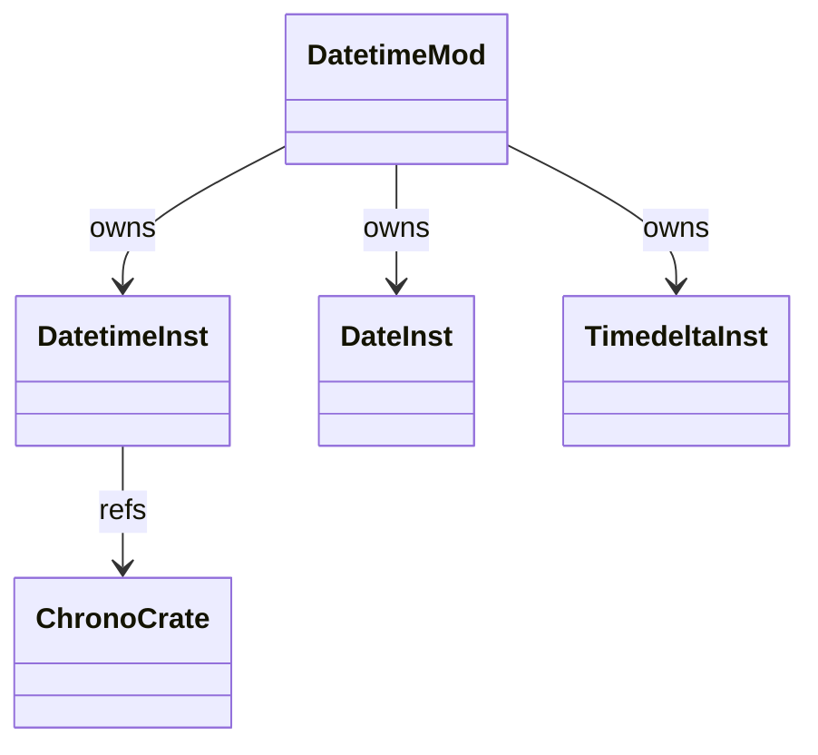
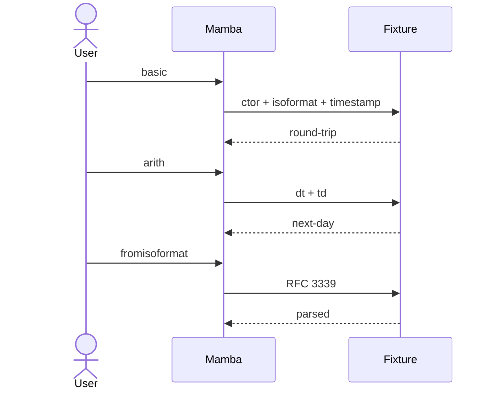

# stdlib `datetime`

Date / datetime / timedelta values + format / parse / arithmetic.
Mamba uses `chrono` Rust crate as the substrate; Python-visible
`datetime`, `date`, `time`, `timedelta` are Instance wrappers
(`class_name = "datetime.datetime"` etc.) carrying the `chrono`
value in `_inner` field.

Three load-bearing invariants:

1. **Naive vs aware datetime split** — naive datetime has no tzinfo;
   aware does. Mamba's current impl handles naive only; aware is
   open gap.
2. **`fromisoformat` accepts CPython 3.11+ extended format** — `T`
   separator, `Z` UTC suffix, `+HH:MM` offsets. `chrono::DateTime::parse_from_rfc3339`
   covers most cases.
3. **`timedelta` arithmetic preserves sign** — `dt + td`, `dt - dt`,
   `td * n` all per CPython rules. No silent overflow at i64 bounds.

## Type model
<!-- type: dependency lang: mermaid -->



## Function catalog
<!-- type: schema lang: yaml -->

```yaml
$schema: "https://json-schema.org/draft/2020-12/schema"
$id: "datetime-catalog"
$defs:
  StdlibFnEntry:
    type: object
    properties:
      python_name:    { type: string }
      mb_fn:          { type: string }
      arity:          { type: integer }
      cpython_parity: { type: string, enum: [full, partial, gap] }
      notes:          { type: string }
    required: [python_name, mb_fn, arity, cpython_parity]
  DatetimeCatalog:
    type: array
    items: { $ref: "#/$defs/StdlibFnEntry" }
    examples:
      - - { python_name: "datetime.datetime.now",            mb_fn: "mb_datetime_now",            arity: 0, cpython_parity: full,    notes: "naive local now" }
        - { python_name: "datetime.datetime",                mb_fn: "mb_datetime_new",            arity: -1, cpython_parity: partial, notes: "(year, month, day, hour, minute, second, microsecond); tzinfo gap" }
        - { python_name: "datetime.datetime.fromtimestamp",  mb_fn: "mb_datetime_fromtimestamp",  arity: 1, cpython_parity: partial, notes: "no tz arg" }
        - { python_name: "datetime.datetime.fromisoformat",  mb_fn: "mb_datetime_fromisoformat",  arity: 1, cpython_parity: partial, notes: "RFC 3339 subset; T sep + Z suffix + offsets" }
        - { python_name: "datetime.timestamp",                mb_fn: "mb_datetime_timestamp",      arity: 1, cpython_parity: full }
        - { python_name: "datetime.isoformat",                mb_fn: "mb_datetime_isoformat",      arity: 1, cpython_parity: full }
        - { python_name: "datetime.strftime",                 mb_fn: "mb_datetime_strftime",       arity: 2, cpython_parity: partial, notes: "chrono format-spec subset" }
        - { python_name: "datetime + timedelta",              mb_fn: "mb_datetime_add_timedelta",  arity: 2, cpython_parity: full }
        - { python_name: "datetime.timezone / aware datetime", mb_fn: "(gap)", arity: -1, cpython_parity: gap, notes: "tzinfo subclass support not wired" }
```

## Acceptance scenarios
<!-- type: overview lang: markdown -->



## Tests
<!-- type: tests lang: yaml -->

```yaml
runner: "cargo test -p mamba --test conformance_tests --release -- {name} --test-threads=1"
fixtures:
  - id: datetime_basic
    name: "stdlib/datetime_basic.py"
    paired: "stdlib/datetime_basic.expected"
  - id: datetime_arith
    name: "stdlib/datetime_arith.py"
    paired: "stdlib/datetime_arith.expected"
  - id: datetime_iso_round_trip
    name: "stdlib/datetime_iso_round_trip.py"
    paired: "stdlib/datetime_iso_round_trip.expected"
  - id: datetime_strftime
    name: "stdlib/datetime_strftime.py"
    paired: "stdlib/datetime_strftime.expected"
```

## Changes
<!-- type: changes lang: yaml -->

```yaml
changes:
  - file: crates/mamba/src/runtime/stdlib/datetime_mod.rs
    action: modify
    impl_mode: hand-written
    description: "datetime / date / timedelta wrappers around chrono. Hand-written; aware datetime + timezone subclass are gaps."
```
