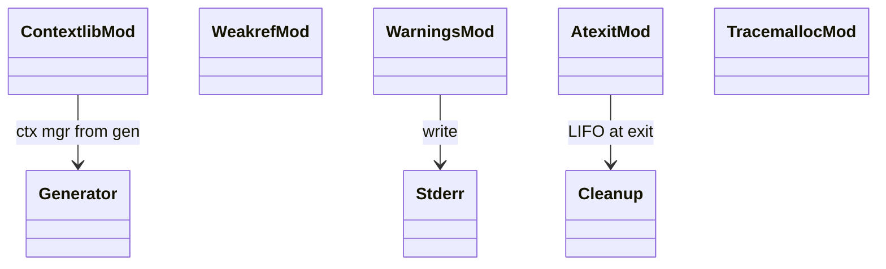

# stdlib diagnostics + utils

Six diagnostics + utility modules co-located. All thin shims; many
features are mocked or no-op (tracemalloc, weakref) because Mamba's
GC and ref-count substrate doesn't expose the same hooks CPython
does.

Three load-bearing invariants:

1. **`contextlib.contextmanager` decorator wraps a generator** —
   the generator's `yield` becomes the with-statement's binding;
   `__enter__` returns the yielded value, `__exit__` resumes the
   generator.
2. **`weakref.ref(obj)` returns a sentinel today** — Mamba's rc layer
   doesn't have weak refs; the Instance simply holds a strong ref
   for now. When the referent is alive the API works; when dropped
   the gap is observable.
3. **`atexit.register(fn)` runs at process exit** — registered
   callbacks fire in LIFO order from `cleanup_all_runtime_state`.

## Type model
<!-- type: dependency lang: mermaid -->



## Function catalog
<!-- type: schema lang: yaml -->

```yaml
$schema: "https://json-schema.org/draft/2020-12/schema"
$id: "diag-catalog"
$defs:
  StdlibFnEntry:
    type: object
    properties:
      python_name:    { type: string }
      mb_fn:          { type: string }
      arity:          { type: integer }
      cpython_parity: { type: string, enum: [full, partial, gap] }
      notes:          { type: string }
    required: [python_name, mb_fn, arity, cpython_parity]
  DiagCatalog:
    type: array
    items: { $ref: "#/$defs/StdlibFnEntry" }
    examples:
      - - { python_name: "contextlib.contextmanager",   mb_fn: "mb_contextlib_contextmanager", arity: 1, cpython_parity: partial, notes: "decorator wraps yield-generator" }
        - { python_name: "contextlib.suppress",         mb_fn: "(gap)",                        arity: -1, cpython_parity: gap }
        - { python_name: "weakref.ref",                 mb_fn: "mb_weakref_ref",               arity: 1, cpython_parity: gap, notes: "strong ref today; rc layer no weak refs" }
        - { python_name: "weakref.proxy",               mb_fn: "(gap)",                        arity: 1, cpython_parity: gap }
        - { python_name: "warnings.warn",               mb_fn: "mb_warnings_warn",             arity: 1, cpython_parity: partial, notes: "to stderr; no filter API" }
        - { python_name: "warnings.filterwarnings",     mb_fn: "(gap)",                        arity: -1, cpython_parity: gap }
        - { python_name: "atexit.register",             mb_fn: "mb_atexit_register",           arity: 1, cpython_parity: full,    notes: "LIFO at process exit" }
        - { python_name: "atexit.unregister",           mb_fn: "mb_atexit_unregister",         arity: 1, cpython_parity: full }
        - { python_name: "tracemalloc.start / stop / get_traced_memory", mb_fn: "(no-op)",     arity: -1, cpython_parity: gap, notes: "Mamba GC has no equivalent hooks" }
        - { python_name: "traceback.format_exc / print_exc", mb_fn: "(gap)",                   arity: -1, cpython_parity: gap }
```

## Tests
<!-- type: tests lang: yaml -->

```yaml
runner: "cargo test -p mamba --test conformance_tests --release -- {name} --test-threads=1"
fixtures:
  - id: contextmanager_basic
    name: "stdlib/contextmanager_basic.py"
    paired: "stdlib/contextmanager_basic.expected"
  - id: atexit_basic
    name: "stdlib/atexit_basic.py"
    paired: "stdlib/atexit_basic.expected"
  - id: warnings_warn
    name: "stdlib/warnings_warn.py"
    paired: "stdlib/warnings_warn.expected"
```

## Changes
<!-- type: changes lang: yaml -->

```yaml
changes:
  - file: crates/mamba/src/runtime/stdlib/contextlib_mod.rs
    action: modify
    impl_mode: hand-written
  - file: crates/mamba/src/runtime/stdlib/weakref_mod.rs
    action: modify
    impl_mode: hand-written
    description: "weakref.ref returns strong ref today; weak ref support requires runtime::rc changes."
  - file: crates/mamba/src/runtime/stdlib/warnings_mod.rs
    action: modify
    impl_mode: hand-written
  - file: crates/mamba/src/runtime/stdlib/atexit_mod.rs
    action: modify
    impl_mode: hand-written
  - file: crates/mamba/src/runtime/stdlib/tracemalloc_mod.rs
    action: modify
    impl_mode: hand-written
    description: "No-op stubs; Mamba GC doesn't expose equivalent hooks."
```
