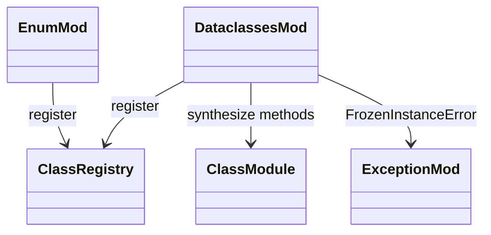

# stdlib `enum` + `dataclasses`

Class-generation helpers. Both modules synthesize a class at runtime
from a description (members for `Enum`, fields for `dataclass`).
Tightly coupled with `runtime/class.md` because they register real
classes via `mb_class_register`.

Three load-bearing invariants:

1. **`Enum.create(name, members)` registers a real class** — not a
   wrapper Instance. Members become class attributes; subclass
   relation is `Enum`.
2. **`@dataclass` runs at decorator time** — synthesizes `__init__`,
   `__repr__`, `__eq__`, optionally `__hash__` per CPython rules
   (eq=True default; frozen=True makes hashable). Mutates the class
   in `CLASS_REGISTRY`.
3. **`@dataclass(frozen=True)` blocks `__setattr__`** — instances
   raise `FrozenInstanceError` on assignment after construction.

## Type model
<!-- type: dependency lang: mermaid -->



## Function catalog
<!-- type: schema lang: yaml -->

```yaml
$schema: "https://json-schema.org/draft/2020-12/schema"
$id: "enum-dataclass-catalog"
$defs:
  StdlibFnEntry:
    type: object
    properties:
      python_name:    { type: string }
      mb_fn:          { type: string }
      arity:          { type: integer }
      cpython_parity: { type: string, enum: [full, partial, gap] }
      notes:          { type: string }
    required: [python_name, mb_fn, arity, cpython_parity]
  Catalog:
    type: object
    properties:
      enum:
        type: array
        items: { $ref: "#/$defs/StdlibFnEntry" }
        examples:
          - - { python_name: "enum.Enum",        mb_fn: "mb_enum_create",        arity: 2, cpython_parity: partial, notes: "(name, members) — functional API; class-statement form gap" }
            - { python_name: "enum.auto",        mb_fn: "mb_enum_auto",          arity: 0, cpython_parity: full,    notes: "monotonic counter" }
            - { python_name: "Enum member.name",  mb_fn: "mb_enum_member_name",   arity: 1, cpython_parity: full }
            - { python_name: "Enum member.value", mb_fn: "mb_enum_member_value",  arity: 1, cpython_parity: full }
            - { python_name: "enum.IntEnum / StrEnum / Flag",      mb_fn: "(gap)", arity: -1, cpython_parity: gap }
      dataclasses:
        type: array
        items: { $ref: "#/$defs/StdlibFnEntry" }
        examples:
          - - { python_name: "@dataclass",                  mb_fn: "mb_dataclass",        arity: 1, cpython_parity: partial, notes: "synthesize __init__/__repr__/__eq__; no kw_only / slots / match_args yet" }
            - { python_name: "@dataclass(frozen=True)",     mb_fn: "mb_dataclass_frozen", arity: 1, cpython_parity: partial, notes: "FrozenInstanceError on setattr" }
            - { python_name: "dataclasses.field",            mb_fn: "mb_field",            arity: -1, cpython_parity: partial, notes: "default / default_factory / repr / compare gaps mostly closed" }
            - { python_name: "dataclasses.asdict / astuple", mb_fn: "(gap)", arity: -1, cpython_parity: gap }
            - { python_name: "dataclasses.replace / fields", mb_fn: "(gap)", arity: -1, cpython_parity: gap }
```

## Tests
<!-- type: tests lang: yaml -->

```yaml
runner: "cargo test -p mamba --test conformance_tests --release -- {name} --test-threads=1"
fixtures:
  - id: enum_basic
    name: "stdlib/enum_basic.py"
    paired: "stdlib/enum_basic.expected"
  - id: enum_auto
    name: "stdlib/enum_auto.py"
    paired: "stdlib/enum_auto.expected"
  - id: dataclass_basic
    name: "stdlib/dataclass_basic.py"
    paired: "stdlib/dataclass_basic.expected"
  - id: dataclass_frozen
    name: "stdlib/dataclass_frozen.py"
    paired: "stdlib/dataclass_frozen.expected"
    verifies: ["FrozenInstanceError on setattr after construction"]
```

## Changes
<!-- type: changes lang: yaml -->

```yaml
changes:
  - file: crates/mamba/src/runtime/stdlib/enum_mod.rs
    action: modify
    impl_mode: hand-written
    description: "Enum / Enum member.name / .value / auto. Hand-written; class-statement form (class Color(Enum): RED=1) and IntEnum / StrEnum / Flag are gaps."
  - file: crates/mamba/src/runtime/stdlib/dataclasses_mod.rs
    action: modify
    impl_mode: hand-written
    description: "@dataclass synthesizes __init__/__repr__/__eq__; @dataclass(frozen=True) blocks setattr. Hand-written; asdict / astuple / replace / fields gaps."
```
