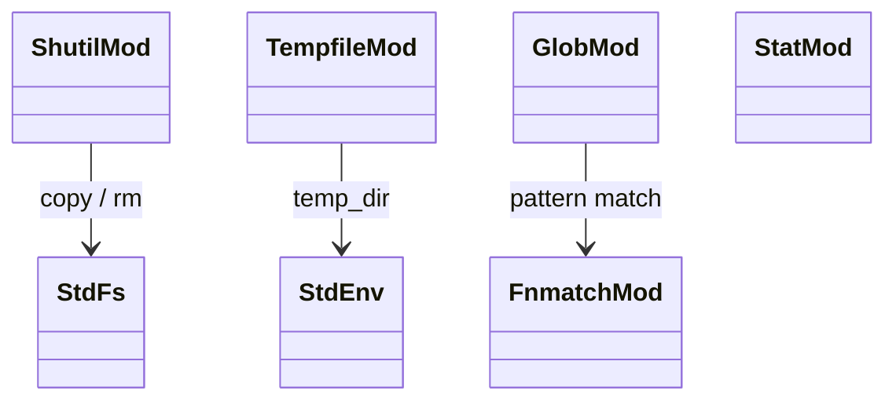
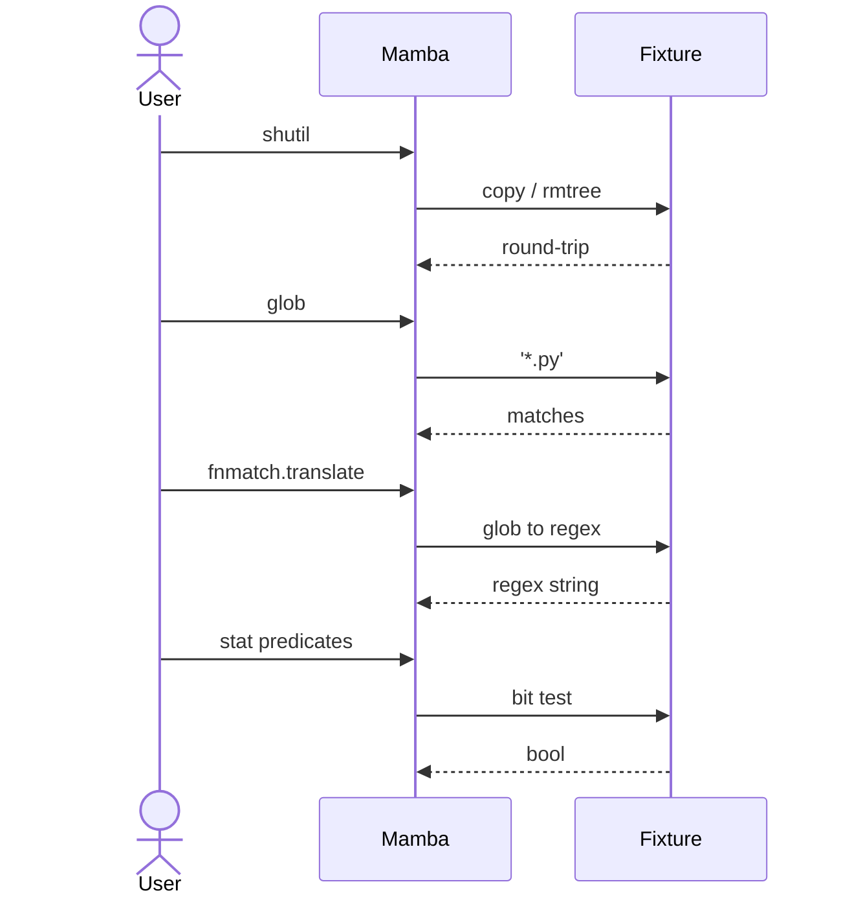

# stdlib `shutil` + `tempfile` + `glob` + `fnmatch` + `stat`

Five filesystem-utility modules co-located: high-level file ops
(shutil), temporary directories (tempfile), glob-style pattern
matching (glob, fnmatch), and stat-result mode bit predicates
(stat).

Three load-bearing invariants:

1. **`shutil.copytree` / `rmtree` walk recursively** —
   directory-tree operations are not atomic; partial failures leave
   partial state. CPython has the same behavior. No transactional
   semantics.
2. **`glob` uses fnmatch under the hood** — `glob.glob('*.py')`
   walks the dir, applies `fnmatch.fnmatch` to each entry. Does NOT
   support recursive `**` today (open gap; CPython 3.5+ supports it).
3. **`stat.S_IS*` are bit-test predicates** — `S_ISDIR(mode)` →
   `(mode & 0o170000) == 0o040000`. Not introspecting any actual
   file; just bit manipulation on the mode integer the user passes.

## Type model
<!-- type: dependency lang: mermaid -->



## Function catalog
<!-- type: schema lang: yaml -->

```yaml
$schema: "https://json-schema.org/draft/2020-12/schema"
$id: "fs-utils-catalog"
$defs:
  StdlibFnEntry:
    type: object
    properties:
      python_name:    { type: string }
      mb_fn:          { type: string }
      arity:          { type: integer }
      cpython_parity: { type: string, enum: [full, partial, gap] }
      notes:          { type: string }
    required: [python_name, mb_fn, arity, cpython_parity]
  FsUtilsCatalog:
    type: object
    properties:
      shutil:
        type: array
        items: { $ref: "#/$defs/StdlibFnEntry" }
        examples:
          - - { python_name: "shutil.copy",     mb_fn: "mb_shutil_copy",     arity: 2, cpython_parity: full }
            - { python_name: "shutil.copytree", mb_fn: "mb_shutil_copytree", arity: 2, cpython_parity: partial, notes: "no copy_function / ignore kwargs" }
            - { python_name: "shutil.rmtree",   mb_fn: "mb_shutil_rmtree",   arity: 1, cpython_parity: full }
            - { python_name: "shutil.move",     mb_fn: "mb_shutil_move",     arity: 2, cpython_parity: full }
            - { python_name: "shutil.which",    mb_fn: "mb_shutil_which",    arity: 1, cpython_parity: full,    notes: "PATH executable lookup" }
      tempfile:
        type: array
        items: { $ref: "#/$defs/StdlibFnEntry" }
        examples:
          - - { python_name: "tempfile.mkdtemp",          mb_fn: "mb_tempfile_mkdtemp",          arity: 0, cpython_parity: partial, notes: "no prefix/suffix kwargs" }
            - { python_name: "tempfile.NamedTemporaryFile", mb_fn: "(gap)",                       arity: 0, cpython_parity: gap }
            - { python_name: "tempfile.TemporaryDirectory", mb_fn: "mb_tempfile_temporary_directory", arity: 0, cpython_parity: partial, notes: "context-manager form basic" }
      glob:
        type: array
        items: { $ref: "#/$defs/StdlibFnEntry" }
        examples:
          - - { python_name: "glob.glob",  mb_fn: "mb_glob_glob",  arity: 1, cpython_parity: partial, notes: "no recursive ** today" }
            - { python_name: "glob.iglob", mb_fn: "(gap)",         arity: 1, cpython_parity: gap }
      fnmatch:
        type: array
        items: { $ref: "#/$defs/StdlibFnEntry" }
        examples:
          - - { python_name: "fnmatch.fnmatch",     mb_fn: "mb_fnmatch_fnmatch",     arity: 2, cpython_parity: full,    notes: "case-insensitive on case-insensitive FS" }
            - { python_name: "fnmatch.fnmatchcase", mb_fn: "mb_fnmatch_fnmatchcase", arity: 2, cpython_parity: full }
            - { python_name: "fnmatch.filter",      mb_fn: "mb_fnmatch_filter",      arity: 2, cpython_parity: full }
            - { python_name: "fnmatch.translate",   mb_fn: "mb_fnmatch_translate",   arity: 1, cpython_parity: full,    notes: "fnmatch glob → regex" }
      stat:
        type: array
        items: { $ref: "#/$defs/StdlibFnEntry" }
        examples:
          - - { python_name: "stat.S_ISDIR",  mb_fn: "mb_stat_s_isdir",  arity: 1, cpython_parity: full }
            - { python_name: "stat.S_ISREG",  mb_fn: "mb_stat_s_isreg",  arity: 1, cpython_parity: full }
            - { python_name: "stat.S_ISLNK",  mb_fn: "mb_stat_s_islnk",  arity: 1, cpython_parity: full }
            - { python_name: "stat constants (S_IFDIR / S_IFREG / etc.)", mb_fn: "(constants)", arity: 0, cpython_parity: full }
```

## Acceptance scenarios
<!-- type: overview lang: markdown -->



## Tests
<!-- type: tests lang: yaml -->

```yaml
runner: "cargo test -p mamba --test conformance_tests --release -- {name} --test-threads=1"
fixtures:
  - id: shutil_copy_rmtree
    name: "stdlib/shutil_copy_rmtree.py"
    paired: "stdlib/shutil_copy_rmtree.expected"
  - id: tempfile_mkdtemp
    name: "stdlib/tempfile_mkdtemp.py"
    paired: "stdlib/tempfile_mkdtemp.expected"
  - id: glob_basic
    name: "stdlib/glob_basic.py"
    paired: "stdlib/glob_basic.expected"
  - id: fnmatch_basic
    name: "stdlib/fnmatch_basic.py"
    paired: "stdlib/fnmatch_basic.expected"
  - id: stat_predicates
    name: "stdlib/stat_predicates.py"
    paired: "stdlib/stat_predicates.expected"
```

## Changes
<!-- type: changes lang: yaml -->

```yaml
changes:
  - file: crates/mamba/src/runtime/stdlib/shutil_mod.rs
    action: modify
    impl_mode: hand-written
    description: "copy / copytree / rmtree / move / which over std::fs. Hand-written."
  - file: crates/mamba/src/runtime/stdlib/tempfile_mod.rs
    action: modify
    impl_mode: hand-written
    description: "mkdtemp + TemporaryDirectory ctx manager. Hand-written; NamedTemporaryFile is gap."
  - file: crates/mamba/src/runtime/stdlib/glob_mod.rs
    action: modify
    impl_mode: hand-written
    description: "glob() over fnmatch.fnmatch + dir walk. Hand-written; recursive ** is open gap."
  - file: crates/mamba/src/runtime/stdlib/fnmatch_mod.rs
    action: modify
    impl_mode: hand-written
    description: "fnmatch / fnmatchcase / filter / translate. Hand-written; translate is the only algorithmic part."
  - file: crates/mamba/src/runtime/stdlib/stat_mod.rs
    action: modify
    impl_mode: hand-written
    description: "S_IS* predicates + S_IF* constants. Hand-written; pure bit-twiddling, ideal Phase-1 codegen target."
```
