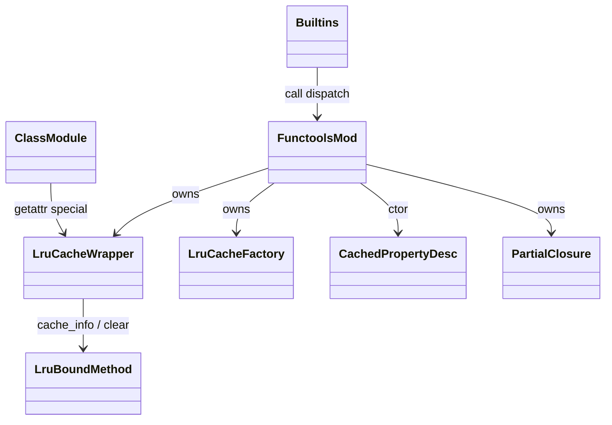
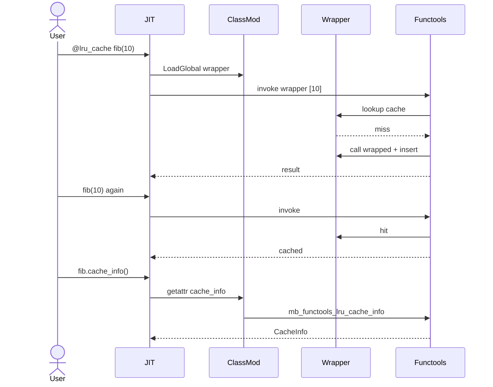
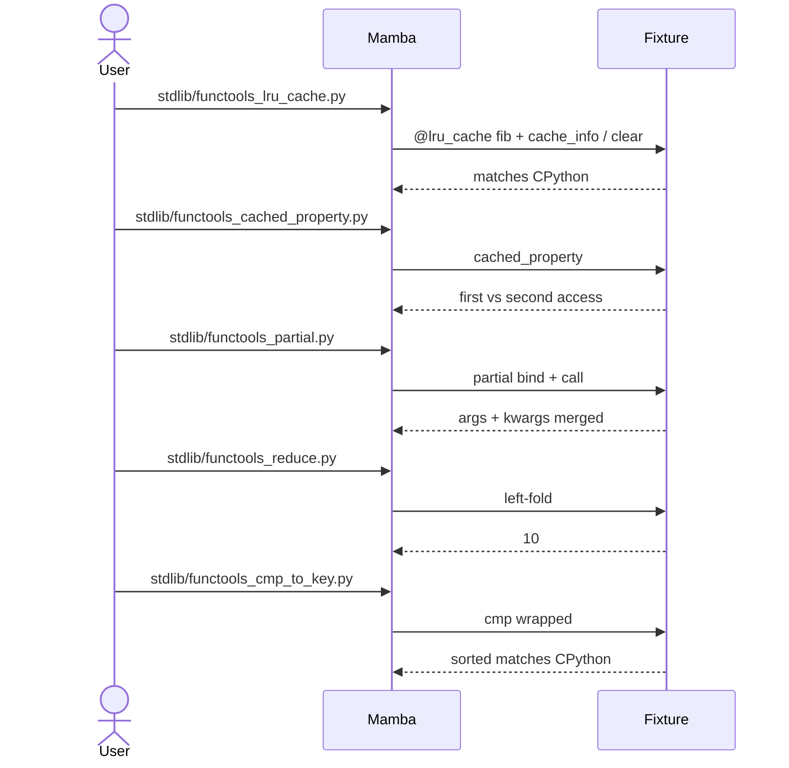

# stdlib `functools`

Higher-order functions and decorators. Three families:

1. **Reductions** — `reduce(func, iter, initial)`
2. **Partial application** — `partial(func, *args, **kwargs)`
3. **Decorators** — `@lru_cache`, `@cached_property`,
   `@singledispatch`, `cmp_to_key`, `update_wrapper`

The decorator family is the load-bearing one: `@lru_cache` and
`@cached_property` are real descriptors per `runtime/class.md` (not
identity passthroughs); the recent runtime fixes (commits
`7b4b6af4` and `59480dd7`) wired both into the descriptor protocol.

Three load-bearing invariants:

1. **`@lru_cache` is a real wrapper Instance, not an alias** — its
   `class_name = "functools.lru_cache_wrapper"` triggers `mb_getattr`
   special-case (per `runtime/class.md`) which binds `cache_info` /
   `cache_clear` to a `_lru_bound_method` Instance. `mb_call_method`
   intercepts those names and routes to `mb_functools_lru_cache_info`
   / `mb_functools_lru_cache_clear`.
2. **`@cached_property` is a real descriptor** — `__cached_property__`
   sentinel class; first access runs getter then writes the result
   onto the instance under the same name; subsequent accesses hit
   instance `__dict__` and skip the descriptor (per
   `runtime/class.md` cached_property interaction).
3. **`Var(sym)` for `@lru_cache`-decorated user fn emits LoadGlobal,
   not FuncRef** — the JIT lowering rule in `lower/hir-to-mir.md`
   ensures the wrapper Instance (stored in `GLOBAL_BY_ID` under the
   original symbol) is hit. `FuncRef` would short-circuit to the raw
   JIT entry, bypassing the cache.

## Type model
<!-- type: dependency lang: mermaid -->



## Function catalog
<!-- type: schema lang: yaml -->

```yaml
$schema: "https://json-schema.org/draft/2020-12/schema"
$id: "functools-catalog"
$defs:
  StdlibFnEntry:
    description: "Catalog row — input shape for future stdlib-fn section type"
    type: object
    properties:
      python_name:    { type: string }
      mb_fn:          { type: string }
      arity:          { type: integer }
      kwargs:         { type: array, items: { type: string } }
      delegates_to:   { type: string }
      cpython_parity: { type: string, enum: [full, partial, gap] }
      notes:          { type: string }
    required: [python_name, mb_fn, arity, cpython_parity]
  FunctoolsCatalog:
    type: object
    properties:
      reductions:
        type: array
        items: { $ref: "#/$defs/StdlibFnEntry" }
        examples:
          - - { python_name: "functools.reduce", mb_fn: "mb_functools_reduce", arity: 3, kwargs: [], cpython_parity: full, notes: "left-fold over iterable; optional initial" }
      partial:
        type: array
        items: { $ref: "#/$defs/StdlibFnEntry" }
        examples:
          - - { python_name: "functools.partial", mb_fn: "mb_functools_partial", arity: -1, kwargs: ["*"], cpython_parity: full, notes: "binds positional + keyword args; returns callable closure" }
      decorators:
        type: array
        items: { $ref: "#/$defs/StdlibFnEntry" }
        examples:
          - - { python_name: "functools.lru_cache",         mb_fn: "mb_functools_lru_cache",         arity: 1, kwargs: [],                cpython_parity: full,    notes: "single-arg form @lru_cache def f(): ..." }
            - { python_name: "functools.lru_cache",         mb_fn: "mb_functools_lru_cache_factory", arity: 0, kwargs: [maxsize, typed], cpython_parity: full,    notes: "factory form @lru_cache(maxsize=128, typed=False) def f" }
            - { python_name: "functools.cached_property",   mb_fn: "mb_functools_cached_property",   arity: 1, kwargs: [],                cpython_parity: full,    notes: "descriptor; first-access caches on instance (commit 59480dd7)" }
            - { python_name: "functools.cmp_to_key",        mb_fn: "mb_functools_cmp_to_key",        arity: 1, kwargs: [],                cpython_parity: full,    notes: "wraps cmp(a,b) → key callable producing K with __lt__" }
            - { python_name: "functools.update_wrapper",    mb_fn: "mb_functools_update_wrapper",    arity: 2, kwargs: [],                cpython_parity: partial, notes: "copies __name__ / __doc__ / __wrapped__; __module__ partial" }
            - { python_name: "functools.wraps",             mb_fn: "(wraps via partial)",            arity: 1, kwargs: [],                cpython_parity: partial, notes: "wraps = partial(update_wrapper, wrapped=...); not direct mb_fn" }
            - { python_name: "functools.singledispatch",    mb_fn: "mb_functools_singledispatch",    arity: 1, kwargs: [],                cpython_parity: partial, notes: "register dispatch table per arg-0 type; no abstract base support yet" }
            - { python_name: "functools.singledispatchmethod", mb_fn: "mb_functools_singledispatchmethod", arity: 1, kwargs: [],         cpython_parity: partial, notes: "method-form of singledispatch" }
      lru_introspection:
        type: array
        items: { $ref: "#/$defs/StdlibFnEntry" }
        examples:
          - - { python_name: "wrapper.cache_info",  mb_fn: "mb_functools_lru_cache_info",  arity: 0, kwargs: [], cpython_parity: full, notes: "returns CacheInfo(hits, misses, maxsize, currsize) named-tuple-like" }
            - { python_name: "wrapper.cache_clear", mb_fn: "mb_functools_lru_cache_clear", arity: 0, kwargs: [], cpython_parity: full, notes: "wipes the wrapper's cache table" }
```

## lru_cache wrapper lifecycle

```mermaid
---
id: lru-cache-lifecycle
initial: Created
nodes:
  Created:    { kind: initial,  label: "@lru_cache f or @lru_cache(maxsize=N) f — wrapper Instance built" }
  Empty:      { kind: normal,   label: "wrapper has no cache entries; hits=0, misses=0" }
  Active:     { kind: normal,   label: "calls hit / miss; cache populated up to maxsize" }
  AtCapacity: { kind: normal,   label: "cache size == maxsize; LRU eviction on next miss" }
  Cleared:    { kind: normal,   label: "wrapper.cache_clear() called; entries dropped, hits/misses reset" }
edges:
  - { from: Created,    to: Empty,      event: "first wrapper-call" }
  - { from: Empty,      to: Active,     event: "first miss inserts entry" }
  - { from: Active,     to: Active,     event: "hit (no insert)" }
  - { from: Active,     to: AtCapacity, event: "miss + size reaches maxsize" }
  - { from: AtCapacity, to: AtCapacity, event: "miss evicts LRU + inserts new" }
  - { from: AtCapacity, to: Active,     event: "(impossible — size sticky once at cap unless cleared)" }
  - { from: Active,     to: Cleared,    event: "wrapper.cache_clear()" }
  - { from: AtCapacity, to: Cleared,    event: "wrapper.cache_clear()" }
  - { from: Cleared,    to: Active,     event: "next miss" }
---
stateDiagram-v2
    [*] --> Created
    Created --> Empty: first call
    Empty --> Active: first miss
    Active --> Active: hit
    Active --> AtCapacity: miss reaches maxsize
    AtCapacity --> AtCapacity: miss evicts LRU
    Active --> Cleared: cache_clear
    AtCapacity --> Cleared: cache_clear
    Cleared --> Active: next miss
```

<!-- type: state-machine lang: mermaid -->



## Decorator dispatch logic
<!-- type: logic lang: mermaid -->

```mermaid
---
id: functools-dispatch
entry: enter
nodes:
  enter:        { kind: start,    label: "decorator application" }
  classify:     { kind: decision, label: "which decorator?" }
  build_lru:    { kind: process,  label: "@lru_cache → Instance class_name=functools.lru_cache_wrapper; fields {fget, cache, hits, misses, maxsize, typed}" }
  build_lru_f:  { kind: process,  label: "@lru_cache(maxsize=N) → factory Instance; calling factory wraps inner fn" }
  build_cprop:  { kind: process,  label: "@cached_property → mb_cached_property_new (delegates to runtime::class)" }
  build_cmp:    { kind: process,  label: "cmp_to_key → wrapper class with __lt__ comparing via mycmp" }
  build_partial:{ kind: process,  label: "partial → Instance carrying (func, *args, **kwargs); call applies bound + new args" }
  build_disp:   { kind: process,  label: "singledispatch → wrapper Instance with dispatch table {type → impl}" }
  store_global: { kind: process,  label: "GLOBAL_BY_ID[sym] = wrapper Instance (per closure.md)" }
  jit_var_load: { kind: process,  label: "subsequent Var(sym) emit LoadGlobal not FuncRef (commit 7b4b6af4)" }
  done:         { kind: terminal, label: "decorator applied; wrapper accessible via Python name" }
edges:
  - { from: enter,         to: classify }
  - { from: classify,      to: build_lru,     label: "@lru_cache (no args)" }
  - { from: classify,      to: build_lru_f,   label: "@lru_cache(maxsize=, typed=)" }
  - { from: classify,      to: build_cprop,   label: "@cached_property" }
  - { from: classify,      to: build_cmp,     label: "cmp_to_key" }
  - { from: classify,      to: build_partial, label: "partial" }
  - { from: classify,      to: build_disp,    label: "singledispatch" }
  - { from: build_lru,     to: store_global }
  - { from: build_lru_f,   to: store_global }
  - { from: build_cprop,   to: store_global }
  - { from: build_cmp,     to: store_global }
  - { from: build_partial, to: store_global }
  - { from: build_disp,    to: store_global }
  - { from: store_global,  to: jit_var_load }
  - { from: jit_var_load,  to: done }
---
flowchart TD
    enter([decorator]) --> classify{which?}
    classify -->|@lru_cache no-arg| build_lru[wrapper Instance]
    classify -->|@lru_cache factory| build_lru_f[factory Instance]
    classify -->|@cached_property| build_cprop[descriptor]
    classify -->|cmp_to_key| build_cmp[K with __lt__]
    classify -->|partial| build_partial[bound closure]
    classify -->|singledispatch| build_disp[dispatch table]
    build_lru --> store_global[GLOBAL_BY_ID]
    build_lru_f --> store_global
    build_cprop --> store_global
    build_cmp --> store_global
    build_partial --> store_global
    build_disp --> store_global
    store_global --> jit_var_load[Var sym → LoadGlobal]
    jit_var_load --> done([applied])
```

## lru_cache call interaction
<!-- type: interaction lang: mermaid -->



## Acceptance scenarios
<!-- type: overview lang: markdown -->



## Tests
<!-- type: tests lang: yaml -->

```yaml
runner: "cargo test -p mamba --test conformance_tests --release -- {name} --test-threads=1"
fixtures:
  - id: functools_lru_cache
    name: "stdlib/functools_lru_cache.py"
    paired: "stdlib/functools_lru_cache.expected"
    verifies: ["@lru_cache + cache_info + cache_clear (commit 7b4b6af4)"]
  - id: functools_cached_property
    name: "stdlib/functools_cached_property.py"
    paired: "stdlib/functools_cached_property.expected"
    verifies: ["@cached_property real descriptor (commit 59480dd7)"]
  - id: functools_partial
    name: "stdlib/functools_partial.py"
    paired: "stdlib/functools_partial.expected"
    verifies: ["partial binds args + kwargs; downstream call merges"]
  - id: functools_reduce
    name: "stdlib/functools_reduce.py"
    paired: "stdlib/functools_reduce.expected"
    verifies: ["reduce left-fold with / without initial"]
  - id: functools_cmp_to_key
    name: "stdlib/functools_cmp_to_key.py"
    paired: "stdlib/functools_cmp_to_key.expected"
    verifies: ["cmp_to_key + sorted integration"]
  - id: functools_singledispatch
    name: "stdlib/functools_singledispatch.py"
    paired: "stdlib/functools_singledispatch.expected"
    verifies: ["singledispatch dispatch table by arg-0 type"]
  - id: functools_wraps
    name: "stdlib/functools_wraps.py"
    paired: "stdlib/functools_wraps.expected"
    verifies: ["@wraps copies __name__ / __doc__ / __wrapped__"]
```

## Changes
<!-- type: changes lang: yaml -->

```yaml
changes:
  - file: crates/mamba/src/runtime/stdlib/functools_mod.rs
    action: modify
    impl_mode: hand-written
    description: "lru_cache wrapper Instance + factory + bound-method; cached_property delegates to runtime/class; partial closure; reduce / cmp_to_key / update_wrapper / singledispatch[method]. Hand-written; the wrapper Instance protocol cuts across class.md + closure.md + lower/hir-to-mir.md and is too cross-cutting for naive codegen — Phase 4 hot-path DSL territory."
```
