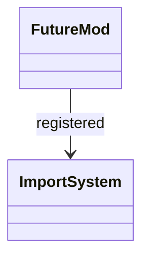

# stdlib `__future__`

`from __future__ import X` directive support. Per CPython, these
imports enable opt-in language features. Mamba is Python 3.12+, so
all `__future__` features that exist in 3.12 are already enabled by
default — `__future__` exists for compatibility with older Python
code, registered with feature names but effectively no-op.

Three load-bearing invariants:

1. **Every `__future__` feature is a no-op import** — annotations,
   division, generator_stop, etc. all already-true in Mamba.
2. **`__future__.feature_name.getOptionalRelease()` returns a tuple**
   matching CPython's release tracking, even though Mamba's behavior
   is the same.
3. **`from __future__ import annotations` is recognised at parse
   time** — even though it's a no-op runtime, the parser accepts the
   syntax without error.

## Type model
<!-- type: dependency lang: mermaid -->



## Function catalog
<!-- type: schema lang: yaml -->

```yaml
$schema: "https://json-schema.org/draft/2020-12/schema"
$id: "future-catalog"
$defs:
  FutureFeature:
    type: object
    properties:
      name:           { type: string }
      mandatory_in:   { type: string, description: "Python version where it became mandatory" }
      mamba_status:   { type: string, enum: [no-op, gap] }
    required: [name, mandatory_in, mamba_status]
  FutureCatalog:
    type: array
    items: { $ref: "#/$defs/FutureFeature" }
    examples:
      - - { name: "nested_scopes",         mandatory_in: "2.2", mamba_status: no-op }
        - { name: "generators",            mandatory_in: "2.3", mamba_status: no-op }
        - { name: "division",              mandatory_in: "3.0", mamba_status: no-op }
        - { name: "absolute_import",       mandatory_in: "3.0", mamba_status: no-op }
        - { name: "with_statement",        mandatory_in: "2.6", mamba_status: no-op }
        - { name: "print_function",        mandatory_in: "3.0", mamba_status: no-op }
        - { name: "unicode_literals",      mandatory_in: "3.0", mamba_status: no-op }
        - { name: "barry_as_FLUFL",        mandatory_in: "(N/A)", mamba_status: gap, description: "April Fools feature" }
        - { name: "generator_stop",        mandatory_in: "3.7", mamba_status: no-op }
        - { name: "annotations",           mandatory_in: "3.13 (postponed; PEP 649)", mamba_status: no-op }
```

## Tests
<!-- type: tests lang: yaml -->

```yaml
runner: "cargo test -p mamba --test conformance_tests --release -- {name} --test-threads=1"
fixtures:
  - id: future_imports_no_op
    name: "stdlib/future_imports.py"
    paired: "stdlib/future_imports.expected"
    verifies: ["from __future__ import X parses without error and has no behavior change"]
```

## Changes
<!-- type: changes lang: yaml -->

```yaml
changes:
  - file: crates/mamba/src/runtime/stdlib/future_mod.rs
    action: modify
    impl_mode: hand-written
    description: "Feature registry; all no-op runtime. Hand-written; barry_as_FLUFL is gap (April Fools, intentionally not implemented)."
```
