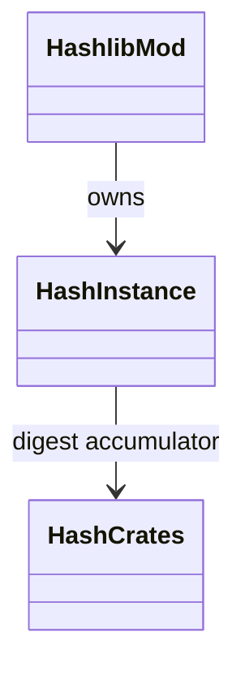
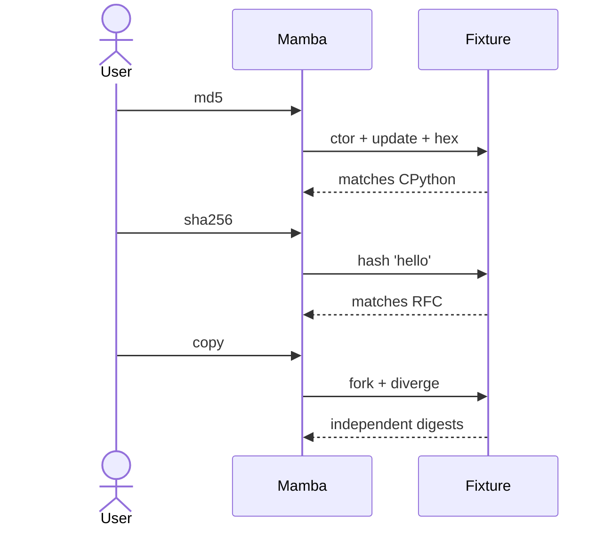

# stdlib `hashlib`

Cryptographic hash functions (md5 / sha-family) over Rust crates
(`md-5`, `sha2`, etc.). Each `hashlib.X()` call produces a Hash
Instance carrying mutable state in `_state` field; `update()` adds
data; `hexdigest()` finalizes.

Three load-bearing invariants:

1. **Hash objects are mutable Instances** — `class_name = "hashlib.md5"`
   etc. with `_state` field holding the underlying `Md5` / `Sha256` /
   `Sha512` digest accumulator. `update` mutates in place.
2. **`copy()` clones the running state** — fork a hash before
   finalization to compute multiple variants. Per CPython.
3. **`hexdigest()` does NOT consume the state** — can call
   `update` after; CPython matches.

## Type model
<!-- type: dependency lang: mermaid -->



## Function catalog
<!-- type: schema lang: yaml -->

```yaml
$schema: "https://json-schema.org/draft/2020-12/schema"
$id: "hashlib-catalog"
$defs:
  StdlibFnEntry:
    type: object
    properties:
      python_name:    { type: string }
      mb_fn:          { type: string }
      arity:          { type: integer }
      cpython_parity: { type: string, enum: [full, partial, gap] }
      notes:          { type: string }
    required: [python_name, mb_fn, arity, cpython_parity]
  HashlibCatalog:
    type: array
    items: { $ref: "#/$defs/StdlibFnEntry" }
    examples:
      - - { python_name: "hashlib.md5",       mb_fn: "mb_hashlib_md5",       arity: 0, cpython_parity: full,    notes: "MD5 ctor" }
        - { python_name: "hashlib.sha256",    mb_fn: "mb_hashlib_sha256",    arity: 0, cpython_parity: full }
        - { python_name: "hashlib.sha512",    mb_fn: "mb_hashlib_sha512",    arity: 0, cpython_parity: full }
        - { python_name: "hash.update",       mb_fn: "mb_hashlib_update",    arity: 2, cpython_parity: full,    notes: "(hash, data) — bytes / str" }
        - { python_name: "hash.copy",         mb_fn: "mb_hashlib_copy",      arity: 1, cpython_parity: full }
        - { python_name: "hash.hexdigest",    mb_fn: "mb_hashlib_hexdigest", arity: 1, cpython_parity: full }
        - { python_name: "hashlib.sha1 / sha224 / sha384 / blake2 / pbkdf2_hmac", mb_fn: "(gap)", arity: -1, cpython_parity: gap }
```

## Acceptance scenarios
<!-- type: overview lang: markdown -->



## Tests
<!-- type: tests lang: yaml -->

```yaml
runner: "cargo test -p mamba --test conformance_tests --release -- {name} --test-threads=1"
fixtures:
  - id: hashlib_md5
    name: "stdlib/hashlib_md5.py"
    paired: "stdlib/hashlib_md5.expected"
  - id: hashlib_sha256
    name: "stdlib/hashlib_sha256.py"
    paired: "stdlib/hashlib_sha256.expected"
  - id: hashlib_sha512
    name: "stdlib/hashlib_sha512.py"
    paired: "stdlib/hashlib_sha512.expected"
  - id: hashlib_copy
    name: "stdlib/hashlib_copy.py"
    paired: "stdlib/hashlib_copy.expected"
```

## Changes
<!-- type: changes lang: yaml -->

```yaml
changes:
  - file: crates/mamba/src/runtime/stdlib/hashlib_mod.rs
    action: modify
    impl_mode: hand-written
    description: "md5 / sha256 / sha512 ctor + update / copy / hexdigest. Hand-written; sha1 / sha224 / sha384 / blake2 / pbkdf2_hmac open gaps."
```
