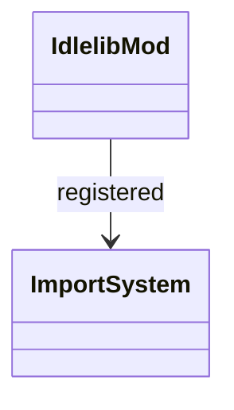

# stdlib `idlelib`

Stub implementation of CPython's IDLE IDE module. Mamba does not
ship an IDLE-equivalent GUI; this module exists as an importable
placeholder so user code that reads `idlelib.__version__` etc.
doesn't crash on `ModuleNotFoundError`.

Three load-bearing invariants:

1. **`import idlelib` succeeds** — registered via
   `runtime/module.md::register_native_modules`. No GUI symbols.
2. **`idlelib.__version__` returns a sentinel string** — `"0.0-stub"`
   identifying mamba's stub vs CPython's real IDLE.
3. **No actual IDE features wired** — `IDLE.main()`, `editor.EditorWindow`,
   `pyshell.PyShell` etc. all gap; calling raises `NotImplementedError`.

## Type model
<!-- type: dependency lang: mermaid -->



## Function catalog
<!-- type: schema lang: yaml -->

```yaml
$schema: "https://json-schema.org/draft/2020-12/schema"
$id: "idlelib-catalog"
$defs:
  IdlelibCatalog:
    type: object
    properties:
      __version__:    { type: string, default: "0.0-stub" }
      gui_symbols:
        type: string
        enum: [gap]
        description: "All IDE / shell / editor symbols are gap"
```

## Tests
<!-- type: tests lang: yaml -->

```yaml
runner: "cargo test -p mamba --test conformance_tests --release -- {name} --test-threads=1"
fixtures:
  - id: idlelib_import_succeeds
    name: "stdlib/idlelib_import.py"
    paired: "stdlib/idlelib_import.expected"
    verifies: ["import idlelib does not raise ModuleNotFoundError"]
```

## Changes
<!-- type: changes lang: yaml -->

```yaml
changes:
  - file: crates/mamba/src/runtime/stdlib/idlelib_mod.rs
    action: modify
    impl_mode: hand-written
    description: "Stub for compatibility. Hand-written; no IDE actually exists in Mamba."
```
