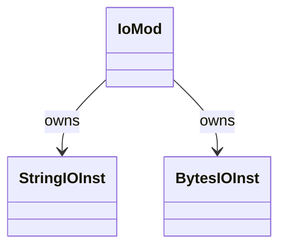
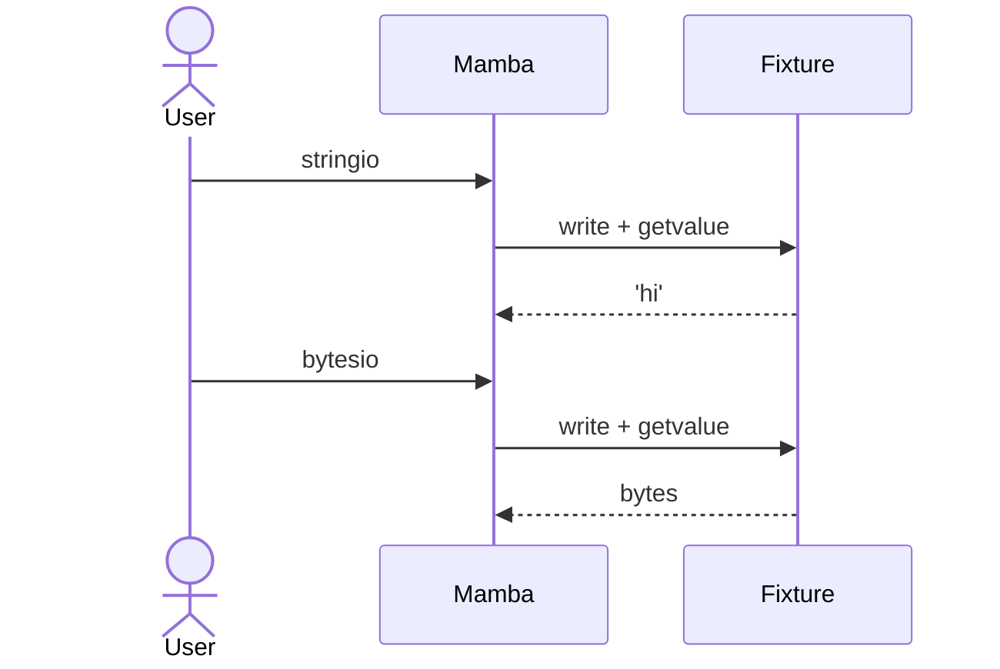

# stdlib `io`

In-memory text / bytes streams (`StringIO` / `BytesIO`). Not the
full `io` module abstraction layer — base classes (`IOBase`,
`RawIOBase`, etc.) are not implemented; only the concrete in-memory
buffer subset is provided.

Three load-bearing invariants:

1. **`StringIO` / `BytesIO` are Instance wrappers** with
   `class_name = "io.StringIO"` / `"io.BytesIO"`, carrying `_buf`
   field with the underlying String / Vec<u8>. Mutation methods
   (`write` / `truncate`) edit the buffer in-place.
2. **`getvalue` returns a snapshot, not a borrow** — caller can
   mutate the StringIO afterward without affecting the snapshot.
3. **`read` consumes from a position cursor** — internal `_pos`
   advances; `seek(0)` resets. Same shape as a real file but with
   memory backing.

## Type model
<!-- type: dependency lang: mermaid -->



## Function catalog
<!-- type: schema lang: yaml -->

```yaml
$schema: "https://json-schema.org/draft/2020-12/schema"
$id: "io-catalog"
$defs:
  StdlibFnEntry:
    type: object
    properties:
      python_name:    { type: string }
      mb_fn:          { type: string }
      arity:          { type: integer }
      cpython_parity: { type: string, enum: [full, partial, gap] }
      notes:          { type: string }
    required: [python_name, mb_fn, arity, cpython_parity]
  IoCatalog:
    type: array
    items: { $ref: "#/$defs/StdlibFnEntry" }
    examples:
      - - { python_name: "io.StringIO",        mb_fn: "mb_stringio_new",      arity: 0, cpython_parity: partial, notes: "no initial-text arg yet" }
        - { python_name: "StringIO.write",     mb_fn: "mb_stringio_write",    arity: 2, cpython_parity: full }
        - { python_name: "StringIO.read",      mb_fn: "mb_stringio_read",     arity: 1, cpython_parity: partial, notes: "no n-bytes arg" }
        - { python_name: "StringIO.getvalue",  mb_fn: "mb_stringio_getvalue", arity: 1, cpython_parity: full }
        - { python_name: "io.BytesIO",         mb_fn: "mb_bytesio_new",       arity: 0, cpython_parity: partial }
        - { python_name: "BytesIO.write",      mb_fn: "mb_bytesio_write",     arity: 2, cpython_parity: full }
        - { python_name: "BytesIO.getvalue",   mb_fn: "mb_bytesio_getvalue",  arity: 1, cpython_parity: full }
        - { python_name: "io.IOBase / RawIOBase / etc. (base classes)", mb_fn: "(gap)", arity: -1, cpython_parity: gap }
        - { python_name: "io.open / io.TextIOWrapper", mb_fn: "(gap)", arity: -1, cpython_parity: gap, notes: "use builtins.open instead" }
```

## Acceptance scenarios
<!-- type: overview lang: markdown -->



## Tests
<!-- type: tests lang: yaml -->

```yaml
runner: "cargo test -p mamba --test conformance_tests --release -- {name} --test-threads=1"
fixtures:
  - id: io_stringio
    name: "stdlib/io_stringio.py"
    paired: "stdlib/io_stringio.expected"
  - id: io_bytesio
    name: "stdlib/io_bytesio.py"
    paired: "stdlib/io_bytesio.expected"
```

## Changes
<!-- type: changes lang: yaml -->

```yaml
changes:
  - file: crates/mamba/src/runtime/stdlib/io_mod.rs
    action: modify
    impl_mode: hand-written
    description: "StringIO + BytesIO Instance wrappers; the full io abstraction layer (IOBase / RawIOBase / TextIOWrapper / etc.) is open gap. Hand-written."
```
