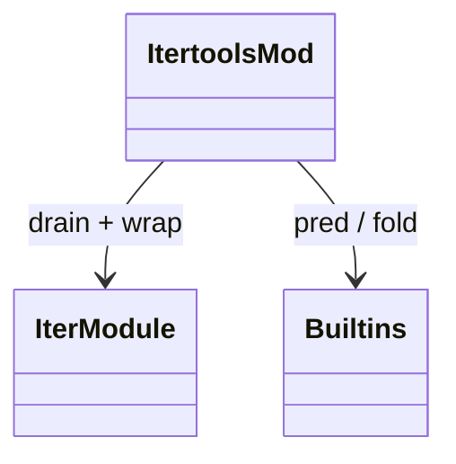
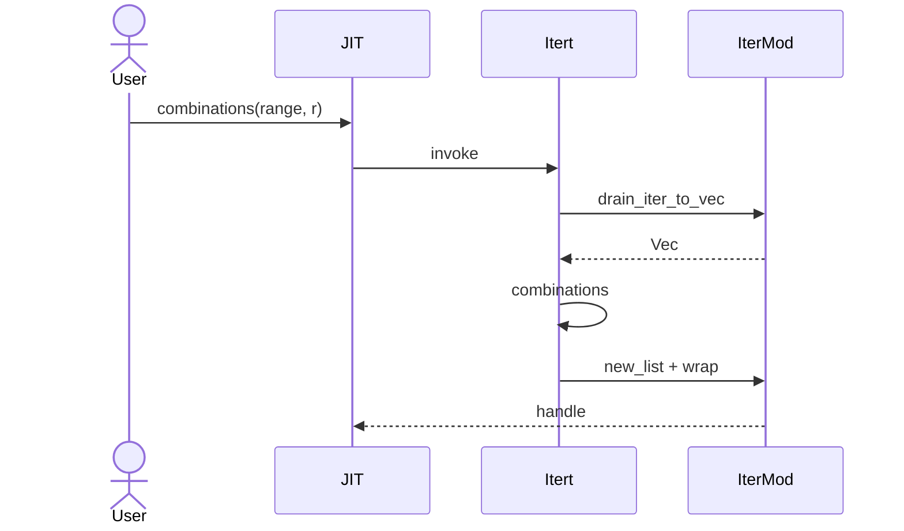
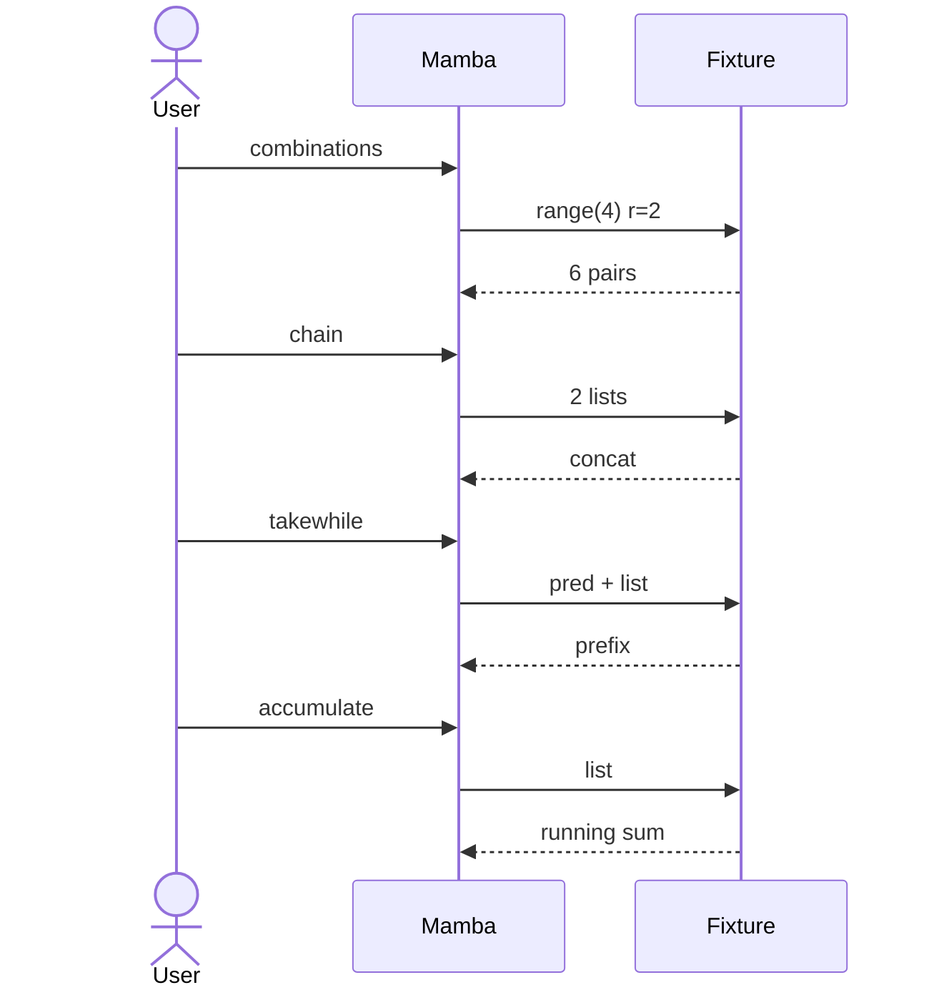

# stdlib `itertools`

Iterator combinators. Most entries take `iterable + ...` and return a
fresh iterator; the implementation drains the input(s) into Vec via
`runtime::iter::drain_iter_to_vec` (per `runtime/iter.md`), applies
the combinator, and returns a new `IterKind::List` over the result.

Three load-bearing invariants:

1. **Combinators eagerly drain input iterators today** — true lazy
   evaluation (à la CPython generator-style) is an open gap; current
   impl materializes into Vec first. Acceptable for correctness, not
   for memory bounds. Open issue: streaming generator chain so
   `itertools.count()` doesn't OOM.
2. **`product` is 2-arg today; CPython is varargs** — same gap for
   `chain`. Marked partial; multi-arg form is a follow-up.
3. **`accumulate` accepts optional binary fn** — default is `+`;
   `accumulate(iter, func)` form is the 2-arg variant.

## Type model
<!-- type: dependency lang: mermaid -->



## Function catalog
<!-- type: schema lang: yaml -->

```yaml
$schema: "https://json-schema.org/draft/2020-12/schema"
$id: "itertools-catalog"
$defs:
  StdlibFnEntry:
    type: object
    properties:
      python_name:    { type: string }
      mb_fn:          { type: string }
      arity:          { type: integer }
      kwargs:         { type: array, items: { type: string } }
      cpython_parity: { type: string, enum: [full, partial, gap] }
      notes:          { type: string }
    required: [python_name, mb_fn, arity, cpython_parity]
  ItertoolsCatalog:
    type: object
    properties:
      chains:
        type: array
        items: { $ref: "#/$defs/StdlibFnEntry" }
        examples:
          - - { python_name: "itertools.chain",        mb_fn: "mb_itertools_chain",          arity: 2, cpython_parity: partial, notes: "2-arg only today; CPython varargs" }
            - { python_name: "itertools.islice",       mb_fn: "mb_itertools_islice",         arity: 4, cpython_parity: full, notes: "(iter, start, stop, step)" }
            - { python_name: "itertools.repeat",       mb_fn: "mb_itertools_repeat",         arity: 2, cpython_parity: full, notes: "(val, n)" }
            - { python_name: "itertools.zip_longest",  mb_fn: "mb_itertools_zip_longest",    arity: 2, cpython_parity: partial, notes: "2-arg; fillvalue=None default" }
            - { python_name: "itertools.zip_longest",  mb_fn: "mb_itertools_zip_longest_fill", arity: 3, cpython_parity: partial, notes: "(a, b, fill); CPython varargs" }
      cartesian:
        type: array
        items: { $ref: "#/$defs/StdlibFnEntry" }
        examples:
          - - { python_name: "itertools.product",      mb_fn: "mb_itertools_product",        arity: 2, cpython_parity: partial, notes: "2-arg; CPython varargs + repeat=N kwarg" }
            - { python_name: "itertools.permutations", mb_fn: "mb_itertools_permutations",   arity: 2, cpython_parity: full, notes: "(iter, r)" }
            - { python_name: "itertools.combinations", mb_fn: "mb_itertools_combinations",   arity: 2, cpython_parity: full, notes: "(iter, r)" }
      filtering:
        type: array
        items: { $ref: "#/$defs/StdlibFnEntry" }
        examples:
          - - { python_name: "itertools.takewhile",     mb_fn: "mb_itertools_takewhile",     arity: 2, cpython_parity: full, notes: "(pred, iter); stop on first false" }
            - { python_name: "itertools.dropwhile",     mb_fn: "mb_itertools_dropwhile",     arity: 2, cpython_parity: full, notes: "(pred, iter); skip while true; emit rest" }
            - { python_name: "itertools.filterfalse",   mb_fn: "mb_itertools_filterfalse",   arity: 2, cpython_parity: full, notes: "(pred, iter); negation of filter" }
      reduction:
        type: array
        items: { $ref: "#/$defs/StdlibFnEntry" }
        examples:
          - - { python_name: "itertools.accumulate",      mb_fn: "mb_itertools_accumulate",      arity: 1, cpython_parity: partial, notes: "default + only" }
            - { python_name: "itertools.accumulate",      mb_fn: "mb_itertools_accumulate_func", arity: 2, cpython_parity: partial, notes: "(iter, func); initial=None gap" }
```

## Combinator dispatch logic

```mermaid
---
id: itertools-dispatch
entry: enter
nodes:
  enter:        { kind: start,    label: "itertools.X(args)" }
  drain:        { kind: process,  label: "drain_iter_to_vec on each iterable arg" }
  classify:     { kind: decision, label: "combinator family?" }
  do_chain:     { kind: process,  label: "concat input vecs" }
  do_islice:    { kind: process,  label: "slice with start/stop/step" }
  do_zip_long:  { kind: process,  label: "zip pairs; fill shorter" }
  do_product:   { kind: process,  label: "Cartesian product nested loops" }
  do_perm:      { kind: process,  label: "permutations of length r — recursive enumerate" }
  do_comb:      { kind: process,  label: "combinations of length r — index walk" }
  do_takewhile: { kind: process,  label: "scan; emit until pred false" }
  do_dropwhile: { kind: process,  label: "scan; skip while pred true; emit rest" }
  do_filter_f:  { kind: process,  label: "scan; emit when pred false" }
  do_accum:     { kind: process,  label: "left-fold with running result emitted" }
  do_repeat:    { kind: process,  label: "n copies of val" }
  alloc_list:   { kind: process,  label: "MbObject::new_list(result_vec); IterKind::List wrap" }
  done:         { kind: terminal, label: "return MbValue (iterator handle)" }
edges:
  - { from: enter,        to: drain }
  - { from: drain,        to: classify }
  - { from: classify,     to: do_chain,     label: "chain" }
  - { from: classify,     to: do_islice,    label: "islice" }
  - { from: classify,     to: do_zip_long,  label: "zip_longest" }
  - { from: classify,     to: do_product,   label: "product" }
  - { from: classify,     to: do_perm,      label: "permutations" }
  - { from: classify,     to: do_comb,      label: "combinations" }
  - { from: classify,     to: do_takewhile, label: "takewhile" }
  - { from: classify,     to: do_dropwhile, label: "dropwhile" }
  - { from: classify,     to: do_filter_f,  label: "filterfalse" }
  - { from: classify,     to: do_accum,     label: "accumulate" }
  - { from: classify,     to: do_repeat,    label: "repeat" }
  - { from: do_chain,     to: alloc_list }
  - { from: do_islice,    to: alloc_list }
  - { from: do_zip_long,  to: alloc_list }
  - { from: do_product,   to: alloc_list }
  - { from: do_perm,      to: alloc_list }
  - { from: do_comb,      to: alloc_list }
  - { from: do_takewhile, to: alloc_list }
  - { from: do_dropwhile, to: alloc_list }
  - { from: do_filter_f,  to: alloc_list }
  - { from: do_accum,     to: alloc_list }
  - { from: do_repeat,    to: alloc_list }
  - { from: alloc_list,   to: done }
---
flowchart TD
    enter([itertools.X]) --> drain[drain_iter_to_vec]
    drain --> classify{family?}
    classify -->|chain| do_chain[concat]
    classify -->|islice| do_islice[slice]
    classify -->|zip_longest| do_zip_long[fill shorter]
    classify -->|product| do_product[Cartesian]
    classify -->|permutations| do_perm[length r]
    classify -->|combinations| do_comb[index walk]
    classify -->|takewhile| do_takewhile[until false]
    classify -->|dropwhile| do_dropwhile[skip then emit]
    classify -->|filterfalse| do_filter_f[neg of filter]
    classify -->|accumulate| do_accum[left-fold + emit]
    classify -->|repeat| do_repeat[n copies]
    do_chain --> alloc_list[new_list + IterKind::List]
    do_islice --> alloc_list
    do_zip_long --> alloc_list
    do_product --> alloc_list
    do_perm --> alloc_list
    do_comb --> alloc_list
    do_takewhile --> alloc_list
    do_dropwhile --> alloc_list
    do_filter_f --> alloc_list
    do_accum --> alloc_list
    do_repeat --> alloc_list
    alloc_list --> done([iter handle])
```

<!-- type: logic lang: mermaid -->



## Drain + emit interaction
<!-- type: interaction lang: mermaid -->



## Acceptance scenarios
<!-- type: overview lang: markdown -->



## Tests
<!-- type: tests lang: yaml -->

```yaml
runner: "cargo test -p mamba --test conformance_tests --release -- {name} --test-threads=1"
fixtures:
  - id: itertools_chain
    name: "stdlib/itertools_chain.py"
    paired: "stdlib/itertools_chain.expected"
  - id: itertools_combinations
    name: "stdlib/itertools_combinations.py"
    paired: "stdlib/itertools_combinations.expected"
  - id: itertools_permutations
    name: "stdlib/itertools_permutations.py"
    paired: "stdlib/itertools_permutations.expected"
  - id: itertools_product
    name: "stdlib/itertools_product.py"
    paired: "stdlib/itertools_product.expected"
  - id: itertools_takewhile_dropwhile
    name: "stdlib/itertools_takewhile_dropwhile.py"
    paired: "stdlib/itertools_takewhile_dropwhile.expected"
  - id: itertools_accumulate
    name: "stdlib/itertools_accumulate.py"
    paired: "stdlib/itertools_accumulate.expected"
  - id: itertools_zip_longest
    name: "stdlib/itertools_zip_longest.py"
    paired: "stdlib/itertools_zip_longest.expected"
  - id: itertools_islice
    name: "stdlib/itertools_islice.py"
    paired: "stdlib/itertools_islice.expected"
  - id: itertools_repeat
    name: "stdlib/itertools_repeat.py"
    paired: "stdlib/itertools_repeat.expected"
```

## Changes
<!-- type: changes lang: yaml -->

```yaml
changes:
  - file: crates/mamba/src/runtime/stdlib/itertools_mod.rs
    action: modify
    impl_mode: hand-written
    description: "13 combinators over runtime::iter::drain_iter_to_vec → operate → IterKind::List wrap. Hand-written; eager-drain semantics is open gap (CPython is lazy). Phase-1 codegen target — catalog above is direct input."
```
