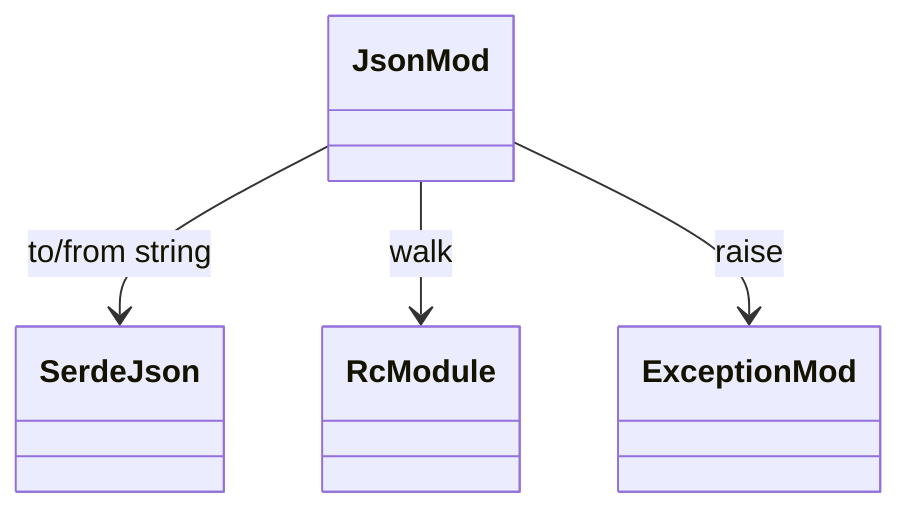
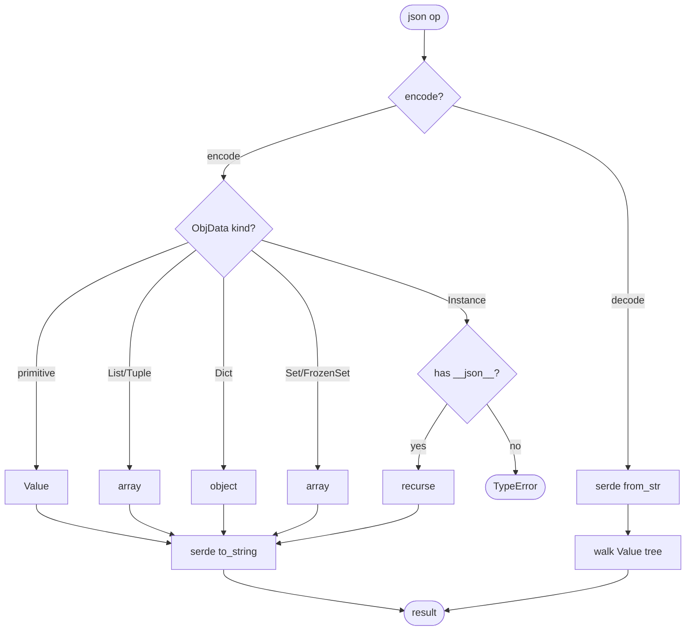
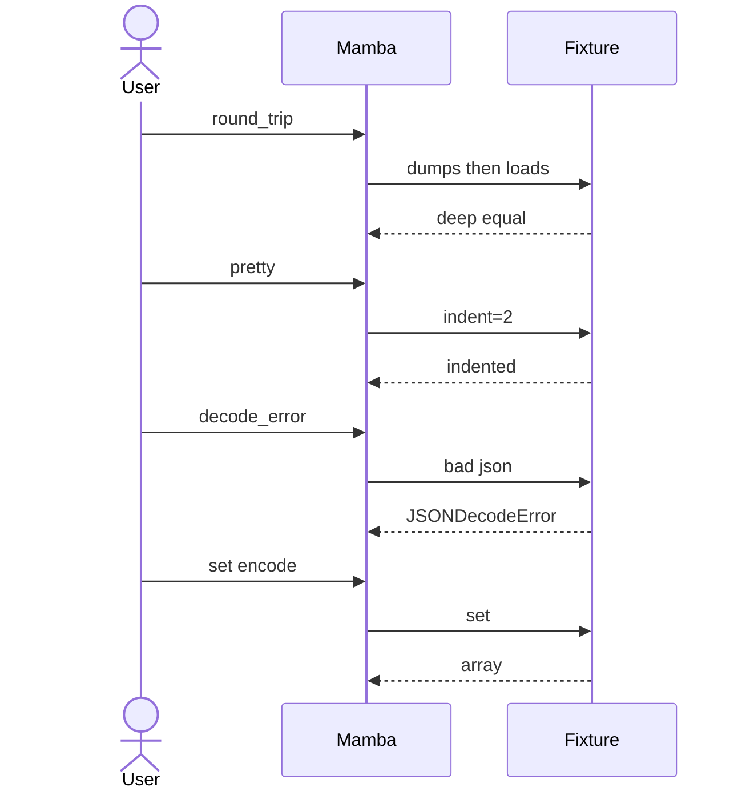

# stdlib `json`

Round-trip JSON between Python values and string. Three entry points
exist on the Python side (`json.dumps`, `json.loads`, `json.dumps(obj, indent=N)`);
each maps to one `mb_json_*` function over `serde_json` under the hood.

Three load-bearing invariants:

1. **`mb_json_dumps` walks ObjData; raises TypeError on Instance**
   without `__json__` dunder — set / frozenset are converted to list,
   tuple to list (CPython parity), dict keys must be str/int/bool/None
   (non-hashable raises).
2. **`mb_json_loads` produces nested ObjData** — JSON object → Dict
   with str keys; JSON array → List; numbers are Int when whole, else
   Float (matches CPython int-vs-float promotion rules).
3. **JSONDecodeError inherits ValueError** — matches CPython
   hierarchy. Raised on parse failure with line + column info from
   serde_json's error position.

## Type model
<!-- type: dependency lang: mermaid -->



## Function catalog
<!-- type: schema lang: yaml -->

```yaml
$schema: "https://json-schema.org/draft/2020-12/schema"
$id: "json-catalog"
$defs:
  StdlibFnEntry:
    type: object
    properties:
      python_name:    { type: string }
      mb_fn:          { type: string }
      arity:          { type: integer }
      kwargs:         { type: array, items: { type: string } }
      cpython_parity: { type: string, enum: [full, partial, gap] }
      raises:         { type: array, items: { type: string } }
      notes:          { type: string }
    required: [python_name, mb_fn, arity, cpython_parity]
  JsonCatalog:
    type: array
    items: { $ref: "#/$defs/StdlibFnEntry" }
    examples:
      - - { python_name: "json.dumps",        mb_fn: "mb_json_dumps",         arity: 1, cpython_parity: partial, raises: [TypeError], notes: "no kwargs (default, sort_keys, separators) yet" }
        - { python_name: "json.dumps",        mb_fn: "mb_json_dumps_pretty",  arity: 2, kwargs: [indent], cpython_parity: partial, notes: "(obj, indent=N) form only" }
        - { python_name: "json.loads",        mb_fn: "mb_json_loads",         arity: 1, cpython_parity: partial, raises: [JSONDecodeError], notes: "no kwargs (parse_int, object_hook, etc.)" }
        - { python_name: "json.JSONDecodeError", mb_fn: "(class)",            arity: -1, cpython_parity: full, notes: "subclass of ValueError; carries .msg, .doc, .pos, .lineno, .colno" }
```

## Encode + decode logic
<!-- type: logic lang: mermaid -->



## Acceptance scenarios
<!-- type: overview lang: markdown -->



## Tests
<!-- type: tests lang: yaml -->

```yaml
runner: "cargo test -p mamba --test conformance_tests --release -- {name} --test-threads=1"
fixtures:
  - id: json_round_trip
    name: "stdlib/json_round_trip.py"
    paired: "stdlib/json_round_trip.expected"
  - id: json_pretty
    name: "stdlib/json_pretty.py"
    paired: "stdlib/json_pretty.expected"
  - id: json_decode_error
    name: "stdlib/json_decode_error.py"
    paired: "stdlib/json_decode_error.expected"
  - id: json_unicode
    name: "stdlib/json_unicode.py"
    paired: "stdlib/json_unicode.expected"
    verifies: ["non-ASCII strings round-trip"]
  - id: json_nested
    name: "stdlib/json_nested.py"
    paired: "stdlib/json_nested.expected"
    verifies: ["deeply nested dicts and lists round-trip"]
```

## Changes
<!-- type: changes lang: yaml -->

```yaml
changes:
  - file: crates/mamba/src/runtime/stdlib/json_mod.rs
    action: modify
    impl_mode: hand-written
    description: "json.dumps / loads / dumps_pretty over serde_json. Hand-written; encode walk + decode build are mechanical translations between ObjData ↔ serde_json::Value. Phase-1 codegen target with stdlib-fn schema + a recursive walker."
```
