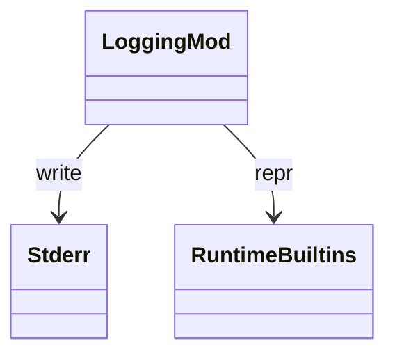

# stdlib `logging`

Module-level convenience functions (`debug` / `info` / `warning` /
`error` / `critical`) writing formatted messages to stderr. Logger
instance / handler / formatter classes are gaps; today only the
top-level functions are wired.

Three load-bearing invariants:

1. **Level is module-global** — `logging.basicConfig(level=N)` is
   gap; current impl filters at WARNING+ by default. Set via
   `logging.set_level` (Mamba-specific) once it lands.
2. **Output goes to stderr** — bypasses `print` capture. Test
   harness can intercept by redirecting stderr.
3. **No log records / handlers / filters** — these object-oriented
   abstractions are not implemented. Top-level functions just
   format-and-eprintln directly.

## Type model
<!-- type: dependency lang: mermaid -->



## Function catalog
<!-- type: schema lang: yaml -->

```yaml
$schema: "https://json-schema.org/draft/2020-12/schema"
$id: "logging-catalog"
$defs:
  StdlibFnEntry:
    type: object
    properties:
      python_name:    { type: string }
      mb_fn:          { type: string }
      arity:          { type: integer }
      cpython_parity: { type: string, enum: [full, partial, gap] }
      notes:          { type: string }
    required: [python_name, mb_fn, arity, cpython_parity]
  LoggingCatalog:
    type: array
    items: { $ref: "#/$defs/StdlibFnEntry" }
    examples:
      - - { python_name: "logging.debug",    mb_fn: "mb_logging_debug",    arity: 1, cpython_parity: partial, notes: "no args formatting / extra kwargs" }
        - { python_name: "logging.info",     mb_fn: "mb_logging_info",     arity: 1, cpython_parity: partial }
        - { python_name: "logging.warning",  mb_fn: "mb_logging_warning",  arity: 1, cpython_parity: partial }
        - { python_name: "logging.error",    mb_fn: "mb_logging_error",    arity: 1, cpython_parity: partial }
        - { python_name: "logging.critical", mb_fn: "mb_logging_critical", arity: 1, cpython_parity: partial }
        - { python_name: "logging.getLogger / Logger / Handler / Formatter / Filter / basicConfig", mb_fn: "(gap)", arity: -1, cpython_parity: gap }
```

## Tests
<!-- type: tests lang: yaml -->

```yaml
runner: "cargo test -p mamba --test conformance_tests --release -- {name} --test-threads=1"
fixtures:
  - id: logging_levels
    name: "stdlib/logging_levels.py"
    paired: "stdlib/logging_levels.expected"
```

## Changes
<!-- type: changes lang: yaml -->

```yaml
changes:
  - file: crates/mamba/src/runtime/stdlib/logging_mod.rs
    action: modify
    impl_mode: hand-written
    description: "Top-level fns to stderr; OO Logger / Handler / Formatter / Filter classes are gaps."
```
