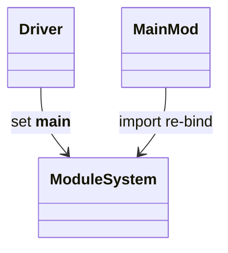

# stdlib `__main__`

Per Python convention, `__main__` is the module the interpreter starts
in when running a script. `if __name__ == '__main__':` is the
conventional entry-point guard. Mamba sets the running script's
module name to `__main__` in `runtime::module::CURRENT_MODULE_PACKAGE`
during driver-level execution (per `driver/compiler-driver.md`).

Three load-bearing invariants:

1. **The entry script's `__name__` is `"__main__"`** — anywhere else
   it's the dotted module path. Conditional execution
   `if __name__ == "__main__":` works as in CPython.
2. **`__main__` is the module Mamba's REPL writes into** — every
   REPL cell appends to the same `__main__` namespace (per
   `driver/repl.md`).
3. **`import __main__` re-binds to the running module** — does not
   re-execute; just exposes the existing namespace as a module.

## Type model
<!-- type: dependency lang: mermaid -->



## Function catalog
<!-- type: schema lang: yaml -->

```yaml
$schema: "https://json-schema.org/draft/2020-12/schema"
$id: "main-catalog"
$defs:
  MainCatalog:
    type: object
    properties:
      __name__:       { type: string, const: "__main__" }
      special_attrs:
        type: array
        items: { type: string }
        examples:
          - [__file__, __doc__, __package__, __loader__, __spec__]
        description: "subset of CPython attrs; many gap"
```

## Tests
<!-- type: tests lang: yaml -->

```yaml
runner: "cargo test -p mamba --test conformance_tests --release -- {name} --test-threads=1"
fixtures:
  - id: name_main_guard
    name: "stdlib/name_main_guard.py"
    paired: "stdlib/name_main_guard.expected"
    verifies: ["if __name__ == '__main__' branches correctly when run as script vs imported"]
```

## Changes
<!-- type: changes lang: yaml -->

```yaml
changes:
  - file: crates/mamba/src/runtime/stdlib/main_mod.rs
    action: modify
    impl_mode: hand-written
    description: "__main__ module wiring. Hand-written; depends on driver-level CURRENT_MODULE_PACKAGE setup."
```
