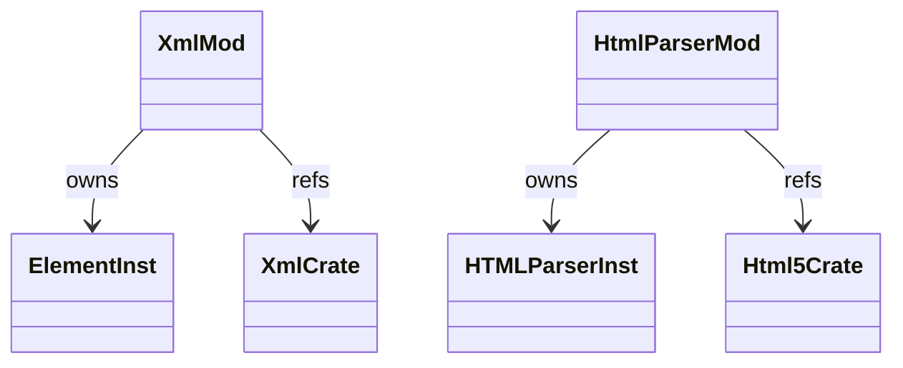

# stdlib `xml` + `html`

Markup parsing. `xml.etree.ElementTree` and `html.parser.HTMLParser`
subsets. Both very partial — full DOM-like API is gap.

Three load-bearing invariants:

1. **`ElementTree.fromstring(s)` returns an Element Instance** with
   `class_name = "xml.etree.ElementTree.Element"` carrying tag /
   attrib / text / children fields.
2. **`HTMLParser` is a subclassable Instance** — users define
   `handle_starttag`, `handle_endtag`, `handle_data` methods;
   `feed(data)` invokes them. Subclass dispatch via `runtime/class.md`.
3. **No XML namespace handling today** — `xmlns:` attributes parsed
   but not resolved. Open gap.

## Type model
<!-- type: dependency lang: mermaid -->



## Function catalog
<!-- type: schema lang: yaml -->

```yaml
$schema: "https://json-schema.org/draft/2020-12/schema"
$id: "markup-catalog"
$defs:
  StdlibFnEntry:
    type: object
    properties:
      python_name:    { type: string }
      mb_fn:          { type: string }
      arity:          { type: integer }
      cpython_parity: { type: string, enum: [full, partial, gap] }
      notes:          { type: string }
    required: [python_name, mb_fn, arity, cpython_parity]
  MarkupCatalog:
    type: array
    items: { $ref: "#/$defs/StdlibFnEntry" }
    examples:
      - - { python_name: "xml.etree.ElementTree.fromstring", mb_fn: "mb_xml_fromstring",  arity: 1, cpython_parity: partial, notes: "no namespace resolution" }
        - { python_name: "Element.tag / attrib / text",       mb_fn: "(field access)",     arity: 1, cpython_parity: partial }
        - { python_name: "Element.find / findall / iter",     mb_fn: "(gap)",              arity: -1, cpython_parity: gap }
        - { python_name: "ElementTree.tostring",              mb_fn: "(gap)",              arity: -1, cpython_parity: gap }
        - { python_name: "html.parser.HTMLParser",            mb_fn: "mb_html_parser_new", arity: 0, cpython_parity: partial, notes: "feed + handle_starttag / handle_endtag / handle_data" }
        - { python_name: "html.escape / unescape",            mb_fn: "(gap)",              arity: -1, cpython_parity: gap }
```

## Tests
<!-- type: tests lang: yaml -->

```yaml
runner: "cargo test -p mamba --test conformance_tests --release -- {name} --test-threads=1"
fixtures:
  - id: xml_basic
    name: "stdlib/xml_basic.py"
    paired: "stdlib/xml_basic.expected"
    verifies: ["fromstring + tag/attrib/text"]
  - id: html_parser_basic
    name: "stdlib/html_parser_basic.py"
    paired: "stdlib/html_parser_basic.expected"
    verifies: ["subclass HTMLParser; feed; handle_starttag/handle_data invoked"]
```

## Changes
<!-- type: changes lang: yaml -->

```yaml
changes:
  - file: crates/mamba/src/runtime/stdlib/xml_mod.rs
    action: modify
    impl_mode: hand-written
  - file: crates/mamba/src/runtime/stdlib/html_parser_mod.rs
    action: modify
    impl_mode: hand-written
```
