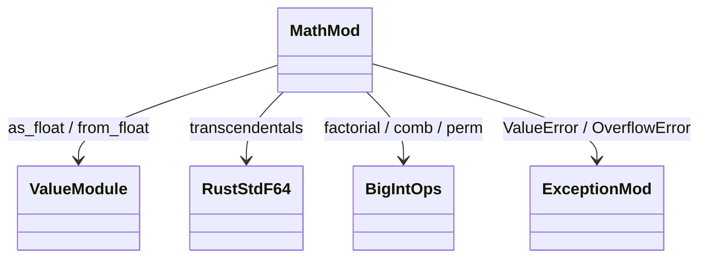
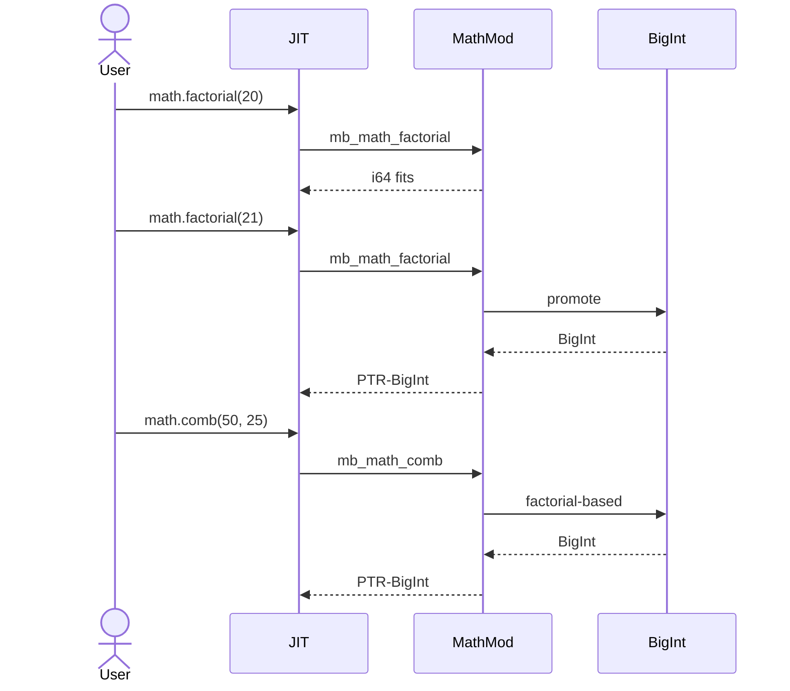
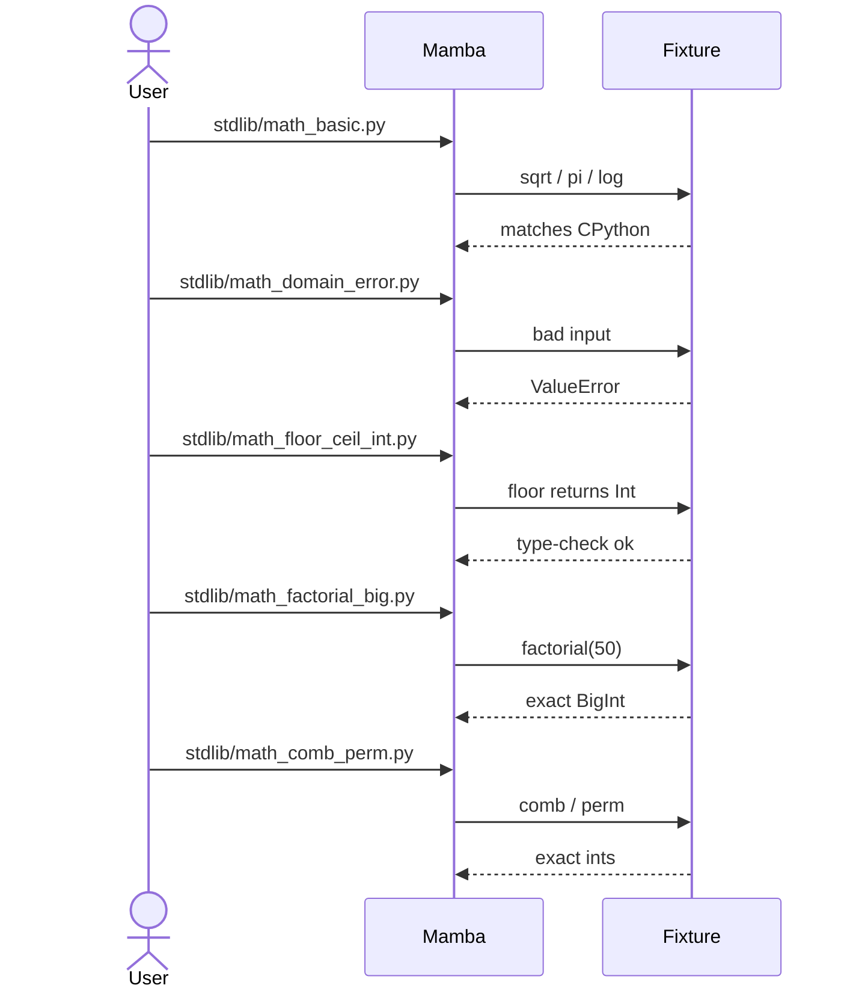

# stdlib `math`

Pure-numeric stdlib module — 36 entries, all of them mechanical
"Python doc → Rust delegation" via the underlying `f64` /
`num_bigint::BigInt` operations. This is the **densest stdlib module
that's also closest to codegen-friendly shape** — third litmus per
msg-6 Phase 1.

Three load-bearing invariants:

1. **Domain errors raise `ValueError`, range errors raise
   `OverflowError`** — mirrors CPython. `sqrt(-1)`, `log(0)`,
   `acos(2)` each pick the right exception. Naive `f64::nan` /
   `f64::infinity` returns would silently produce garbage results
   downstream; explicit raise is the contract.
2. **Integer-arg fast paths produce integer results** — `floor` /
   `ceil` / `trunc` / `gcd` / `lcm` / `comb` / `perm` / `factorial`
   return `Ty::Int`, NOT `Ty::Float`. CPython parity requires this
   and stdlib type-check fixtures depend on it.
3. **`math.factorial`, `math.comb`, `math.perm` promote to BigInt**
   — `factorial(20)` overflows `i64`; result must be heap BigInt
   (per `runtime/bigint.md`). Same for combinatorial inputs > 20.

## Type model
<!-- type: dependency lang: mermaid -->



## Function catalog
<!-- type: schema lang: yaml -->

```yaml
$schema: "https://json-schema.org/draft/2020-12/schema"
$id: "math-catalog"
$defs:
  StdlibFnEntry:
    type: object
    properties:
      python_name:    { type: string }
      mb_fn:          { type: string }
      arity:          { type: integer }
      kwargs:         { type: array, items: { type: string } }
      delegates_to:   { type: string, description: "Rust f64 method or BigInt path" }
      cpython_parity: { type: string, enum: [full, partial, gap] }
      result_ty:      { type: string, enum: [Float, Int, Bool, BigInt-or-Int] }
      raises:         { type: array, items: { type: string }, description: "ValueError / OverflowError" }
      notes:          { type: string }
    required: [python_name, mb_fn, arity, cpython_parity, result_ty]
  MathCatalog:
    type: object
    properties:
      basic:
        type: array
        items: { $ref: "#/$defs/StdlibFnEntry" }
        examples:
          - - { python_name: "math.sqrt",    mb_fn: "mb_math_sqrt",    arity: 1, delegates_to: "f64::sqrt",    result_ty: Float, raises: [ValueError], cpython_parity: full, notes: "ValueError on negative input" }
            - { python_name: "math.fabs",    mb_fn: "mb_math_fabs",    arity: 1, delegates_to: "f64::abs",     result_ty: Float, cpython_parity: full }
            - { python_name: "math.exp",     mb_fn: "mb_math_exp",     arity: 1, delegates_to: "f64::exp",     result_ty: Float, raises: [OverflowError], cpython_parity: full }
            - { python_name: "math.log",     mb_fn: "mb_math_log",     arity: 1, delegates_to: "f64::ln",      result_ty: Float, raises: [ValueError], cpython_parity: full, notes: "log(x) ≡ ln(x) for 1-arg form" }
            - { python_name: "math.log",     mb_fn: "mb_math_log_base", arity: 2, delegates_to: "f64::log",    result_ty: Float, raises: [ValueError], cpython_parity: full, notes: "2-arg form math.log(x, base)" }
            - { python_name: "math.log2",    mb_fn: "mb_math_log2",    arity: 1, delegates_to: "f64::log2",    result_ty: Float, raises: [ValueError], cpython_parity: full }
            - { python_name: "math.log10",   mb_fn: "mb_math_log10",   arity: 1, delegates_to: "f64::log10",   result_ty: Float, raises: [ValueError], cpython_parity: full }
            - { python_name: "math.pow",     mb_fn: "mb_math_pow",     arity: 2, delegates_to: "f64::powf",    result_ty: Float, cpython_parity: full }
      rounding:
        type: array
        items: { $ref: "#/$defs/StdlibFnEntry" }
        examples:
          - - { python_name: "math.floor",   mb_fn: "mb_math_floor",   arity: 1, delegates_to: "f64::floor (then to Int)", result_ty: Int, cpython_parity: full }
            - { python_name: "math.ceil",    mb_fn: "mb_math_ceil",    arity: 1, delegates_to: "f64::ceil (then to Int)",  result_ty: Int, cpython_parity: full }
            - { python_name: "math.trunc",   mb_fn: "mb_math_trunc",   arity: 1, delegates_to: "f64::trunc (then to Int)", result_ty: Int, cpython_parity: full }
            - { python_name: "math.copysign", mb_fn: "mb_math_copysign", arity: 2, delegates_to: "f64::copysign", result_ty: Float, cpython_parity: full }
            - { python_name: "math.fmod",    mb_fn: "mb_math_fmod",    arity: 2, delegates_to: "f64::rem (C fmod)", result_ty: Float, cpython_parity: full, notes: "C fmod, not Python % (truncation, not floor)" }
      trig:
        type: array
        items: { $ref: "#/$defs/StdlibFnEntry" }
        examples:
          - - { python_name: "math.sin",     mb_fn: "mb_math_sin",     arity: 1, delegates_to: "f64::sin",     result_ty: Float, cpython_parity: full }
            - { python_name: "math.cos",     mb_fn: "mb_math_cos",     arity: 1, delegates_to: "f64::cos",     result_ty: Float, cpython_parity: full }
            - { python_name: "math.tan",     mb_fn: "mb_math_tan",     arity: 1, delegates_to: "f64::tan",     result_ty: Float, cpython_parity: full }
            - { python_name: "math.asin",    mb_fn: "mb_math_asin",    arity: 1, delegates_to: "f64::asin",    result_ty: Float, raises: [ValueError], cpython_parity: full, notes: "domain [-1, 1]" }
            - { python_name: "math.acos",    mb_fn: "mb_math_acos",    arity: 1, delegates_to: "f64::acos",    result_ty: Float, raises: [ValueError], cpython_parity: full, notes: "domain [-1, 1]" }
            - { python_name: "math.atan",    mb_fn: "mb_math_atan",    arity: 1, delegates_to: "f64::atan",    result_ty: Float, cpython_parity: full }
            - { python_name: "math.atan2",   mb_fn: "mb_math_atan2",   arity: 2, delegates_to: "f64::atan2",   result_ty: Float, cpython_parity: full }
            - { python_name: "math.sinh",    mb_fn: "mb_math_sinh",    arity: 1, delegates_to: "f64::sinh",    result_ty: Float, cpython_parity: full }
            - { python_name: "math.cosh",    mb_fn: "mb_math_cosh",    arity: 1, delegates_to: "f64::cosh",    result_ty: Float, cpython_parity: full }
            - { python_name: "math.degrees", mb_fn: "mb_math_degrees", arity: 1, delegates_to: "f64 mul",      result_ty: Float, cpython_parity: full }
            - { python_name: "math.radians", mb_fn: "mb_math_radians", arity: 1, delegates_to: "f64 mul",      result_ty: Float, cpython_parity: full }
      geometry:
        type: array
        items: { $ref: "#/$defs/StdlibFnEntry" }
        examples:
          - - { python_name: "math.hypot", mb_fn: "mb_math_hypot", arity: 2, delegates_to: "f64::hypot", result_ty: Float, cpython_parity: partial, notes: "2-arg only today; CPython 3.8+ accepts varargs" }
      combinatorial:
        type: array
        items: { $ref: "#/$defs/StdlibFnEntry" }
        examples:
          - - { python_name: "math.gcd",       mb_fn: "mb_math_gcd",       arity: 2, delegates_to: "Euclidean i64",                 result_ty: Int,             cpython_parity: partial, notes: "2-arg only today; CPython 3.9+ accepts varargs" }
            - { python_name: "math.lcm",       mb_fn: "mb_math_lcm",       arity: 2, delegates_to: "i64 via gcd",                   result_ty: Int,             cpython_parity: partial, notes: "2-arg only" }
            - { python_name: "math.factorial", mb_fn: "mb_math_factorial", arity: 1, delegates_to: "iterative; BigInt promote",     result_ty: BigInt-or-Int,   raises: [ValueError], cpython_parity: full, notes: "ValueError on negative; BigInt for n >= 21" }
            - { python_name: "math.comb",      mb_fn: "mb_math_comb",      arity: 2, delegates_to: "factorial-based via BigInt",    result_ty: BigInt-or-Int,   raises: [ValueError], cpython_parity: full }
            - { python_name: "math.perm",      mb_fn: "mb_math_perm",      arity: 2, delegates_to: "factorial-based via BigInt",    result_ty: BigInt-or-Int,   raises: [ValueError], cpython_parity: full }
      constants:
        type: array
        items:
          type: object
          properties:
            python_name: { type: string }
            value:       { type: string }
          required: [python_name, value]
        examples:
          - - { python_name: "math.pi",  value: "std::f64::consts::PI" }
            - { python_name: "math.e",   value: "std::f64::consts::E" }
            - { python_name: "math.tau", value: "std::f64::consts::TAU" }
            - { python_name: "math.inf", value: "f64::INFINITY" }
            - { python_name: "math.nan", value: "f64::NAN" }
```

## Domain / range error logic
<!-- type: logic lang: mermaid -->

```mermaid
---
id: math-error-dispatch
entry: enter
nodes:
  enter:        { kind: start,    label: "math.X(args)" }
  domain_check: { kind: decision, label: "domain valid? (sqrt: x >= 0; log: x > 0; acos/asin: -1 <= x <= 1; factorial: x >= 0)" }
  raise_value:  { kind: process,  label: "mb_raise(ValueError, 'math domain error')" }
  do_compute:   { kind: process,  label: "delegate to f64 / BigInt op" }
  range_check:  { kind: decision, label: "result is f64::INFINITY or NaN AND CPython would have raised?" }
  raise_overflow: { kind: process, label: "mb_raise(OverflowError, 'math range error')" }
  is_int_result:{ kind: decision, label: "result type should be Int (floor / ceil / trunc / gcd / etc.)?" }
  to_int:       { kind: process,  label: "f64::round_to_int OR BigInt promote per result_ty" }
  done:         { kind: terminal, label: "return MbValue (Float / Int / BigInt)" }
edges:
  - { from: enter,         to: domain_check }
  - { from: domain_check,  to: raise_value,    label: "no" }
  - { from: domain_check,  to: do_compute,     label: "yes" }
  - { from: do_compute,    to: range_check }
  - { from: range_check,   to: raise_overflow, label: "yes (overflow / inf where CPython raises)" }
  - { from: range_check,   to: is_int_result,  label: "no" }
  - { from: is_int_result, to: to_int,         label: "yes" }
  - { from: is_int_result, to: done,           label: "no — Float result" }
  - { from: to_int,        to: done }
  - { from: raise_value,   to: done }
  - { from: raise_overflow, to: done }
---
flowchart TD
    enter([math.X args]) --> domain_check{domain ok?}
    domain_check -->|no| raise_value[ValueError]
    domain_check -->|yes| do_compute[delegate]
    do_compute --> range_check{overflow / NaN raise?}
    range_check -->|yes| raise_overflow[OverflowError]
    range_check -->|no| is_int_result{int result?}
    is_int_result -->|yes| to_int[round to Int / BigInt promote]
    is_int_result -->|no| done([Float])
    to_int --> done
    raise_value --> done
    raise_overflow --> done
```

## Combinatorial promotion interaction
<!-- type: interaction lang: mermaid -->



## Acceptance scenarios
<!-- type: overview lang: markdown -->



## Tests
<!-- type: tests lang: yaml -->

```yaml
runner: "cargo test -p mamba --test conformance_tests --release -- {name} --test-threads=1"
fixtures:
  - id: math_basic
    name: "stdlib/math_basic.py"
    paired: "stdlib/math_basic.expected"
    verifies: ["sqrt / fabs / pi / e / tau / log / log2 / log10 / exp / pow"]
  - id: math_trig
    name: "stdlib/math_trig.py"
    paired: "stdlib/math_trig.expected"
    verifies: ["sin / cos / tan / asin / acos / atan / atan2 / sinh / cosh / degrees / radians"]
  - id: math_domain_error
    name: "stdlib/math_domain_error.py"
    paired: "stdlib/math_domain_error.expected"
    verifies: ["sqrt(-1) / log(0) / acos(2) raise ValueError"]
  - id: math_floor_ceil_int
    name: "stdlib/math_floor_ceil_int.py"
    paired: "stdlib/math_floor_ceil_int.expected"
    verifies: ["floor / ceil / trunc return Int (not Float)"]
  - id: math_factorial_big
    name: "stdlib/math_factorial_big.py"
    paired: "stdlib/math_factorial_big.expected"
    verifies: ["factorial(50) exact BigInt; factorial(-1) raises"]
  - id: math_comb_perm
    name: "stdlib/math_comb_perm.py"
    paired: "stdlib/math_comb_perm.expected"
    verifies: ["comb / perm exact via BigInt-promoted intermediate"]
  - id: math_gcd_lcm
    name: "stdlib/math_gcd_lcm.py"
    paired: "stdlib/math_gcd_lcm.expected"
    verifies: ["gcd(12, 18) = 6; lcm(4, 6) = 12 (2-arg form today)"]
```

## Changes
<!-- type: changes lang: yaml -->

```yaml
changes:
  - file: crates/mamba/src/runtime/stdlib/math_mod.rs
    action: modify
    impl_mode: hand-written
    description: "36 mb_math_* shims over Rust f64 std + BigInt for combinatorials. Hand-written; this is the most codegen-friendly stdlib module — Phase 1 codegen target. The catalog above is direct codegen input shape."
```
