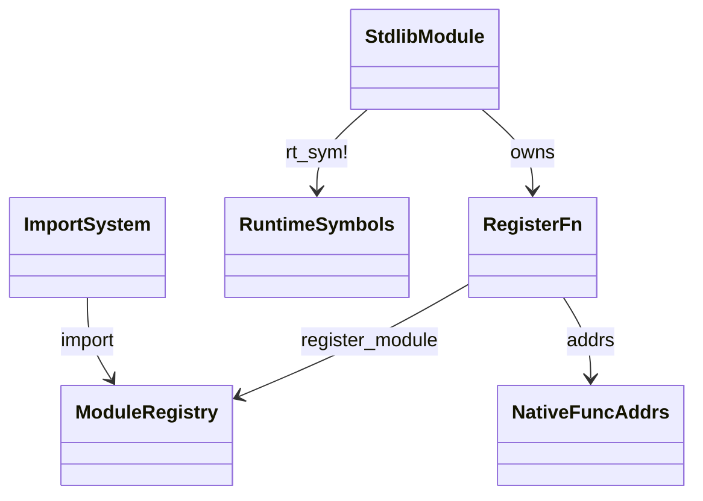
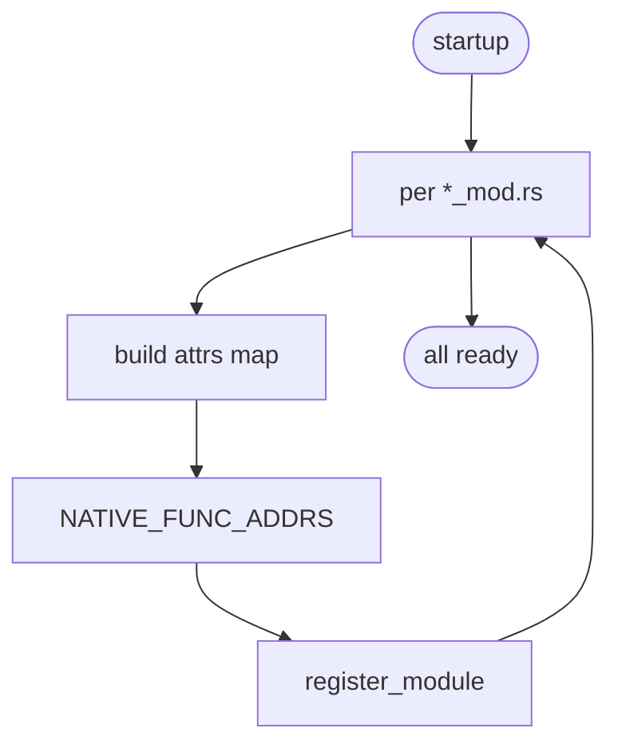

# stdlib native-implementations architecture

Cross-cutting spec describing how the ~97 stdlib modules in
`runtime/stdlib/*_mod.rs` plug into the runtime. Common pattern:

1. Each module exposes a `pub fn register()` that builds a
   `HashMap<String, MbValue>` of attrs (function pointers as
   FUNC-tagged MbValue, or class Instances) and calls
   `super::register_module(name, attrs)` to add to `MODULES`.
2. Each `mb_*` function uses either an `extern "C" fn` ABI for
   native dispatch (per `runtime/symbols.md` + `runtime/module.md`
   `NATIVE_FUNC_ADDRS`) or a `pub fn(args) -> MbValue` form callable
   via the `runtime_symbols.rs` registration table.
3. Per-module `register()` is called once at startup from
   `runtime::module::mb_register_native_modules`.

Three load-bearing invariants:

1. **Native module attrs are bound at startup, not first import** —
   the module appears in `MODULES` immediately; first `import X`
   just retrieves the cached `MbModule`.
2. **Function pointer + class Instance attrs are equivalent** — the
   user-side experience (`math.sin(x)`, `re.compile(p)`,
   `collections.deque()`) is the same whether the attr is a callable
   FUNC tag or a class Instance with `__call__`.
3. **`extern "C" fn dispatch_X` wrappers go through `mb_call_spread`
   ABI** — required for callable-as-value patterns
   (`f = math.sin; f(x)`). Pure `pub fn` symbols would not be
   reach via `mb_call_spread` and break alias support.

## Type model
<!-- type: dependency lang: mermaid -->



## Module-registration shape
<!-- type: schema lang: yaml -->

```yaml
$schema: "https://json-schema.org/draft/2020-12/schema"
$id: "native-impl-types"
$defs:
  ModuleRegistration:
    description: "Pattern every *_mod.rs follows"
    type: object
    properties:
      module_name:    { type: string, description: "Python-visible name (e.g. math, re, collections)" }
      attrs_built_in: { type: array, items: { type: string }, description: "list of attr names" }
      register_called_from: { type: string, const: "runtime::module::mb_register_native_modules" }
      rt_sym_entries: { type: array, items: { type: string }, description: "names in rt_sym! catalog" }
      native_dispatch_wrappers:
        type: array
        items: { type: string }
        description: "extern C fn dispatch_X for mb_call_spread compatibility"
    required: [module_name, attrs_built_in, register_called_from]
```

## Registration logic
<!-- type: logic lang: mermaid -->



## Tests
<!-- type: tests lang: yaml -->

```yaml
runner: "cargo test -p mamba --test runtime_tests --release -- {name} --test-threads=1"
fixtures:
  - id: native_module_import
    name: "test_native_module_import_succeeds"
    description: "every registered native module is importable; attrs callable"
  - id: native_alias_callable
    name: "test_native_alias_callable"
    description: "f = math.sin; f(x) works (extern C ABI)"
```

## Changes
<!-- type: changes lang: yaml -->

```yaml
changes:
  - file: crates/mamba/src/runtime/stdlib
    action: modify
    impl_mode: hand-written
    description: "Cross-cutting registration pattern across ~97 stdlib *_mod.rs files. Hand-written; the register() + extern C dispatch pattern is the contract — adding a new stdlib module = a new file following the pattern + entry in mb_register_native_modules."
```
