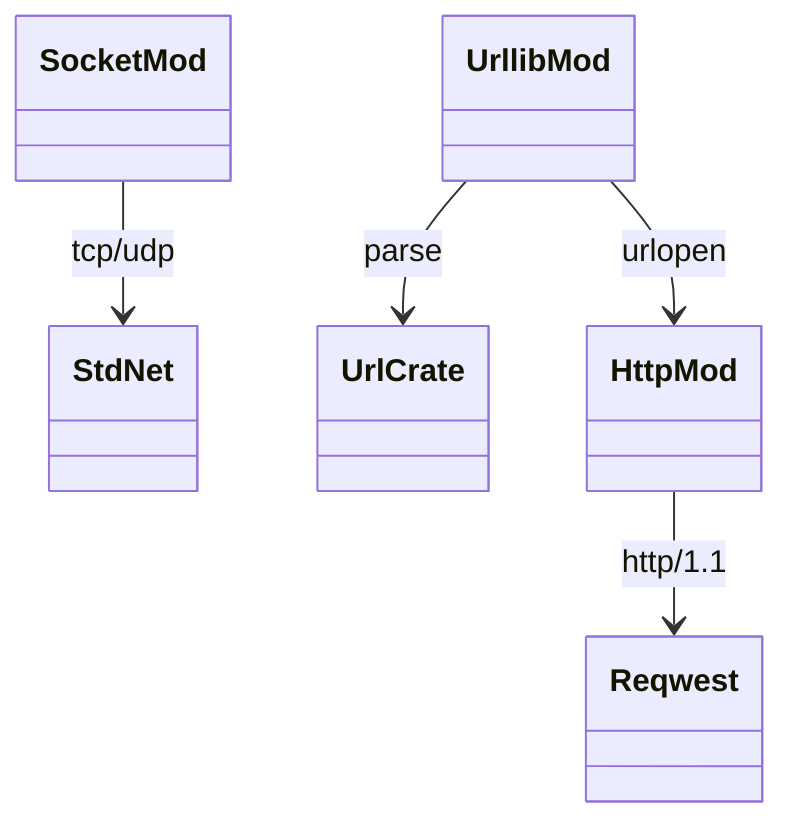

# stdlib `socket` + `http` + `urllib`

Network primitives. Three layers:

- `socket` — TCP / UDP sockets via `std::net`
- `http` — `http.client` HTTP/1.1 client
- `urllib` — `urllib.request.urlopen` (HTTP only) + `urllib.parse`
  URL helpers

All synchronous / blocking today; async equivalents go through
`asyncio` per `runtime/async.md`.

Three load-bearing invariants:

1. **`socket.socket()` returns an Instance** with `_inner` field
   holding the `std::net::TcpStream` / `UdpSocket`.
2. **HTTP client is HTTP/1.1 only** — HTTP/2 / HTTP/3 / TLS via
   rustls are gaps.
3. **URL parsing follows WHATWG-shaped rules but uses `url` crate** —
   `urllib.parse.urlparse` returns a 6-tuple per CPython
   `(scheme, netloc, path, params, query, fragment)`.

## Type model
<!-- type: dependency lang: mermaid -->



## Function catalog
<!-- type: schema lang: yaml -->

```yaml
$schema: "https://json-schema.org/draft/2020-12/schema"
$id: "network-catalog"
$defs:
  StdlibFnEntry:
    type: object
    properties:
      python_name:    { type: string }
      mb_fn:          { type: string }
      arity:          { type: integer }
      cpython_parity: { type: string, enum: [full, partial, gap] }
      notes:          { type: string }
    required: [python_name, mb_fn, arity, cpython_parity]
  NetworkCatalog:
    type: array
    items: { $ref: "#/$defs/StdlibFnEntry" }
    examples:
      - - { python_name: "socket.socket",                mb_fn: "mb_socket_socket",          arity: -1, cpython_parity: partial, notes: "AF_INET / SOCK_STREAM defaults" }
        - { python_name: "socket.connect / send / recv / close", mb_fn: "(method)",          arity: -1, cpython_parity: partial }
        - { python_name: "http.client.HTTPConnection",    mb_fn: "mb_http_connection",        arity: 1, cpython_parity: partial, notes: "no TLS" }
        - { python_name: "http.client.HTTPResponse",       mb_fn: "(returned)",                arity: -1, cpython_parity: partial }
        - { python_name: "urllib.request.urlopen",        mb_fn: "mb_urllib_urlopen",         arity: 1, cpython_parity: partial }
        - { python_name: "urllib.parse.urlparse",         mb_fn: "mb_urllib_urlparse",        arity: 1, cpython_parity: full }
        - { python_name: "urllib.parse.urlencode",        mb_fn: "mb_urllib_urlencode",       arity: 1, cpython_parity: full }
        - { python_name: "ssl module / TLS / asyncio sockets", mb_fn: "(gap)", arity: -1, cpython_parity: gap }
```

## Tests
<!-- type: tests lang: yaml -->

```yaml
runner: "cargo test -p mamba --test conformance_tests --release -- {name} --test-threads=1"
fixtures:
  - id: socket_tcp_round_trip
    name: "stdlib/socket_tcp_round_trip.py"
    paired: "stdlib/socket_tcp_round_trip.expected"
    verifies: ["loopback TCP echo via std::net (mocked / sandboxed)"]
  - id: urlparse_round_trip
    name: "stdlib/urlparse_round_trip.py"
    paired: "stdlib/urlparse_round_trip.expected"
```

## Changes
<!-- type: changes lang: yaml -->

```yaml
changes:
  - file: crates/mamba/src/runtime/stdlib/socket_mod.rs
    action: modify
    impl_mode: hand-written
  - file: crates/mamba/src/runtime/stdlib/http_mod.rs
    action: modify
    impl_mode: hand-written
  - file: crates/mamba/src/runtime/stdlib/urllib_mod.rs
    action: modify
    impl_mode: hand-written
```
