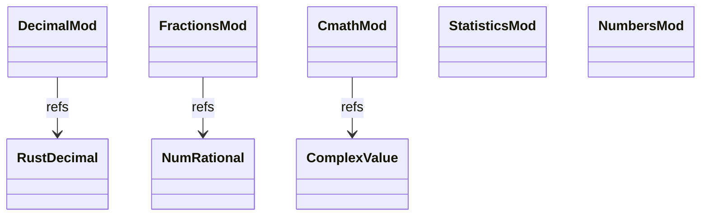

# stdlib numeric — decimal + fractions + cmath + statistics + numbers

Five numeric-helper modules. `Decimal` (arbitrary-precision base-10
arithmetic) and `Fraction` (rational numbers) are Instance wrappers
over Rust crates (`rust_decimal`, `num-rational`). `cmath` is
complex-number trig / log. `statistics` covers mean / median / etc.
`numbers` is the abstract numeric tower (`Number` / `Real` / `Rational`)
— mostly stub.

Three load-bearing invariants:

1. **`Decimal('0.1') + Decimal('0.2') == Decimal('0.3')` exactly** —
   no float rounding. The contract that distinguishes Decimal from
   float.
2. **`Fraction` reduces to lowest terms** — `Fraction(2, 4)` ==
   `Fraction(1, 2)`. GCD-reduction at construction.
3. **`cmath` accepts complex inputs** — operating on `ObjData::Complex(real, imag)`
   pairs; trig over complex plane.

## Type model
<!-- type: dependency lang: mermaid -->



## Function catalog
<!-- type: schema lang: yaml -->

```yaml
$schema: "https://json-schema.org/draft/2020-12/schema"
$id: "numeric-catalog"
$defs:
  StdlibFnEntry:
    type: object
    properties:
      python_name:    { type: string }
      mb_fn:          { type: string }
      arity:          { type: integer }
      cpython_parity: { type: string, enum: [full, partial, gap] }
      notes:          { type: string }
    required: [python_name, mb_fn, arity, cpython_parity]
  NumericCatalog:
    type: array
    items: { $ref: "#/$defs/StdlibFnEntry" }
    examples:
      - - { python_name: "decimal.Decimal",       mb_fn: "mb_decimal_new",      arity: 1, cpython_parity: partial, notes: "string / int input" }
        - { python_name: "Decimal arithmetic",     mb_fn: "(via class methods)", arity: 2, cpython_parity: partial, notes: "+/-/*/// exact base-10" }
        - { python_name: "decimal.getcontext",     mb_fn: "(gap)",               arity: 0, cpython_parity: gap }
        - { python_name: "fractions.Fraction",     mb_fn: "mb_fraction_new",     arity: 2, cpython_parity: partial }
        - { python_name: "Fraction.numerator / denominator", mb_fn: "(field)",   arity: 1, cpython_parity: full }
        - { python_name: "cmath.sqrt / sin / cos / log / etc.", mb_fn: "mb_cmath_X", arity: 1, cpython_parity: partial }
        - { python_name: "statistics.mean / median / mode / stdev / variance", mb_fn: "mb_statistics_X", arity: 1, cpython_parity: partial }
        - { python_name: "numbers.Number / Real / Rational / Integral", mb_fn: "(stub abstract base)", arity: 0, cpython_parity: gap }
```

## Tests
<!-- type: tests lang: yaml -->

```yaml
runner: "cargo test -p mamba --test conformance_tests --release -- {name} --test-threads=1"
fixtures:
  - id: decimal_exact
    name: "stdlib/decimal_exact.py"
    paired: "stdlib/decimal_exact.expected"
    verifies: ["Decimal('0.1') + Decimal('0.2') == Decimal('0.3')"]
  - id: fraction_reduce
    name: "stdlib/fraction_reduce.py"
    paired: "stdlib/fraction_reduce.expected"
  - id: cmath_basic
    name: "stdlib/cmath_basic.py"
    paired: "stdlib/cmath_basic.expected"
  - id: statistics_basic
    name: "stdlib/statistics_basic.py"
    paired: "stdlib/statistics_basic.expected"
```

## Changes
<!-- type: changes lang: yaml -->

```yaml
changes:
  - file: crates/mamba/src/runtime/stdlib/decimal_mod.rs
    action: modify
    impl_mode: hand-written
  - file: crates/mamba/src/runtime/stdlib/fractions_mod.rs
    action: modify
    impl_mode: hand-written
  - file: crates/mamba/src/runtime/stdlib/cmath_mod.rs
    action: modify
    impl_mode: hand-written
  - file: crates/mamba/src/runtime/stdlib/statistics_mod.rs
    action: modify
    impl_mode: hand-written
  - file: crates/mamba/src/runtime/stdlib/numbers_mod.rs
    action: modify
    impl_mode: hand-written
    description: "Stub abstract base classes."
```
