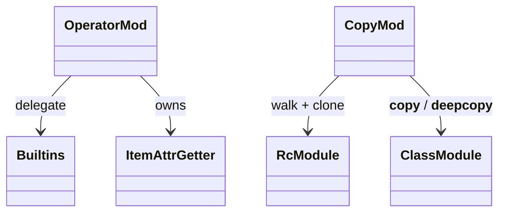
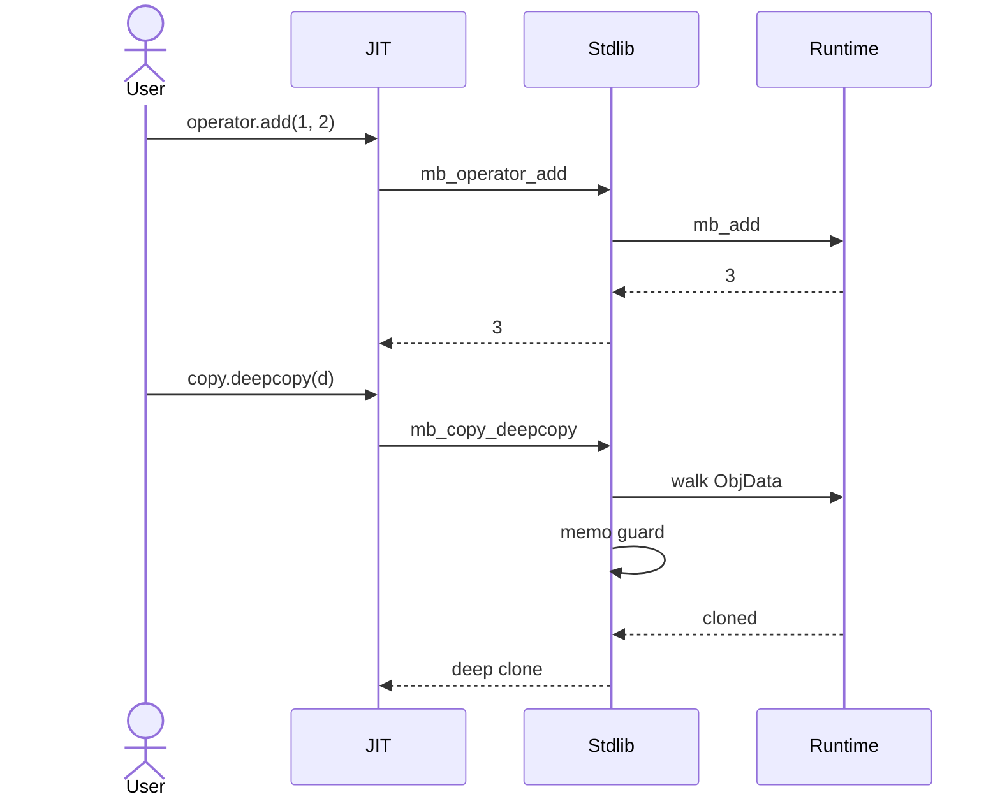
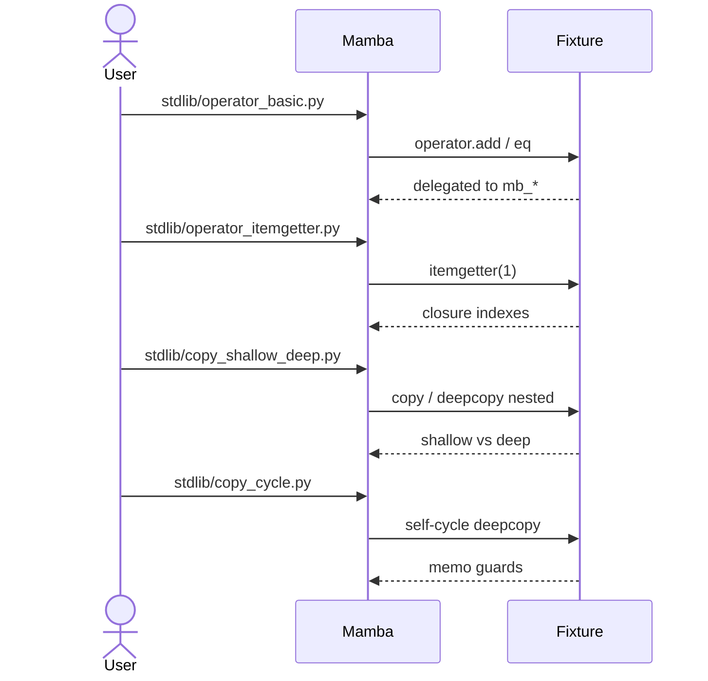

# stdlib `operator` + `copy`

Two stdlib modules co-located in this spec because their wiring shape
is symmetrical: each Python-visible function is a thin shim over the
existing runtime intrinsics (per `runtime/builtins.md` and
`runtime/value-and-rc.md`). `operator.add(a, b)` ≡ `mb_add(a, b)` etc.,
and `copy.copy(obj)` walks the heap object via the rc layer to produce
a shallow / deep clone.

This is the **first stdlib litmus** for codegen-friendliness —
every `operator.X` is a pure delegation to `mb_X`, structured as a
catalog rather than handwritten branches. If a future
`stdlib-fn` section type lands (per msg-6 Phase 1), this catalog is
its first input.

Three load-bearing invariants:

1. **`operator.X` is a 1:1 alias to `mb_X`** — every entry in the
   catalog is a one-line forward to a runtime intrinsic. Adding a new
   `operator.X` should be a single catalog row, not a new branch in
   any dispatcher.
2. **`copy.copy` is shallow; `copy.deepcopy` walks recursively** —
   shallow shares interior `MbValue` references; deep allocates fresh
   per nested ObjData. The recursion respects `__copy__` /
   `__deepcopy__` dunders if defined on user instances.
3. **Cycle detection in deepcopy uses an ID map** — same as CPython's
   `memo` parameter. A self-referential dict/list/instance won't
   infinite-loop; the second visit returns the already-cloned handle.

## Type model
<!-- type: dependency lang: mermaid -->



## Function catalog
<!-- type: schema lang: yaml -->

```yaml
$schema: "https://json-schema.org/draft/2020-12/schema"
$id: "operator-copy-catalog"
$defs:
  StdlibFnEntry:
    description: "Catalog row — input shape for future stdlib-fn section type"
    type: object
    properties:
      python_name:   { type: string, description: "fully-qualified Python name (operator.add)" }
      mb_fn:         { type: string, description: "wired to mb_* runtime intrinsic or local mb_<module>_<fn>" }
      arity:         { type: integer, minimum: 0 }
      kwargs:        { type: array, items: { type: string }, description: "supported kwargs (typically empty for operator)" }
      delegates_to:  { type: string, description: "if simple delegation: target mb_* fn" }
      cpython_doc:   { type: string, description: "https://docs.python.org/3.13/library/<module>.html#<anchor>" }
      cpython_parity: { type: string, enum: [full, partial, gap] }
    required: [python_name, mb_fn, arity, cpython_parity]
  OperatorCatalog:
    type: object
    properties:
      arithmetic:
        type: array
        items: { $ref: "#/$defs/StdlibFnEntry" }
        examples:
          - - { python_name: "operator.add",      mb_fn: "mb_operator_add",      arity: 2, delegates_to: "mb_add",      cpython_parity: full }
            - { python_name: "operator.sub",      mb_fn: "mb_operator_sub",      arity: 2, delegates_to: "mb_sub",      cpython_parity: full }
            - { python_name: "operator.mul",      mb_fn: "mb_operator_mul",      arity: 2, delegates_to: "mb_mul",      cpython_parity: full }
            - { python_name: "operator.truediv",  mb_fn: "mb_operator_truediv",  arity: 2, delegates_to: "mb_truediv",  cpython_parity: full }
            - { python_name: "operator.floordiv", mb_fn: "mb_operator_floordiv", arity: 2, delegates_to: "mb_floordiv", cpython_parity: full }
            - { python_name: "operator.mod",      mb_fn: "mb_operator_mod",      arity: 2, delegates_to: "mb_mod",      cpython_parity: full }
            - { python_name: "operator.pow",      mb_fn: "mb_operator_pow",      arity: 2, delegates_to: "mb_pow",      cpython_parity: full }
            - { python_name: "operator.neg",      mb_fn: "mb_operator_neg",      arity: 1, delegates_to: "mb_neg",      cpython_parity: full }
            - { python_name: "operator.abs",      mb_fn: "mb_operator_abs",      arity: 1, delegates_to: "mb_abs",      cpython_parity: full }
            - { python_name: "operator.not_",     mb_fn: "mb_operator_not",      arity: 1, delegates_to: "mb_not",      cpython_parity: full }
      comparison:
        type: array
        items: { $ref: "#/$defs/StdlibFnEntry" }
        examples:
          - - { python_name: "operator.eq", mb_fn: "mb_operator_eq", arity: 2, delegates_to: "mb_eq", cpython_parity: full }
            - { python_name: "operator.ne", mb_fn: "mb_operator_ne", arity: 2, delegates_to: "mb_ne", cpython_parity: full }
            - { python_name: "operator.lt", mb_fn: "mb_operator_lt", arity: 2, delegates_to: "mb_lt", cpython_parity: full }
            - { python_name: "operator.le", mb_fn: "mb_operator_le", arity: 2, delegates_to: "mb_le", cpython_parity: full }
            - { python_name: "operator.gt", mb_fn: "mb_operator_gt", arity: 2, delegates_to: "mb_gt", cpython_parity: full }
            - { python_name: "operator.ge", mb_fn: "mb_operator_ge", arity: 2, delegates_to: "mb_ge", cpython_parity: full }
      higher_order:
        type: array
        items: { $ref: "#/$defs/StdlibFnEntry" }
        examples:
          - - { python_name: "operator.itemgetter",   mb_fn: "mb_operator_itemgetter",   arity: 1,  delegates_to: "(closure)",      cpython_parity: full,    description: "itemgetter(k)(obj) → obj[k]" }
            - { python_name: "operator.attrgetter",   mb_fn: "mb_operator_attrgetter",   arity: 1,  delegates_to: "(closure)",      cpython_parity: full,    description: "attrgetter('a.b.c')(obj) → obj.a.b.c (dotted walk)" }
            - { python_name: "operator.methodcaller", mb_fn: "mb_operator_methodcaller", arity: -1, delegates_to: "(closure)",      cpython_parity: partial, description: "methodcaller name args kw obj — kwargs partial today" }
  CopyCatalog:
    type: object
    properties:
      copy_fns:
        type: array
        items: { $ref: "#/$defs/StdlibFnEntry" }
        examples:
          - - { python_name: "copy.copy",     mb_fn: "mb_copy_copy",     arity: 1, delegates_to: "(rc walk)",          cpython_parity: full, description: "shallow — share interior MbValue refs" }
            - { python_name: "copy.deepcopy", mb_fn: "mb_copy_deepcopy", arity: 2, delegates_to: "(recursive + memo)", cpython_parity: full, description: "deep — fresh ObjData per nested; memo dict for cycles" }
```

## copy / deepcopy dispatch logic
<!-- type: logic lang: mermaid -->

```mermaid
---
id: copy-dispatch
entry: enter
nodes:
  enter:        { kind: start,    label: "mb_copy_copy(obj) | mb_copy_deepcopy(obj, memo)" }
  is_primitive: { kind: decision, label: "obj is INT / FLOAT / BOOL / NONE / STR (immutable)?" }
  return_same:  { kind: terminal, label: "primitives are reference-counted aliases; return as-is" }
  is_instance:  { kind: decision, label: "obj is Instance with __copy__ / __deepcopy__ ?" }
  call_dunder:  { kind: process,  label: "dispatch __copy__(self) or __deepcopy__(self, memo)" }
  is_deep:      { kind: decision, label: "deepcopy mode?" }
  is_memo_hit:  { kind: decision, label: "memo[id(obj)] exists?" }
  return_memo:  { kind: terminal, label: "return cached deep copy (cycle short-circuit)" }
  walk_data:    { kind: process,  label: "match ObjData: List/Tuple/Dict/Set/Instance — alloc fresh ObjData" }
  recurse_each: { kind: process,  label: "for each interior MbValue: recurse mb_copy_deepcopy(v, memo)" }
  memo_insert:  { kind: process,  label: "memo[id(orig)] = new before recursion (cycle protect)" }
  shallow_alloc:{ kind: process,  label: "copy: alloc fresh container; share interior MbValue (retain)" }
  done:         { kind: terminal, label: "return new MbValue" }
edges:
  - { from: enter,        to: is_primitive }
  - { from: is_primitive, to: return_same,   label: "yes" }
  - { from: is_primitive, to: is_instance,   label: "no" }
  - { from: is_instance,  to: call_dunder,   label: "yes" }
  - { from: is_instance,  to: is_deep,       label: "no" }
  - { from: is_deep,      to: is_memo_hit,   label: "deepcopy" }
  - { from: is_deep,      to: shallow_alloc, label: "copy" }
  - { from: is_memo_hit,  to: return_memo,   label: "yes" }
  - { from: is_memo_hit,  to: memo_insert,   label: "no" }
  - { from: memo_insert,  to: walk_data }
  - { from: walk_data,    to: recurse_each }
  - { from: recurse_each, to: done }
  - { from: shallow_alloc, to: done }
  - { from: call_dunder,  to: done }
---
flowchart TD
    enter([copy / deepcopy]) --> is_primitive{primitive?}
    is_primitive -->|yes| return_same([return as-is])
    is_primitive -->|no| is_instance{__copy__ / __deepcopy__?}
    is_instance -->|yes| call_dunder[dispatch dunder]
    is_instance -->|no| is_deep{deepcopy?}
    is_deep -->|deepcopy| is_memo_hit{memo hit?}
    is_deep -->|copy| shallow_alloc[fresh container; retain interior]
    is_memo_hit -->|yes| return_memo([cached])
    is_memo_hit -->|no| memo_insert[memo insert pre-recursion]
    memo_insert --> walk_data[fresh ObjData per kind]
    walk_data --> recurse_each[recurse interior]
    recurse_each --> done([new MbValue])
    shallow_alloc --> done
    call_dunder --> done
```

## operator + copy interaction
<!-- type: interaction lang: mermaid -->



## Acceptance scenarios
<!-- type: overview lang: markdown -->



## Tests
<!-- type: tests lang: yaml -->

```yaml
runner: "cargo test -p mamba --test conformance_tests --release -- {name} --test-threads=1"
fixtures:
  - id: operator_basic
    name: "stdlib/operator_basic.py"
    paired: "stdlib/operator_basic.expected"
    verifies: ["operator.add / sub / mul / div / mod / pow / neg / abs / not"]
  - id: operator_compare
    name: "stdlib/operator_compare.py"
    paired: "stdlib/operator_compare.expected"
    verifies: ["operator.eq / ne / lt / le / gt / ge"]
  - id: operator_itemgetter
    name: "stdlib/operator_itemgetter.py"
    paired: "stdlib/operator_itemgetter.expected"
    verifies: ["itemgetter(k) and itemgetter(k1, k2) — multi-key tuple"]
  - id: operator_attrgetter
    name: "stdlib/operator_attrgetter.py"
    paired: "stdlib/operator_attrgetter.expected"
    verifies: ["attrgetter('a.b.c') dotted walk"]
  - id: copy_shallow_deep
    name: "stdlib/copy_shallow_deep.py"
    paired: "stdlib/copy_shallow_deep.expected"
    verifies: ["copy.copy shares interior; copy.deepcopy clones nested"]
  - id: copy_cycle
    name: "stdlib/copy_cycle.py"
    paired: "stdlib/copy_cycle.expected"
    verifies: ["self-cycle deepcopy via memo dict; no infinite loop"]
  - id: copy_user_dunder
    name: "stdlib/copy_user_dunder.py"
    paired: "stdlib/copy_user_dunder.expected"
    verifies: ["__copy__ / __deepcopy__ dunders dispatched on Instance"]
```

## Changes
<!-- type: changes lang: yaml -->

```yaml
changes:
  - file: crates/mamba/src/runtime/stdlib/operator_mod.rs
    action: modify
    impl_mode: hand-written
    description: "operator catalog — ~25 thin shims delegating to runtime intrinsics; itemgetter / attrgetter / methodcaller closures. Hand-written; should be Phase-1 codegen target (msg-6) once stdlib-fn section type lands."
  - file: crates/mamba/src/runtime/stdlib/copy_mod.rs
    action: modify
    impl_mode: hand-written
    description: "mb_copy_copy + mb_copy_deepcopy with memo cycle guard; __copy__ / __deepcopy__ dunder dispatch. Hand-written; copy is more algorithmic than operator (recursion + memo) so may stay hand-written or codegen with hot-path DSL (Phase 4)."
```
