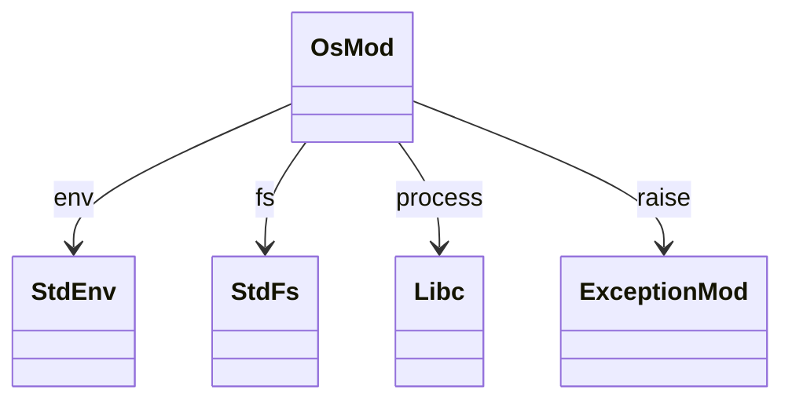
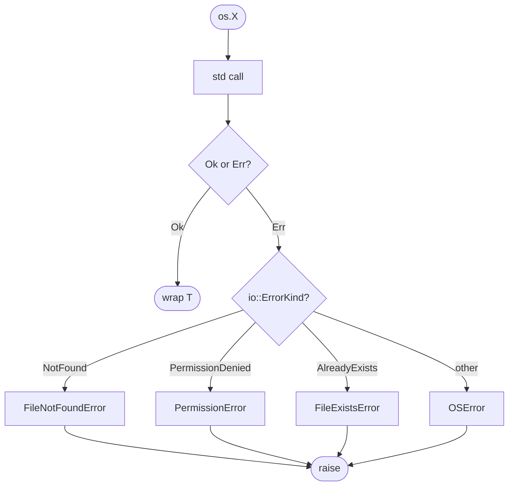
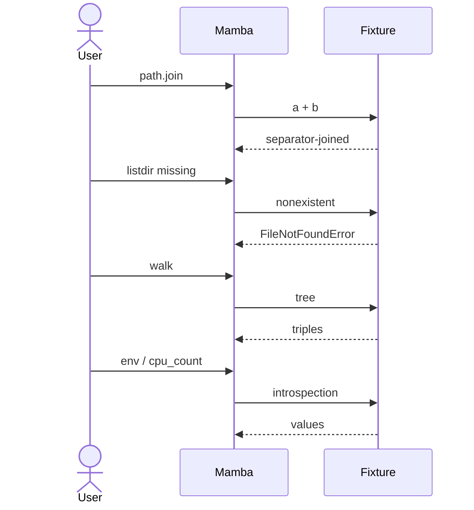

# stdlib `os`

Process / environment / filesystem operations. 22 entries delegating
to `std::env`, `std::fs`, and `libc` calls. Three groups: process
introspection (`getcwd` / `getpid` / `getenv` / `cpu_count`),
filesystem operations (`mkdir` / `remove` / `rename` / `listdir` /
`walk`), and `os.path` sub-namespace (`join` / `exists` / `isfile` /
`basename` / `dirname` / etc.).

Three load-bearing invariants:

1. **`os.path.X` lives in `os_mod` flat namespace** — Python's
   `os.path` is presented as attribute access on the `os` module;
   Mamba flattens to `mb_os_path_join` / `mb_os_path_exists` etc.
   The import system stitches `os.path.X` lookups back to these.
2. **All filesystem errors raise `OSError` subclasses** — file
   not found → `FileNotFoundError`; permission → `PermissionError`;
   etc. Per `runtime/exception.md` MRO chain.
3. **`os.walk` is eager today; CPython is generator-style** — open
   gap; current impl materializes the full walk into a List of
   `(dirpath, dirnames, filenames)` tuples before returning.

## Type model
<!-- type: dependency lang: mermaid -->



## Function catalog
<!-- type: schema lang: yaml -->

```yaml
$schema: "https://json-schema.org/draft/2020-12/schema"
$id: "os-catalog"
$defs:
  StdlibFnEntry:
    type: object
    properties:
      python_name:    { type: string }
      mb_fn:          { type: string }
      arity:          { type: integer }
      cpython_parity: { type: string, enum: [full, partial, gap] }
      raises:         { type: array, items: { type: string } }
      notes:          { type: string }
    required: [python_name, mb_fn, arity, cpython_parity]
  OsCatalog:
    type: object
    properties:
      process:
        type: array
        items: { $ref: "#/$defs/StdlibFnEntry" }
        examples:
          - - { python_name: "os.getcwd",     mb_fn: "mb_os_getcwd",     arity: 0, cpython_parity: full }
            - { python_name: "os.getpid",     mb_fn: "mb_os_getpid",     arity: 0, cpython_parity: full }
            - { python_name: "os.cpu_count",  mb_fn: "mb_os_cpu_count",  arity: 0, cpython_parity: full }
            - { python_name: "os.getenv",     mb_fn: "mb_os_getenv",     arity: 2, cpython_parity: full,    notes: "(key, default=None)" }
      filesystem:
        type: array
        items: { $ref: "#/$defs/StdlibFnEntry" }
        examples:
          - - { python_name: "os.listdir",   mb_fn: "mb_os_listdir",   arity: 1, raises: [FileNotFoundError], cpython_parity: full }
            - { python_name: "os.mkdir",     mb_fn: "mb_os_mkdir",     arity: 1, raises: [FileExistsError, FileNotFoundError], cpython_parity: full }
            - { python_name: "os.makedirs",  mb_fn: "mb_os_makedirs",  arity: 1, cpython_parity: partial, notes: "no exist_ok kwarg yet" }
            - { python_name: "os.remove",    mb_fn: "mb_os_remove",    arity: 1, raises: [FileNotFoundError, PermissionError], cpython_parity: full }
            - { python_name: "os.rmdir",     mb_fn: "mb_os_rmdir",     arity: 1, cpython_parity: full }
            - { python_name: "os.rename",    mb_fn: "mb_os_rename",    arity: 2, cpython_parity: full }
            - { python_name: "os.walk",      mb_fn: "mb_os_walk",      arity: 1, cpython_parity: partial, notes: "eager today; CPython generator-style" }
      path:
        type: array
        items: { $ref: "#/$defs/StdlibFnEntry" }
        examples:
          - - { python_name: "os.path.join",       mb_fn: "mb_os_path_join",       arity: 2, cpython_parity: partial, notes: "2-arg only; varargs gap" }
            - { python_name: "os.path.exists",     mb_fn: "mb_os_path_exists",     arity: 1, cpython_parity: full }
            - { python_name: "os.path.isfile",     mb_fn: "mb_os_path_isfile",     arity: 1, cpython_parity: full }
            - { python_name: "os.path.isdir",     mb_fn: "mb_os_path_isdir",      arity: 1, cpython_parity: full }
            - { python_name: "os.path.basename",   mb_fn: "mb_os_path_basename",   arity: 1, cpython_parity: full }
            - { python_name: "os.path.dirname",    mb_fn: "mb_os_path_dirname",    arity: 1, cpython_parity: full }
            - { python_name: "os.path.abspath",    mb_fn: "mb_os_path_abspath",    arity: 1, cpython_parity: full }
            - { python_name: "os.path.split",      mb_fn: "mb_os_path_split",      arity: 1, cpython_parity: full }
            - { python_name: "os.path.splitext",   mb_fn: "mb_os_path_splitext",   arity: 1, cpython_parity: full }
            - { python_name: "os.path.expanduser", mb_fn: "mb_os_path_expanduser", arity: 1, cpython_parity: full,    notes: "~ → $HOME" }
            - { python_name: "os.path.getsize",    mb_fn: "mb_os_path_getsize",    arity: 1, raises: [OSError], cpython_parity: full }
```

## Error mapping logic
<!-- type: logic lang: mermaid -->



## Acceptance scenarios
<!-- type: overview lang: markdown -->



## Tests
<!-- type: tests lang: yaml -->

```yaml
runner: "cargo test -p mamba --test conformance_tests --release -- {name} --test-threads=1"
fixtures:
  - id: os_path_basic
    name: "stdlib/os_path_basic.py"
    paired: "stdlib/os_path_basic.expected"
  - id: os_listdir
    name: "stdlib/os_listdir.py"
    paired: "stdlib/os_listdir.expected"
  - id: os_walk
    name: "stdlib/os_walk.py"
    paired: "stdlib/os_walk.expected"
  - id: os_env
    name: "stdlib/os_env.py"
    paired: "stdlib/os_env.expected"
  - id: os_error_mapping
    name: "stdlib/os_error_mapping.py"
    paired: "stdlib/os_error_mapping.expected"
    verifies: ["FileNotFoundError / PermissionError / FileExistsError mapped from io::ErrorKind"]
```

## Changes
<!-- type: changes lang: yaml -->

```yaml
changes:
  - file: crates/mamba/src/runtime/stdlib/os_mod.rs
    action: modify
    impl_mode: hand-written
    description: "22 entries: process introspection + filesystem ops + os.path sub-namespace. Hand-written; io::ErrorKind → OSError-subclass mapping is the contract. Phase-1 codegen target — every entry is a 1-row catalog → mechanical wrapper, with the error mapping shared via a helper."
```
