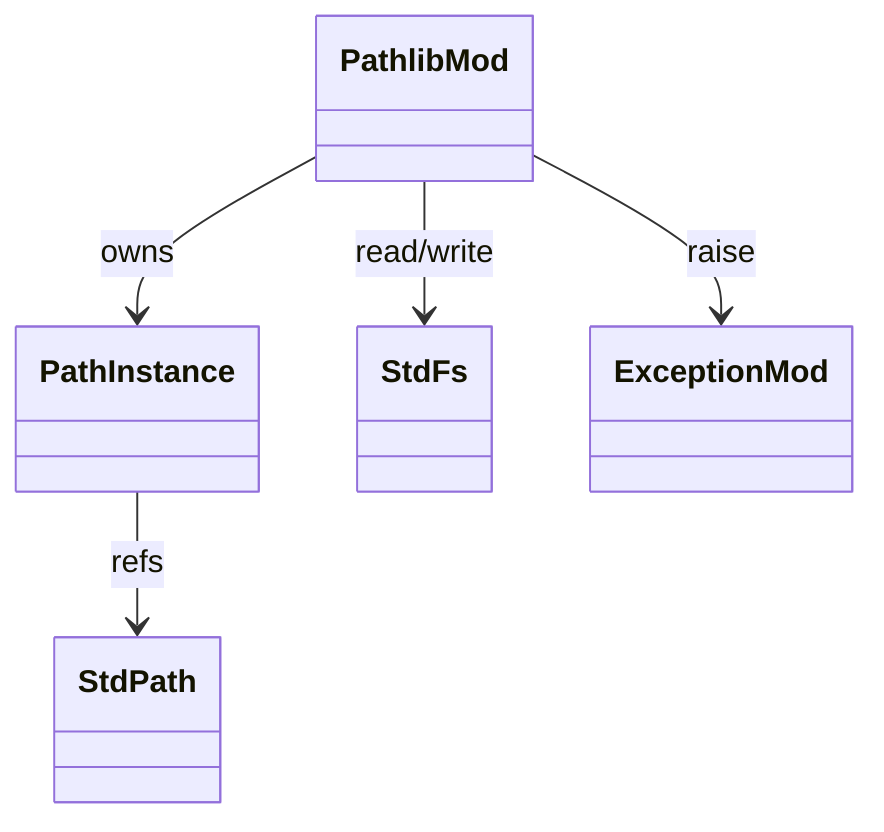
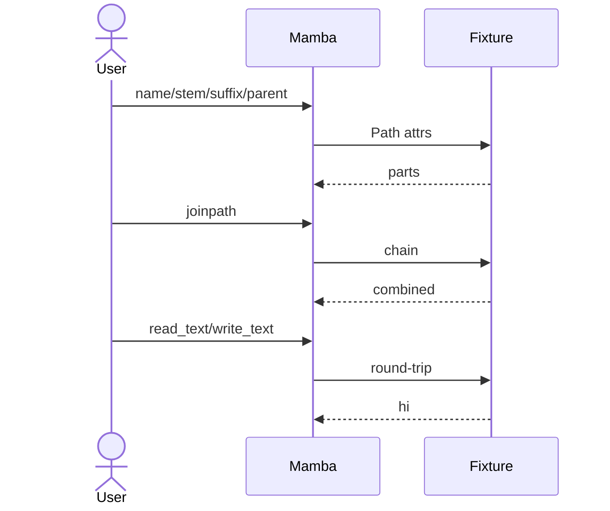

# stdlib `pathlib`

Object-oriented filesystem paths via `Path` instances. 13 entries
delegating to `std::path::Path` operations under the hood. Same
underlying `std::fs` calls as `os` (per `stdlib/os.md`); pathlib
provides the OO veneer.

Three load-bearing invariants:

1. **`Path(s)` returns an Instance with `class_name = "pathlib.Path"`**
   carrying the string in `_path` field — methods read this.
   Per-platform `PurePath` / `PosixPath` / `WindowsPath` distinction
   not yet wired (open gap; Mamba uses one `Path` class).
2. **Method chaining returns new `Path` Instance** — `p.parent`,
   `p.joinpath(x)`, `p.resolve()` all alloc a fresh Instance. Mutable
   path doesn't exist; consistent with CPython.
3. **`read_text` / `write_text` raise OSError subclasses** — same
   error mapping as `os` (per `runtime/exception.md`).

## Type model
<!-- type: dependency lang: mermaid -->



## Function catalog
<!-- type: schema lang: yaml -->

```yaml
$schema: "https://json-schema.org/draft/2020-12/schema"
$id: "pathlib-catalog"
$defs:
  StdlibFnEntry:
    type: object
    properties:
      python_name:    { type: string }
      mb_fn:          { type: string }
      arity:          { type: integer }
      cpython_parity: { type: string, enum: [full, partial, gap] }
      notes:          { type: string }
    required: [python_name, mb_fn, arity, cpython_parity]
  PathlibCatalog:
    type: array
    items: { $ref: "#/$defs/StdlibFnEntry" }
    examples:
      - - { python_name: "pathlib.Path",            mb_fn: "mb_pathlib_new",        arity: 1, cpython_parity: partial, notes: "always Path; PurePath / PosixPath / WindowsPath distinct gap" }
        - { python_name: "Path.exists",             mb_fn: "mb_pathlib_exists",     arity: 1, cpython_parity: full }
        - { python_name: "Path.is_file",            mb_fn: "mb_pathlib_is_file",    arity: 1, cpython_parity: full }
        - { python_name: "Path.is_dir",             mb_fn: "mb_pathlib_is_dir",     arity: 1, cpython_parity: full }
        - { python_name: "Path.name",               mb_fn: "mb_pathlib_name",       arity: 1, cpython_parity: full,    notes: "property — final component" }
        - { python_name: "Path.stem",               mb_fn: "mb_pathlib_stem",       arity: 1, cpython_parity: full,    notes: "property — name without suffix" }
        - { python_name: "Path.suffix",             mb_fn: "mb_pathlib_suffix",     arity: 1, cpython_parity: full,    notes: "property — last extension" }
        - { python_name: "Path.parent",             mb_fn: "mb_pathlib_parent",     arity: 1, cpython_parity: full,    notes: "property — parent Path" }
        - { python_name: "Path.joinpath",           mb_fn: "mb_pathlib_joinpath",   arity: 2, cpython_parity: full,    notes: "p.joinpath(x); also accessible via p / x" }
        - { python_name: "Path.read_text",          mb_fn: "mb_pathlib_read_text",  arity: 1, cpython_parity: partial, notes: "no encoding kwarg" }
        - { python_name: "Path.write_text",         mb_fn: "mb_pathlib_write_text", arity: 2, cpython_parity: partial }
        - { python_name: "Path.mkdir",              mb_fn: "mb_pathlib_mkdir",      arity: 1, cpython_parity: partial, notes: "no parents= / exist_ok=" }
        - { python_name: "Path.resolve",            mb_fn: "mb_pathlib_resolve",    arity: 1, cpython_parity: full }
        - { python_name: "Path.glob / iterdir / unlink / rmdir / rename", mb_fn: "(gap)", arity: -1, cpython_parity: gap }
```

## Acceptance scenarios
<!-- type: overview lang: markdown -->



## Tests
<!-- type: tests lang: yaml -->

```yaml
runner: "cargo test -p mamba --test conformance_tests --release -- {name} --test-threads=1"
fixtures:
  - id: pathlib_basic
    name: "stdlib/pathlib_basic.py"
    paired: "stdlib/pathlib_basic.expected"
  - id: pathlib_join_chain
    name: "stdlib/pathlib_join_chain.py"
    paired: "stdlib/pathlib_join_chain.expected"
  - id: pathlib_read_write
    name: "stdlib/pathlib_read_write.py"
    paired: "stdlib/pathlib_read_write.expected"
  - id: pathlib_resolve
    name: "stdlib/pathlib_resolve.py"
    paired: "stdlib/pathlib_resolve.expected"
```

## Changes
<!-- type: changes lang: yaml -->

```yaml
changes:
  - file: crates/mamba/src/runtime/stdlib/pathlib_mod.rs
    action: modify
    impl_mode: hand-written
    description: "13 mb_pathlib_* entries — Path Instance with _path field; properties (name/stem/suffix/parent) + I/O (read_text/write_text/mkdir/resolve). Hand-written; PurePath/PosixPath/WindowsPath distinction is open gap. Phase-1 codegen target."
```
