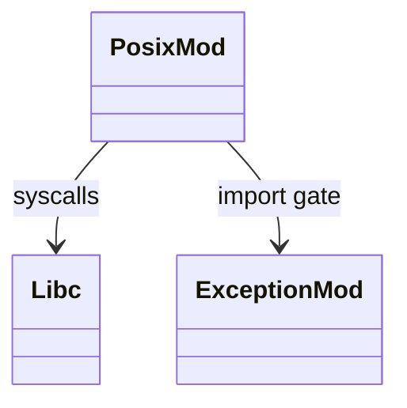
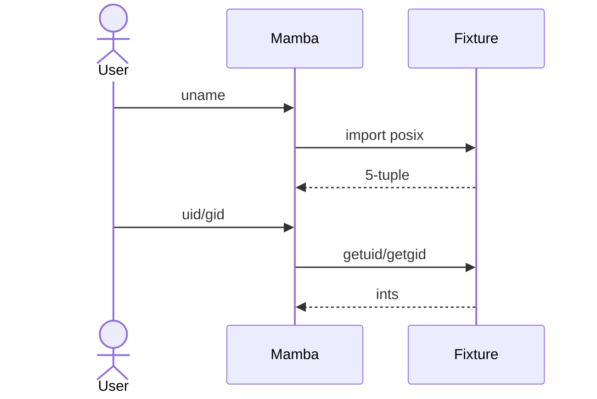

# stdlib `posix`

Unix-specific syscalls. Per CPython, `posix` exists on POSIX
platforms only; on Windows the equivalent is `nt`. Mamba currently
exposes `posix` on macOS / Linux; Windows is gap (no `nt_mod.rs` yet).

Three `cfg(target_family = "unix")`-gated entries:

1. `posix.uname()` — kernel name + node + release + version + machine
2. `posix.getuid()` — process effective UID
3. `posix.getgid()` — process effective GID

Three load-bearing invariants:

1. **`posix` is platform-conditional** — `cfg(unix)` at module level;
   on Windows the entire registration is skipped. Importing `posix`
   on Windows raises `ModuleNotFoundError`.
2. **`uname()` returns a 5-tuple** — `(sysname, nodename, release,
   version, machine)`. CPython actually returns a `posix.uname_result`
   named-tuple; Mamba's plain tuple is partial.
3. **UID / GID are i64** — even though `uid_t` is u32 in libc;
   Mamba widens to fit NaN-box int range.

## Type model
<!-- type: dependency lang: mermaid -->



## Function catalog
<!-- type: schema lang: yaml -->

```yaml
$schema: "https://json-schema.org/draft/2020-12/schema"
$id: "posix-catalog"
$defs:
  StdlibFnEntry:
    type: object
    properties:
      python_name:    { type: string }
      mb_fn:          { type: string }
      arity:          { type: integer }
      cpython_parity: { type: string, enum: [full, partial, gap] }
      platform:       { type: string, enum: [unix, windows, all] }
      notes:          { type: string }
    required: [python_name, mb_fn, arity, cpython_parity, platform]
  PosixCatalog:
    type: array
    items: { $ref: "#/$defs/StdlibFnEntry" }
    examples:
      - - { python_name: "posix.uname",   mb_fn: "mb_posix_uname",   arity: 0, platform: unix, cpython_parity: partial, notes: "returns plain 5-tuple; CPython has uname_result named-tuple" }
        - { python_name: "posix.getuid",  mb_fn: "mb_posix_getuid",  arity: 0, platform: unix, cpython_parity: full }
        - { python_name: "posix.getgid",  mb_fn: "mb_posix_getgid",  arity: 0, platform: unix, cpython_parity: full }
        - { python_name: "posix.fork / waitpid / etc.", mb_fn: "(gap)", arity: -1, platform: unix, cpython_parity: gap }
        - { python_name: "nt module (Windows equivalent)", mb_fn: "(gap)", arity: -1, platform: windows, cpython_parity: gap }
```

## Acceptance scenarios
<!-- type: overview lang: markdown -->



## Tests
<!-- type: tests lang: yaml -->

```yaml
runner: "cargo test -p mamba --test conformance_tests --release -- {name} --test-threads=1"
fixtures:
  - id: posix_uname
    name: "stdlib/posix_uname.py"
    paired: "stdlib/posix_uname.expected"
  - id: posix_uid_gid
    name: "stdlib/posix_uid_gid.py"
    paired: "stdlib/posix_uid_gid.expected"
```

## Changes
<!-- type: changes lang: yaml -->

```yaml
changes:
  - file: crates/mamba/src/runtime/stdlib/posix_mod.rs
    action: modify
    impl_mode: hand-written
    description: "3 unix-gated entries; Windows nt module is gap. Hand-written; libc-bridging requires cfg-gating that codegen would need to be platform-aware to handle."
```
