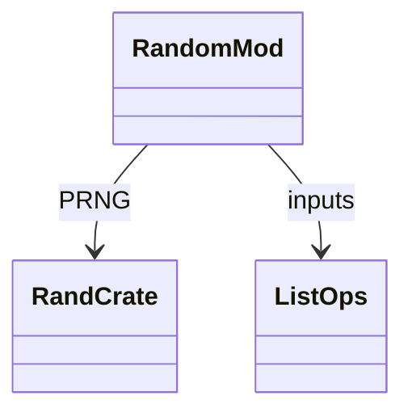
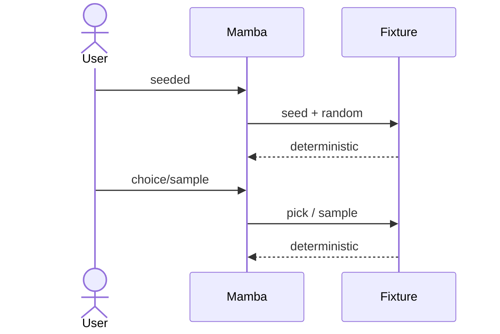

# stdlib `random`

Pseudo-random number generation. Uses Rust's `rand` crate
(currently `StdRng` thread-local seeded from system entropy on
first use; reseedable via `seed`). Note: random's recent commits
patched dispatcher ABI bugs (`7cc4bcdf4`).

Three load-bearing invariants:

1. **Single thread-local RNG** — all `random.X()` calls share one
   PRNG state per thread. `random.seed(n)` reseeds from a known
   value (deterministic test runs).
2. **`random.choice` / `shuffle` / `sample` operate on a list** —
   error if input is non-list (no auto-coerce from generators).
   `shuffle` is in-place; `sample` allocates a new list.
3. **`random.random()` returns half-open `[0.0, 1.0)`** —
   matches CPython.

## Type model
<!-- type: dependency lang: mermaid -->



## Function catalog
<!-- type: schema lang: yaml -->

```yaml
$schema: "https://json-schema.org/draft/2020-12/schema"
$id: "random-catalog"
$defs:
  StdlibFnEntry:
    type: object
    properties:
      python_name:    { type: string }
      mb_fn:          { type: string }
      arity:          { type: integer }
      cpython_parity: { type: string, enum: [full, partial, gap] }
      notes:          { type: string }
    required: [python_name, mb_fn, arity, cpython_parity]
  RandomCatalog:
    type: array
    items: { $ref: "#/$defs/StdlibFnEntry" }
    examples:
      - - { python_name: "random.random",   mb_fn: "mb_random_random",   arity: 0, cpython_parity: full,    notes: "[0.0, 1.0)" }
        - { python_name: "random.randint",  mb_fn: "mb_random_randint",  arity: 2, cpython_parity: full,    notes: "[a, b] inclusive" }
        - { python_name: "random.uniform",  mb_fn: "mb_random_uniform",  arity: 2, cpython_parity: full,    notes: "[a, b] float" }
        - { python_name: "random.choice",   mb_fn: "mb_random_choice",   arity: 1, cpython_parity: partial, notes: "list only; sequence general gap" }
        - { python_name: "random.shuffle",  mb_fn: "mb_random_shuffle",  arity: 1, cpython_parity: full,    notes: "in-place" }
        - { python_name: "random.sample",   mb_fn: "mb_random_sample",   arity: 2, cpython_parity: full,    notes: "(population, k); k <= len" }
        - { python_name: "random.seed",     mb_fn: "mb_random_seed",     arity: 1, cpython_parity: full }
        - { python_name: "random.gauss / triangular / weights / etc.", mb_fn: "(gap)", arity: -1, cpython_parity: gap }
```

## Acceptance scenarios
<!-- type: overview lang: markdown -->



## Tests
<!-- type: tests lang: yaml -->

```yaml
runner: "cargo test -p mamba --test conformance_tests --release -- {name} --test-threads=1"
fixtures:
  - id: random_basic
    name: "stdlib/random_basic.py"
    paired: "stdlib/random_basic.expected"
  - id: random_seeded
    name: "stdlib/random_seeded.py"
    paired: "stdlib/random_seeded.expected"
  - id: random_choice_sample
    name: "stdlib/random_choice_sample.py"
    paired: "stdlib/random_choice_sample.expected"
```

## Changes
<!-- type: changes lang: yaml -->

```yaml
changes:
  - file: crates/mamba/src/runtime/stdlib/random_mod.rs
    action: modify
    impl_mode: hand-written
    description: "random / randint / uniform / choice / shuffle / sample / seed over rand::StdRng thread-local. Hand-written; dispatcher ABI bug fixed in commit 7cc4bcdf4."
```
