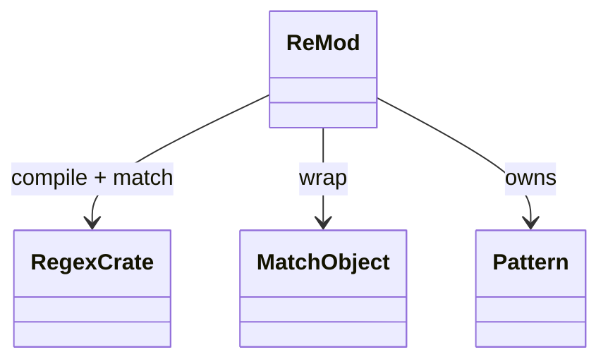
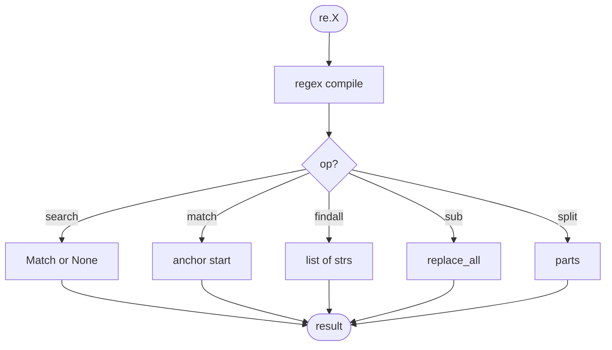
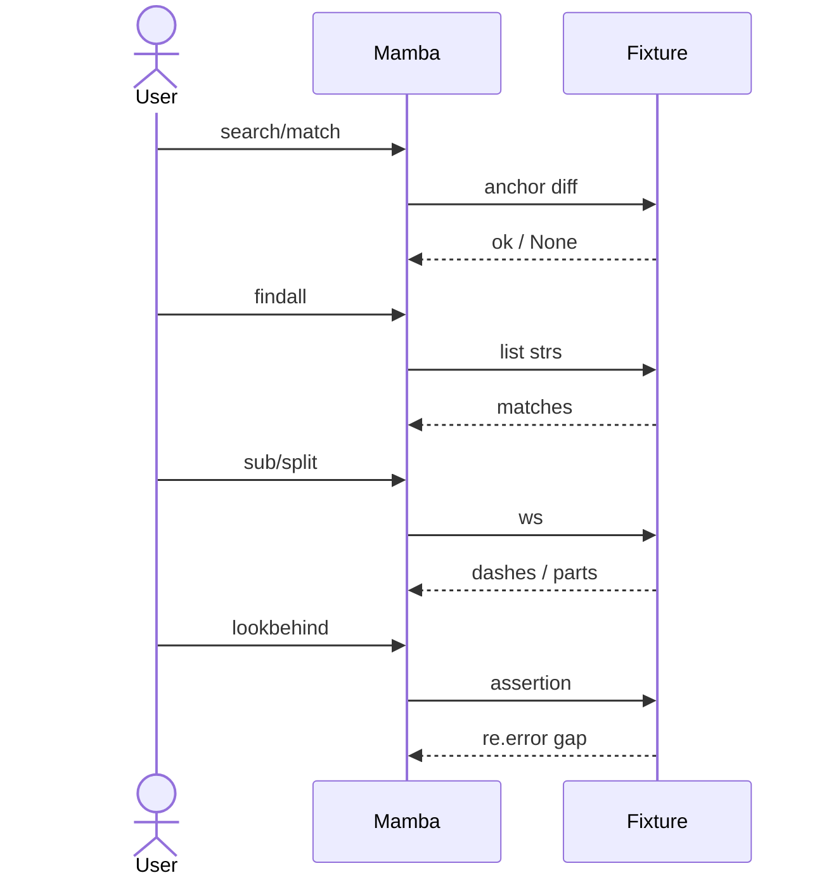

# stdlib `re`

Regular expressions over the `regex` Rust crate. The `regex` crate is
RE2-shaped (no backtracking, linear-time), so a small set of CPython
features that depend on backtracking are open gaps:

- Lookbehind / lookahead assertions
- Backreferences (`\1` etc.) inside the pattern
- Named groups via `(?P<name>...)` are partial — capture works,
  named back-references don't

For typical match / search / findall / sub / split usage, parity is
full.

Three load-bearing invariants:

1. **Patterns are compiled per-call, NOT cached** — `re.match(p, s)`
   compiles `p` each invocation. CPython caches; Mamba's open gap.
   Tracked under `re.compile` partial coverage.
2. **`re.match` anchors at start; `re.search` does not** — same as
   CPython.
3. **`re.sub` accepts a callable replacement** — when `repl` is
   callable, called per match with the Match object; result is
   substituted. Today partially supported (callable replacement is
   gap; string replacement works).

## Type model
<!-- type: dependency lang: mermaid -->



## Function catalog
<!-- type: schema lang: yaml -->

```yaml
$schema: "https://json-schema.org/draft/2020-12/schema"
$id: "re-catalog"
$defs:
  StdlibFnEntry:
    type: object
    properties:
      python_name:    { type: string }
      mb_fn:          { type: string }
      arity:          { type: integer }
      kwargs:         { type: array, items: { type: string } }
      cpython_parity: { type: string, enum: [full, partial, gap] }
      notes:          { type: string }
    required: [python_name, mb_fn, arity, cpython_parity]
  ReCatalog:
    type: array
    items: { $ref: "#/$defs/StdlibFnEntry" }
    examples:
      - - { python_name: "re.search",   mb_fn: "mb_re_search",   arity: 2, cpython_parity: full,    notes: "first match anywhere" }
        - { python_name: "re.match",    mb_fn: "mb_re_match",    arity: 2, cpython_parity: full,    notes: "match must anchor at start" }
        - { python_name: "re.findall",  mb_fn: "mb_re_findall",  arity: 2, cpython_parity: full,    notes: "all non-overlapping matches as list" }
        - { python_name: "re.sub",      mb_fn: "mb_re_sub",      arity: 3, cpython_parity: partial, notes: "string repl works; callable repl gap" }
        - { python_name: "re.split",    mb_fn: "mb_re_split",    arity: 2, cpython_parity: partial, notes: "no maxsplit kwarg yet" }
        - { python_name: "re.escape",   mb_fn: "mb_re_escape",   arity: 1, cpython_parity: full }
        - { python_name: "re.compile",  mb_fn: "(gap)",          arity: 1, cpython_parity: gap,     notes: "compile + reuse cache not wired today" }
        - { python_name: "re.fullmatch", mb_fn: "(gap)",         arity: 2, cpython_parity: gap }
  PatternFeatures:
    description: "RE2 limits — features the regex crate does not support"
    type: array
    items: { type: string }
    examples:
      - - "lookbehind  (?<=...)  /  (?<!...)"
        - "lookahead   (?=...)   /  (?!...)"
        - "backreferences in pattern  (...)\\1"
        - "named backrefs (?P=name)"
```

## Pattern dispatch logic
<!-- type: logic lang: mermaid -->



## Acceptance scenarios
<!-- type: overview lang: markdown -->



## Tests
<!-- type: tests lang: yaml -->

```yaml
runner: "cargo test -p mamba --test conformance_tests --release -- {name} --test-threads=1"
fixtures:
  - id: re_search_match
    name: "stdlib/re_search_match.py"
    paired: "stdlib/re_search_match.expected"
  - id: re_findall
    name: "stdlib/re_findall.py"
    paired: "stdlib/re_findall.expected"
  - id: re_sub_split
    name: "stdlib/re_sub_split.py"
    paired: "stdlib/re_sub_split.expected"
  - id: re_groups
    name: "stdlib/re_groups.py"
    paired: "stdlib/re_groups.expected"
    verifies: ["capture groups via match.group(0..n)"]
  - id: re_escape
    name: "stdlib/re_escape.py"
    paired: "stdlib/re_escape.expected"
```

## Changes
<!-- type: changes lang: yaml -->

```yaml
changes:
  - file: crates/mamba/src/runtime/stdlib/re_mod.rs
    action: modify
    impl_mode: hand-written
    description: "search / match / findall / sub / split / escape over the regex crate (RE2-shaped). Hand-written; lookahead/lookbehind/backref are open gaps from RE2 substrate. Phase-1 codegen target — entries are mechanical 1:1 wraps."
```
