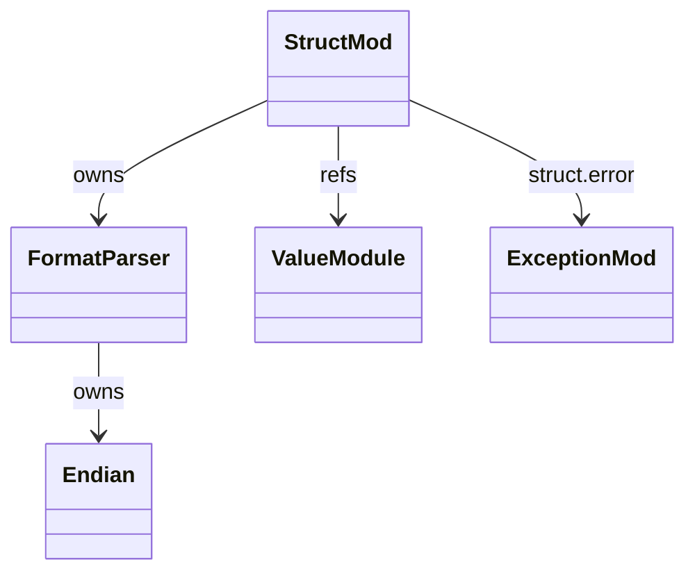
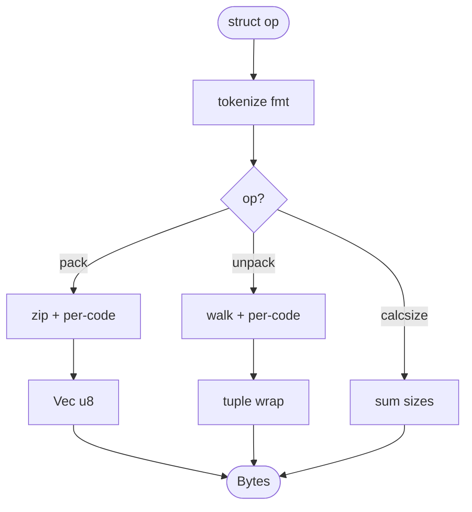
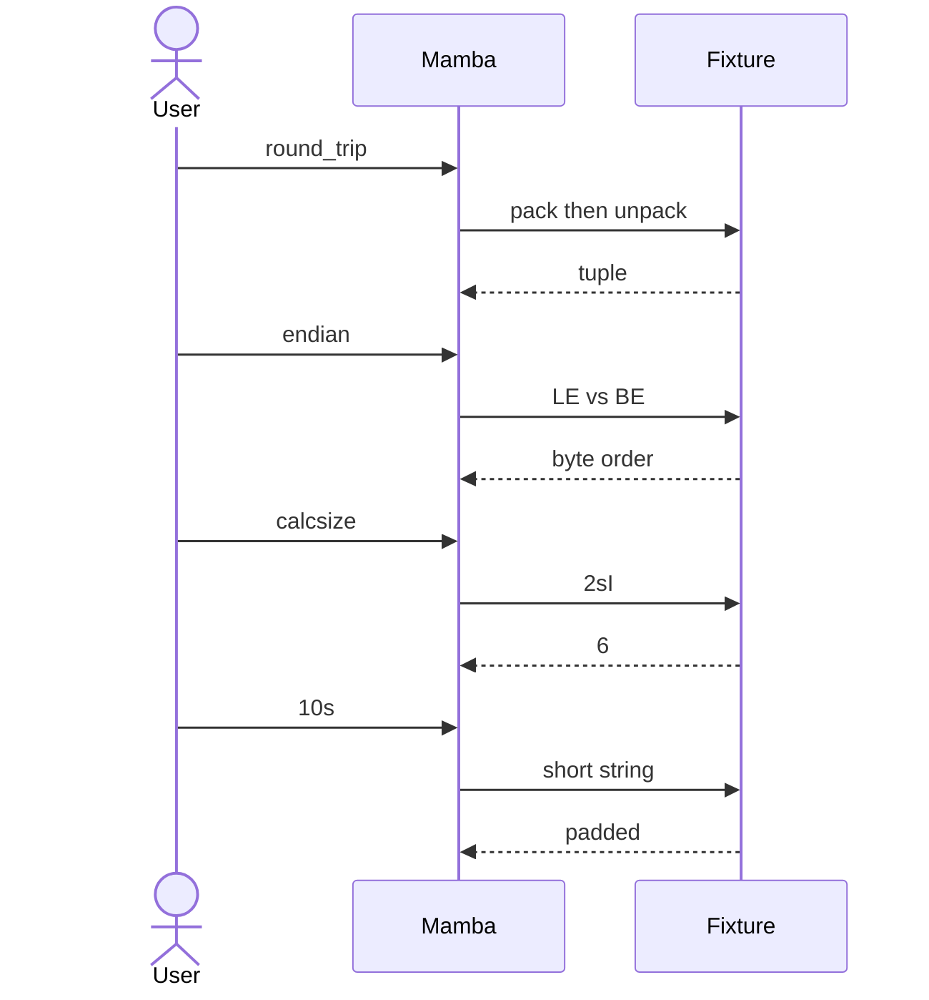

# stdlib `struct`

Binary pack / unpack of Python values per a format string DSL
(`'>i'`, `'<2sI'`, `'@10s'`, etc.). Three entry points:
`struct.pack(fmt, *args)`, `struct.unpack(fmt, data)`,
`struct.calcsize(fmt)`.

Three load-bearing invariants:

1. **Endian-prefix binding**: `<` little-endian, `>` big-endian, `=`
   native, `!` network (big), `@` native + native align. The first
   non-letter character (or absent) determines mode; `@` enables
   native alignment padding (relevant for `'@i'` after `'@b'`).
2. **Format codes one-to-one with C types** — `b/B` (i8/u8), `h/H`
   (i16/u16), `i/I` (i32/u32), `q/Q` (i64/u64), `f/d` (f32/f64),
   `s` (n-byte string), `?` (bool), `x` (pad byte), `c` (char).
3. **`unpack` returns a tuple even when the format produces a single
   value** — `struct.unpack('i', data)` returns `(42,)` not `42`.
   Matches CPython.

## Type model
<!-- type: dependency lang: mermaid -->



## Function catalog
<!-- type: schema lang: yaml -->

```yaml
$schema: "https://json-schema.org/draft/2020-12/schema"
$id: "struct-catalog"
$defs:
  StdlibFnEntry:
    type: object
    properties:
      python_name:    { type: string }
      mb_fn:          { type: string }
      arity:          { type: integer }
      cpython_parity: { type: string, enum: [full, partial, gap] }
      notes:          { type: string }
    required: [python_name, mb_fn, arity, cpython_parity]
  StructCatalog:
    type: array
    items: { $ref: "#/$defs/StdlibFnEntry" }
    examples:
      - - { python_name: "struct.pack",     mb_fn: "mb_struct_pack",     arity: -1, cpython_parity: full }
        - { python_name: "struct.unpack",   mb_fn: "mb_struct_unpack",   arity: 2,  cpython_parity: full }
        - { python_name: "struct.calcsize", mb_fn: "mb_struct_calcsize", arity: 1,  cpython_parity: full }
        - { python_name: "struct.iter_unpack", mb_fn: "(gap)",           arity: 2,  cpython_parity: gap, notes: "iterator over repeated unpacks" }
        - { python_name: "struct.error",    mb_fn: "(class)",            arity: -1, cpython_parity: full, notes: "subclass of Exception" }
  FormatCodes:
    type: array
    items:
      type: object
      properties:
        code:    { type: string }
        c_type:  { type: string }
        size:    { type: integer, description: "bytes" }
      required: [code, c_type, size]
    examples:
      - - { code: "b", c_type: "int8_t",   size: 1 }
        - { code: "B", c_type: "uint8_t",  size: 1 }
        - { code: "h", c_type: "int16_t",  size: 2 }
        - { code: "H", c_type: "uint16_t", size: 2 }
        - { code: "i", c_type: "int32_t",  size: 4 }
        - { code: "I", c_type: "uint32_t", size: 4 }
        - { code: "q", c_type: "int64_t",  size: 8 }
        - { code: "Q", c_type: "uint64_t", size: 8 }
        - { code: "f", c_type: "float",    size: 4 }
        - { code: "d", c_type: "double",   size: 8 }
        - { code: "s", c_type: "char[N]",  size: -1, description: "N from prefix; treated as bytes" }
        - { code: "?", c_type: "bool",     size: 1 }
        - { code: "x", c_type: "pad",      size: 1 }
        - { code: "c", c_type: "char",     size: 1 }
```

## Pack / unpack dispatch
<!-- type: logic lang: mermaid -->



## Acceptance scenarios
<!-- type: overview lang: markdown -->



## Tests
<!-- type: tests lang: yaml -->

```yaml
runner: "cargo test -p mamba --test conformance_tests --release -- {name} --test-threads=1"
fixtures:
  - id: struct_round_trip
    name: "stdlib/struct_round_trip.py"
    paired: "stdlib/struct_round_trip.expected"
  - id: struct_endian
    name: "stdlib/struct_endian.py"
    paired: "stdlib/struct_endian.expected"
  - id: struct_calcsize
    name: "stdlib/struct_calcsize.py"
    paired: "stdlib/struct_calcsize.expected"
  - id: struct_string_field
    name: "stdlib/struct_string_field.py"
    paired: "stdlib/struct_string_field.expected"
```

## Changes
<!-- type: changes lang: yaml -->

```yaml
changes:
  - file: crates/mamba/src/runtime/stdlib/struct_mod.rs
    action: modify
    impl_mode: hand-written
    description: "pack / unpack / calcsize over hand-written format-string parser. Hand-written; format DSL parsing is more algorithmic than mechanical → Phase 3 codegen (parser-rules section type) territory if codegen ever wants to handle it."
```
