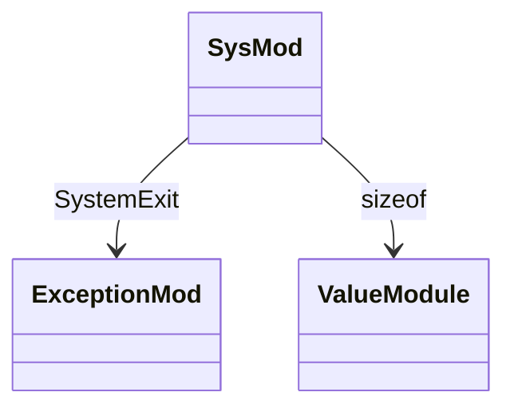
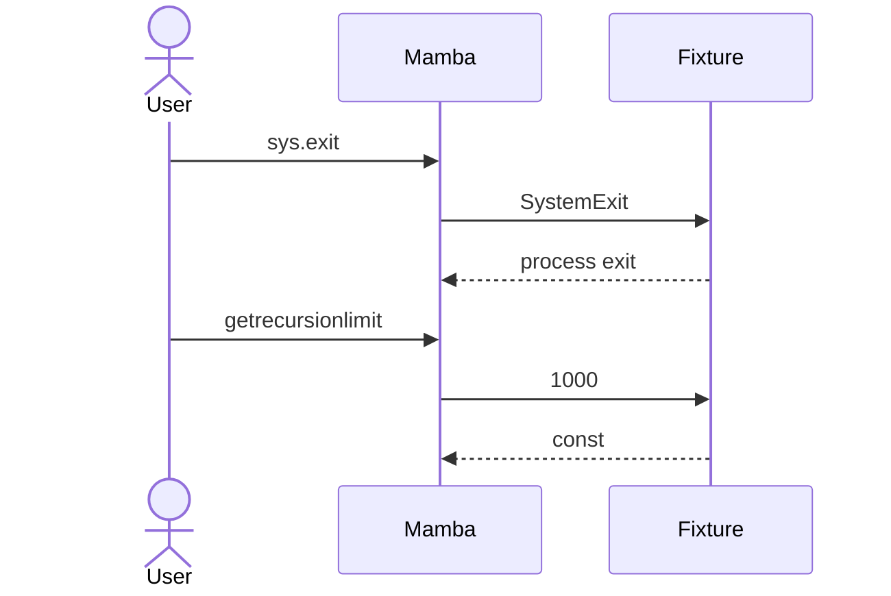

# stdlib `sys`

Interpreter-level introspection. 5 entries today; CPython has many
more (`sys.argv`, `sys.modules`, `sys.path`, `sys.stdout/stderr`,
`sys.platform`, `sys.maxsize`, `sys.version_info` are partial /
gap).

Three load-bearing invariants:

1. **`sys.exit(code)` raises `SystemExit`** — propagates through the
   normal exception machinery; the driver's top-level catch turns it
   into a real process exit. Not a direct `libc::exit` call.
2. **`sys.getrecursionlimit` returns CPython-default 1000** — but
   `sys.setrecursionlimit` is currently a no-op (open gap; Mamba's
   stack depth is limited by the OS thread stack, not a configurable
   counter).
3. **`sys.getsizeof` returns conservative bytes-of-Mbvalue** — for
   primitives 8 bytes (NaN-box); for ptr objects it dereferences
   ObjData and sums interior; not bit-perfect with CPython but
   monotonic enough for tests.

## Type model
<!-- type: dependency lang: mermaid -->



## Function catalog
<!-- type: schema lang: yaml -->

```yaml
$schema: "https://json-schema.org/draft/2020-12/schema"
$id: "sys-catalog"
$defs:
  StdlibFnEntry:
    type: object
    properties:
      python_name:    { type: string }
      mb_fn:          { type: string }
      arity:          { type: integer }
      cpython_parity: { type: string, enum: [full, partial, gap] }
      notes:          { type: string }
    required: [python_name, mb_fn, arity, cpython_parity]
  SysCatalog:
    type: array
    items: { $ref: "#/$defs/StdlibFnEntry" }
    examples:
      - - { python_name: "sys.exit",                 mb_fn: "mb_sys_exit",                 arity: 1, cpython_parity: full,    notes: "raises SystemExit; driver catches" }
        - { python_name: "sys.getrecursionlimit",    mb_fn: "mb_sys_getrecursionlimit",    arity: 0, cpython_parity: partial, notes: "constant 1000" }
        - { python_name: "sys.setrecursionlimit",    mb_fn: "mb_sys_setrecursionlimit",    arity: 1, cpython_parity: gap,     notes: "no-op today" }
        - { python_name: "sys.getdefaultencoding",   mb_fn: "mb_sys_getdefaultencoding",   arity: 0, cpython_parity: full,    notes: "always 'utf-8'" }
        - { python_name: "sys.getsizeof",            mb_fn: "mb_sys_getsizeof",            arity: 1, cpython_parity: partial, notes: "best-effort estimate" }
        - { python_name: "sys.argv",        mb_fn: "(gap)", arity: 0, cpython_parity: gap, notes: "CLI argv not yet exposed" }
        - { python_name: "sys.modules",     mb_fn: "(gap)", arity: 0, cpython_parity: gap, notes: "MODULES registry not exposed as Python dict yet" }
        - { python_name: "sys.path",        mb_fn: "(gap)", arity: 0, cpython_parity: gap, notes: "SEARCH_PATHS not exposed yet" }
        - { python_name: "sys.platform",    mb_fn: "(gap)", arity: 0, cpython_parity: gap }
        - { python_name: "sys.maxsize",     mb_fn: "(gap)", arity: 0, cpython_parity: gap, notes: "would be 2^47 - 1 (NaN-box int max)" }
        - { python_name: "sys.version_info",mb_fn: "(gap)", arity: 0, cpython_parity: gap }
```

## Acceptance scenarios
<!-- type: overview lang: markdown -->



## Tests
<!-- type: tests lang: yaml -->

```yaml
runner: "cargo test -p mamba --test conformance_tests --release -- {name} --test-threads=1"
fixtures:
  - id: sys_exit
    name: "stdlib/sys_exit.py"
    paired: "stdlib/sys_exit.expected"
  - id: sys_introspection
    name: "stdlib/sys_introspection.py"
    paired: "stdlib/sys_introspection.expected"
    verifies: ["getrecursionlimit / getdefaultencoding / getsizeof"]
```

## Changes
<!-- type: changes lang: yaml -->

```yaml
changes:
  - file: crates/mamba/src/runtime/stdlib/sys_mod.rs
    action: modify
    impl_mode: hand-written
    description: "5 entries today; many CPython attrs (argv / modules / path / platform / maxsize / version_info) are open gaps. Hand-written; once core attrs land they're Phase-1 codegen."
```
