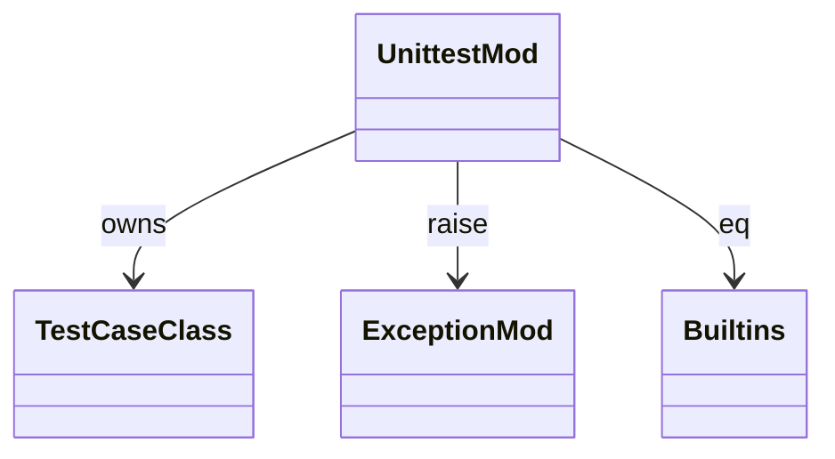

# stdlib `unittest`

Minimal `unittest` shape. `TestCase` base class + assert helpers;
discovery / runner / fixture lifecycle are gaps. Conformance tests
in mamba use Rust's `cargo test` harness directly, so unittest is
mostly for compatibility with imported Python test code.

Three load-bearing invariants:

1. **`TestCase` is a base class** users can subclass with `def
   test_*` methods. Discovery (call any `test_*` method) is the
   open gap.
2. **Assertion helpers raise `AssertionError`** with informative
   messages (per CPython parity). On failure includes both expected
   and actual values.
3. **`assertEqual` uses Python `==`** — same as CPython; Mamba
   delegates to `mb_eq` (per `runtime/builtins.md`).

## Type model
<!-- type: dependency lang: mermaid -->



## Function catalog
<!-- type: schema lang: yaml -->

```yaml
$schema: "https://json-schema.org/draft/2020-12/schema"
$id: "unittest-catalog"
$defs:
  StdlibFnEntry:
    type: object
    properties:
      python_name:    { type: string }
      mb_fn:          { type: string }
      arity:          { type: integer }
      cpython_parity: { type: string, enum: [full, partial, gap] }
      notes:          { type: string }
    required: [python_name, mb_fn, arity, cpython_parity]
  UnittestCatalog:
    type: array
    items: { $ref: "#/$defs/StdlibFnEntry" }
    examples:
      - - { python_name: "unittest.TestCase",         mb_fn: "mb_unittest_testcase",         arity: 0, cpython_parity: partial, notes: "base class registered in CLASS_REGISTRY" }
        - { python_name: "TestCase.assertEqual",       mb_fn: "mb_unittest_assert_equal",     arity: 3, cpython_parity: full }
        - { python_name: "TestCase.assertNotEqual",    mb_fn: "mb_unittest_assert_not_equal", arity: 3, cpython_parity: full }
        - { python_name: "TestCase.assertTrue",        mb_fn: "mb_unittest_assert_true",      arity: 2, cpython_parity: full }
        - { python_name: "TestCase.assertFalse",       mb_fn: "mb_unittest_assert_false",     arity: 2, cpython_parity: full }
        - { python_name: "TestCase.assertRaises",      mb_fn: "(gap)",                        arity: -1, cpython_parity: gap }
        - { python_name: "unittest.main / TestLoader / TextTestRunner / discover", mb_fn: "(gap)", arity: -1, cpython_parity: gap }
        - { python_name: "setUp / tearDown / setUpClass / tearDownClass lifecycle", mb_fn: "(gap)", arity: -1, cpython_parity: gap }
```

## Tests
<!-- type: tests lang: yaml -->

```yaml
runner: "cargo test -p mamba --test conformance_tests --release -- {name} --test-threads=1"
fixtures:
  - id: unittest_assert_basic
    name: "stdlib/unittest_assert_basic.py"
    paired: "stdlib/unittest_assert_basic.expected"
```

## Changes
<!-- type: changes lang: yaml -->

```yaml
changes:
  - file: crates/mamba/src/runtime/stdlib/unittest_mod.rs
    action: modify
    impl_mode: hand-written
    description: "TestCase base class + 4 assertion helpers. Hand-written; discovery / runner / setUp/tearDown lifecycle / assertRaises ctx are gaps."
```
