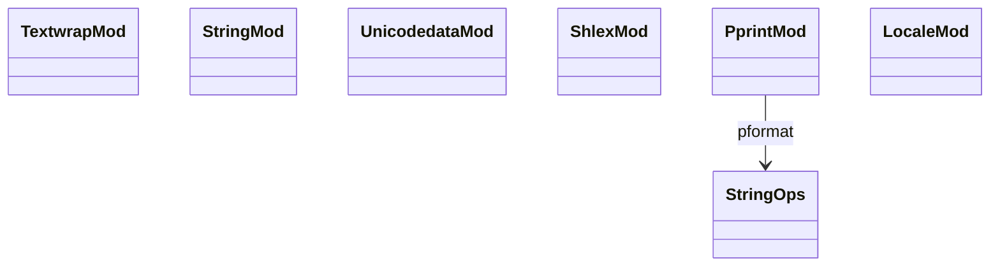

# stdlib text-processing

Six text-utility modules. `textwrap` for paragraph reflow; `string`
for constants (`ascii_letters`, `digits`, etc.) + `Template`;
`unicodedata` for character classification; `shlex` for shell-style
tokenisation; `pprint` for pretty-printed repr; `locale` for
locale-sensitive string ops (mostly stub).

Three load-bearing invariants:

1. **`textwrap.dedent`** preserves common leading whitespace; finds
   the longest common prefix across non-empty lines and strips it.
2. **`string.Template($name)` is `$`-prefix substitution** —
   different DSL from f-strings. `Template.substitute(d)` requires
   all keys present; `safe_substitute` allows missing.
3. **`pprint.pformat` indents nested containers** — uses
   `value_to_string` (per `runtime/string-ops.md`) but with depth-
   based indentation. Configurable width default 80.

## Type model
<!-- type: dependency lang: mermaid -->



## Function catalog
<!-- type: schema lang: yaml -->

```yaml
$schema: "https://json-schema.org/draft/2020-12/schema"
$id: "text-catalog"
$defs:
  StdlibFnEntry:
    type: object
    properties:
      python_name:    { type: string }
      mb_fn:          { type: string }
      arity:          { type: integer }
      cpython_parity: { type: string, enum: [full, partial, gap] }
      notes:          { type: string }
    required: [python_name, mb_fn, arity, cpython_parity]
  TextCatalog:
    type: array
    items: { $ref: "#/$defs/StdlibFnEntry" }
    examples:
      - - { python_name: "textwrap.wrap",      mb_fn: "mb_textwrap_wrap",     arity: 2, cpython_parity: partial, notes: "no break_long_words / break_on_hyphens" }
        - { python_name: "textwrap.fill",      mb_fn: "mb_textwrap_fill",     arity: 2, cpython_parity: full }
        - { python_name: "textwrap.dedent",    mb_fn: "mb_textwrap_dedent",   arity: 1, cpython_parity: full }
        - { python_name: "textwrap.indent",    mb_fn: "mb_textwrap_indent",   arity: 2, cpython_parity: full }
        - { python_name: "textwrap.shorten",   mb_fn: "mb_textwrap_shorten",  arity: 2, cpython_parity: partial }
        - { python_name: "string.capwords",    mb_fn: "mb_string_capwords",   arity: 1, cpython_parity: full }
        - { python_name: "string constants (ascii_letters / digits / hexdigits / printable / punctuation)", mb_fn: "(constants)", arity: 0, cpython_parity: full }
        - { python_name: "string.Template",    mb_fn: "(gap)",                arity: -1, cpython_parity: gap, notes: "$-prefix substitution" }
        - { python_name: "unicodedata.category / name / lookup", mb_fn: "mb_unicodedata_X", arity: 1, cpython_parity: partial }
        - { python_name: "shlex.split / quote",          mb_fn: "mb_shlex_split / quote",  arity: 1, cpython_parity: partial }
        - { python_name: "pprint.pformat / pprint",       mb_fn: "mb_pprint_pformat / pprint", arity: -1, cpython_parity: partial, notes: "indent + width default 80" }
        - { python_name: "locale.setlocale / getlocale", mb_fn: "(stub)",     arity: -1, cpython_parity: gap }
```

## Tests
<!-- type: tests lang: yaml -->

```yaml
runner: "cargo test -p mamba --test conformance_tests --release -- {name} --test-threads=1"
fixtures:
  - id: textwrap_dedent
    name: "stdlib/textwrap_dedent.py"
    paired: "stdlib/textwrap_dedent.expected"
  - id: string_constants
    name: "stdlib/string_constants.py"
    paired: "stdlib/string_constants.expected"
  - id: unicodedata_category
    name: "stdlib/unicodedata_category.py"
    paired: "stdlib/unicodedata_category.expected"
  - id: shlex_split
    name: "stdlib/shlex_split.py"
    paired: "stdlib/shlex_split.expected"
  - id: pprint_basic
    name: "stdlib/pprint_basic.py"
    paired: "stdlib/pprint_basic.expected"
```

## Changes
<!-- type: changes lang: yaml -->

```yaml
changes:
  - file: crates/mamba/src/runtime/stdlib/textwrap_mod.rs
    action: modify
    impl_mode: hand-written
  - file: crates/mamba/src/runtime/stdlib/string_constants_mod.rs
    action: modify
    impl_mode: hand-written
  - file: crates/mamba/src/runtime/stdlib/unicodedata_mod.rs
    action: modify
    impl_mode: hand-written
  - file: crates/mamba/src/runtime/stdlib/shlex_mod.rs
    action: modify
    impl_mode: hand-written
  - file: crates/mamba/src/runtime/stdlib/pprint_mod.rs
    action: modify
    impl_mode: hand-written
  - file: crates/mamba/src/runtime/stdlib/locale_mod.rs
    action: modify
    impl_mode: hand-written
    description: "Stub locale; getpreferredencoding / format gap."
```
