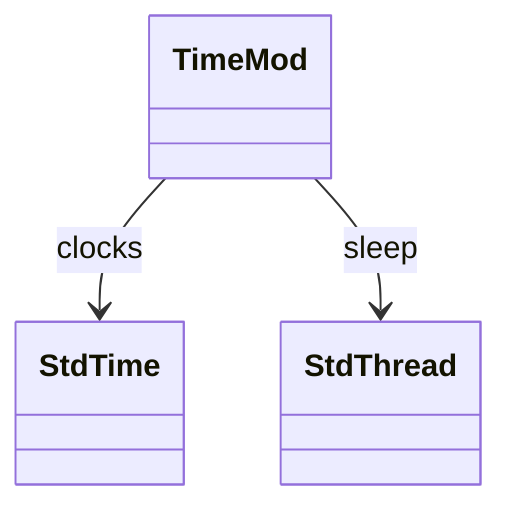
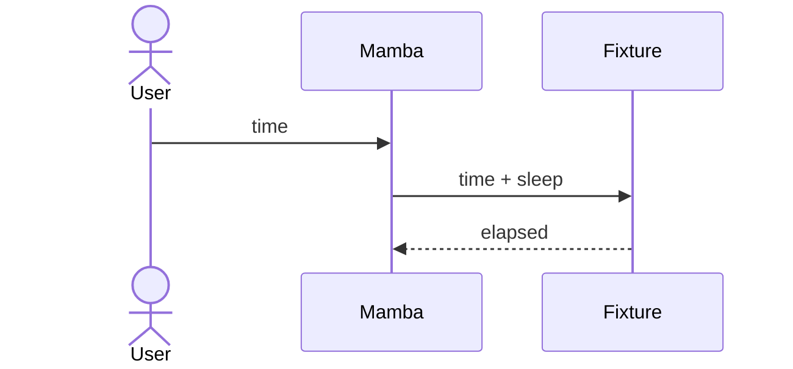

# stdlib `time`

Clock and sleep primitives. 4 entries today via `std::time` /
`std::thread::sleep`. CPython has many more (gmtime / localtime /
strftime / asctime / ctime / mktime / strptime / time_ns / etc.) —
all open gaps.

Three load-bearing invariants:

1. **`time.time()` returns float seconds since epoch** — UTC; uses
   `std::time::SystemTime::UNIX_EPOCH`. Not nanosecond-aligned today;
   `time.time_ns()` is gap.
2. **`time.sleep(secs)` blocks the calling OS thread** — not
   coroutine-aware. For async sleep use `asyncio.sleep` (per
   `runtime/async.md`).
3. **`time.monotonic()` and `time.perf_counter()` are distinct
   clocks** — monotonic guarantees no backward jumps;
   perf_counter offers higher precision. Mamba uses `Instant` for
   both (effectively the same source today).

## Type model
<!-- type: dependency lang: mermaid -->



## Function catalog
<!-- type: schema lang: yaml -->

```yaml
$schema: "https://json-schema.org/draft/2020-12/schema"
$id: "time-catalog"
$defs:
  StdlibFnEntry:
    type: object
    properties:
      python_name:    { type: string }
      mb_fn:          { type: string }
      arity:          { type: integer }
      cpython_parity: { type: string, enum: [full, partial, gap] }
      notes:          { type: string }
    required: [python_name, mb_fn, arity, cpython_parity]
  TimeCatalog:
    type: array
    items: { $ref: "#/$defs/StdlibFnEntry" }
    examples:
      - - { python_name: "time.time",         mb_fn: "mb_time_time",         arity: 0, cpython_parity: full }
        - { python_name: "time.monotonic",    mb_fn: "mb_time_monotonic",    arity: 0, cpython_parity: full }
        - { python_name: "time.perf_counter", mb_fn: "mb_time_perf_counter", arity: 0, cpython_parity: full }
        - { python_name: "time.sleep",        mb_fn: "mb_time_sleep",        arity: 1, cpython_parity: full }
        - { python_name: "time.time_ns",      mb_fn: "(gap)",                arity: 0, cpython_parity: gap }
        - { python_name: "time.gmtime / localtime / strftime / strptime", mb_fn: "(gap)", arity: -1, cpython_parity: gap }
```

## Acceptance scenarios
<!-- type: overview lang: markdown -->



## Tests
<!-- type: tests lang: yaml -->

```yaml
runner: "cargo test -p mamba --test conformance_tests --release -- {name} --test-threads=1"
fixtures:
  - id: time_basic
    name: "stdlib/time_basic.py"
    paired: "stdlib/time_basic.expected"
  - id: time_monotonic
    name: "stdlib/time_monotonic.py"
    paired: "stdlib/time_monotonic.expected"
```

## Changes
<!-- type: changes lang: yaml -->

```yaml
changes:
  - file: crates/mamba/src/runtime/stdlib/time_mod.rs
    action: modify
    impl_mode: hand-written
    description: "time / sleep / monotonic / perf_counter. Hand-written; gmtime / localtime / strftime / strptime / time_ns are gaps."
```
