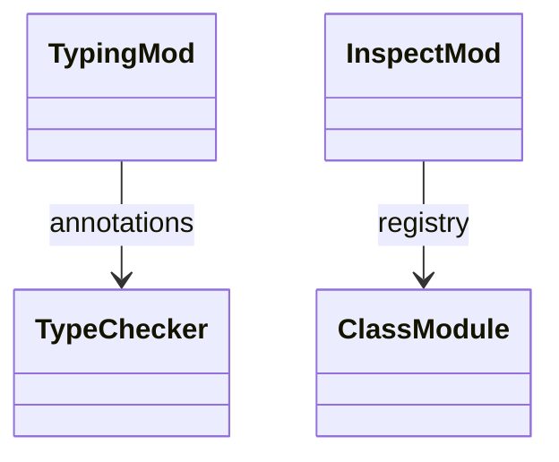

# stdlib `typing` + `inspect`

Type-hint helpers (`typing.cast` / `typing.get_type_hints`) and
runtime reflection (`inspect.isfunction` / `isclass` / `ismethod`).
Mostly thin shims; type-hint introspection is partial because Mamba's
type system (per `types/type-checker.md`) doesn't preserve full
generic info at runtime.

Three load-bearing invariants:

1. **`typing.cast(t, x)` returns `x` unchanged** — purely a type
   hint to the static checker; runtime is identity.
2. **`typing.get_type_hints(obj)` returns dict of name to type
   string** — partial; Mamba's annotations may be Ty::Any if not
   explicit, and don't preserve full generic depth.
3. **`inspect.isfunction` / `isclass` / `ismethod` use ObjData
   discriminator** — Function, Class, Instance with bound-method
   marker. Per CPython parity for the basic predicates.

## Type model
<!-- type: dependency lang: mermaid -->



## Function catalog
<!-- type: schema lang: yaml -->

```yaml
$schema: "https://json-schema.org/draft/2020-12/schema"
$id: "typing-inspect-catalog"
$defs:
  StdlibFnEntry:
    type: object
    properties:
      python_name:    { type: string }
      mb_fn:          { type: string }
      arity:          { type: integer }
      cpython_parity: { type: string, enum: [full, partial, gap] }
      notes:          { type: string }
    required: [python_name, mb_fn, arity, cpython_parity]
  TypingInspectCatalog:
    type: object
    properties:
      typing:
        type: array
        items: { $ref: "#/$defs/StdlibFnEntry" }
        examples:
          - - { python_name: "typing.cast",           mb_fn: "mb_typing_cast",           arity: 2, cpython_parity: full,    notes: "runtime identity" }
            - { python_name: "typing.get_type_hints", mb_fn: "mb_typing_get_type_hints", arity: 1, cpython_parity: partial, notes: "name to type-string dict" }
            - { python_name: "typing sentinel TypeVar/Generic/Protocol/Any", mb_fn: "mb_typing_sentinel", arity: 0, cpython_parity: partial, notes: "all return same sentinel" }
            - { python_name: "typing.NamedTuple / TypedDict / overload", mb_fn: "(gap)", arity: -1, cpython_parity: gap }
      inspect:
        type: array
        items: { $ref: "#/$defs/StdlibFnEntry" }
        examples:
          - - { python_name: "inspect.isfunction", mb_fn: "mb_inspect_isfunction", arity: 1, cpython_parity: full }
            - { python_name: "inspect.isclass",    mb_fn: "mb_inspect_isclass",    arity: 1, cpython_parity: full }
            - { python_name: "inspect.ismethod",   mb_fn: "mb_inspect_ismethod",   arity: 1, cpython_parity: full }
            - { python_name: "inspect.signature / getsource / getmembers", mb_fn: "(gap)", arity: -1, cpython_parity: gap }
```

## Tests
<!-- type: tests lang: yaml -->

```yaml
runner: "cargo test -p mamba --test conformance_tests --release -- {name} --test-threads=1"
fixtures:
  - id: typing_cast_identity
    name: "stdlib/typing_cast.py"
    paired: "stdlib/typing_cast.expected"
  - id: inspect_predicates
    name: "stdlib/inspect_predicates.py"
    paired: "stdlib/inspect_predicates.expected"
```

## Changes
<!-- type: changes lang: yaml -->

```yaml
changes:
  - file: crates/mamba/src/runtime/stdlib/typing_mod.rs
    action: modify
    impl_mode: hand-written
    description: "Thin shims; cast is identity. Hand-written."
  - file: crates/mamba/src/runtime/stdlib/inspect_mod.rs
    action: modify
    impl_mode: hand-written
    description: "Predicates over ObjData / class registry. Hand-written."
```
