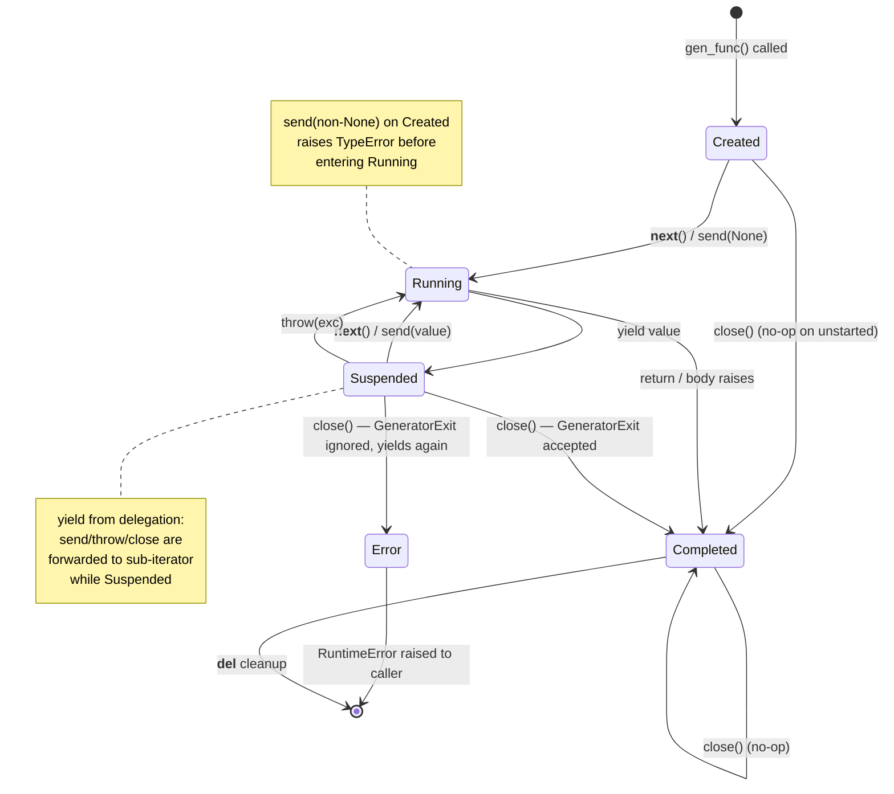
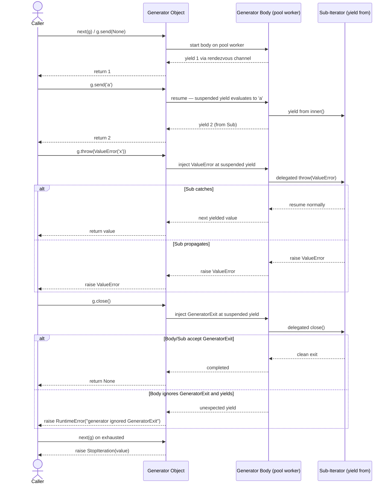
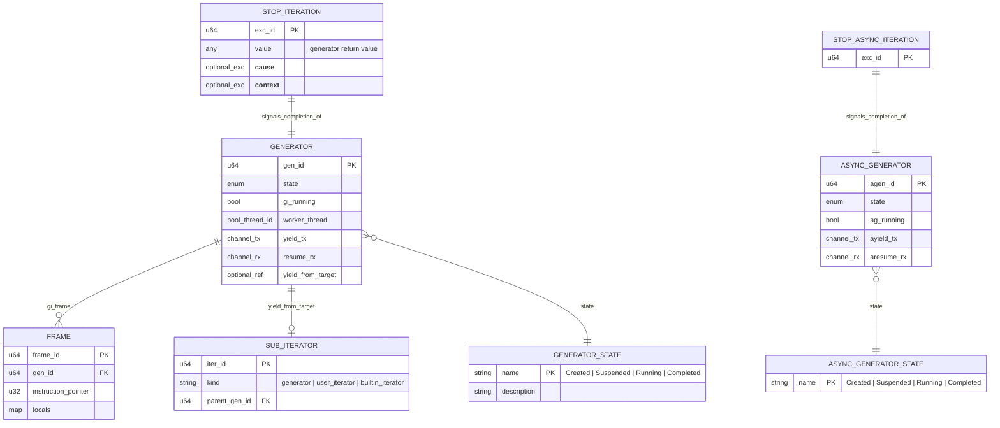
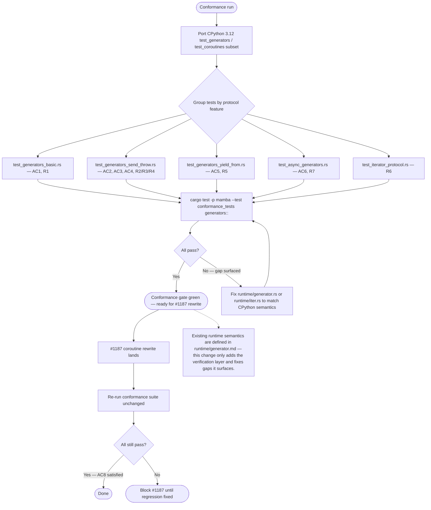

# Mamba 756 Patrol Spec

## Overview
<!-- type: overview lang: markdown -->

This change locks the Mamba generator and iterator protocol to CPython 3.12 semantics by building a conformance test suite that exercises every moving part of PEP 255 / 342 / 380 / 525. Generators already compile and run in Mamba (see `runtime/generator.md` R1-R5), but bidirectional communication (`send`), exception injection (`throw`), cleanup (`close` / `GeneratorExit`), `StopIteration.value` propagation, `yield from` delegation, the iterator protocol itself, and async generators driven by `async for` are not verified end-to-end against CPython. Issue #756 is the conformance gate; the parallel perf rewrite tracked by #1187 must land without breaking any test in this suite.

The scope is test ports plus fixes for any conformance gaps found along the way. Tests are ported from CPython 3.12 `Lib/test/test_generators.py` and `test_coroutines.py` (subset), grouped into 5 new integration test files under `crates/mamba/tests/conformance/generators/` covering: basic iteration, `send`/`throw`, `yield from` delegation, async generators, and the raw iterator protocol. Each ported test carries a header comment citing the CPython commit hash for traceability (AC7). The existing `runtime/generator.md` state machine and channel-based runtime stay intact — this change adds the verification layer, then fixes any non-conforming behavior surfaced by the new tests.

This change is explicitly independent of the generator perf rewrite (#1187). The channel-based runtime in `runtime/generator.rs` is the current implementation; the conformance suite built here is the acceptance gate that the rewrite must pass without test modifications (AC8). Async generators are in scope (AC6, R7) because user code mixes sync and async generators and deferring would leave a permanent gap; `asyncio` task wrapping and `contextlib.contextmanager` conformance remain out of scope.
## Requirements
<!-- type: requirements lang: mermaid -->


## Scenarios
<!-- type: scenarios lang: yaml -->

```yaml
_sdd:
  id: scenarios
  refs:
    - $ref: "#R1"
    - $ref: "#R2"
    - $ref: "#R3"
    - $ref: "#R4"
    - $ref: "#R5"
    - $ref: "#R6"
    - $ref: "#R7"
    - $ref: "#R8"

scenarios:
  - id: AC1
    title: Core protocol — iteration, exhaustion, StopIteration.value
    requirement: R1
    given: |
      def g():
          yield 1
          yield 2
          return 3
    when: |
      1. `list(g())` is materialized for the for-loop path
      2. A fresh generator is advanced via three manual `next()` calls
    then: |
      - for-loop path yields [1, 2] and terminates cleanly
      - next() path: first two calls return 1 and 2
      - third next() raises StopIteration with `exc.value == 3`

  - id: AC2
    title: send() happy path and first-send-with-non-None TypeError
    requirement: R2
    given: |
      def echo():
          while True:
              received = yield
              if received is None:
                  return
              print(received)
      def never_started():
          yield 1
    when: |
      1. `g = echo(); next(g); g.send('hello')` happy path
      2. `g2 = never_started(); g2.send('x')` on not-yet-started generator
    then: |
      - Happy path prints 'hello'
      - send('x') raises TypeError whose message substring matches CPython: "can't send non-None value to a just-started generator"

  - id: AC3
    title: throw() both caught and uncaught paths
    requirement: R3
    given: |
      def catch():
          try:
              yield 1
          except ValueError:
              yield 'caught'
      def propagate():
          yield 1
    when: |
      1. `g = catch(); next(g); g.throw(ValueError('x'))` — caught path
      2. `g2 = propagate(); next(g2); g2.throw(ValueError('x'))` — uncaught path
    then: |
      - Caught path returns 'caught' from throw()
      - Uncaught path propagates ValueError('x') out of throw() to the caller

  - id: AC4
    title: close() happy path and ignored-GeneratorExit RuntimeError
    requirement: R4
    given: |
      def normal():
          yield 1
          yield 2
      def ignores_exit():
          try:
              yield 1
          except GeneratorExit:
              yield 2  # protocol violation
    when: |
      1. `g = normal(); next(g); g.close()` — happy path
      2. `g2 = ignores_exit(); next(g2); g2.close()` — violation
    then: |
      - Happy path returns None from close(); subsequent next() raises StopIteration
      - Violation path raises RuntimeError("generator ignored GeneratorExit") from close()

  - id: AC5
    title: yield from — send, throw, close delegation and StopIteration.value
    requirement: R5
    given: |
      def inner():
          received = yield 1
          received = yield received
          return 'done'
      def outer():
          result = yield from inner()
          yield result
    when: |
      `g = outer(); next(g); g.send('a'); g.send('b'); next(g)` and a parallel trial that calls `g.throw(ValueError)` after the first yield
    then: |
      - send path: yields 1, 'a', 'done' in order
      - throw path: ValueError is raised inside `inner()` at its suspended yield
      - close path: `g.close()` forwards GeneratorExit to `inner()` before propagating to outer
      - StopIteration.value from inner() becomes the value of the `yield from` expression in outer()

  - id: AC6
    title: Async generator driven by async for and aclose
    requirement: R7
    given: |
      async def ag():
          yield 1
          yield 2
    when: |
      1. `async for x in ag(): collected.append(x)` run via a minimal driver loop
      2. A separately-constructed async generator is aclose()d mid-flight
    then: |
      - async for collects [1, 2] and terminates cleanly via StopAsyncIteration
      - aclose() completes without leaving the driver loop hung; asend/athrow round-trip with matching semantics to sync throw/send

  - id: AC7
    title: Ported CPython test_generators.py subset runs green
    requirement: R1
    given: |
      A subset of CPython 3.12 Lib/test/test_generators.py and test_coroutines.py
      ported into crates/mamba/tests/conformance/generators/ with each
      test file header citing the CPython 3.12 commit hash the port is based on.
    when: |
      `cargo test -p mamba --test conformance_tests generators::` runs
    then: |
      All ported tests pass. Header comment in every file names the CPython commit hash for provenance.

  - id: AC8
    title: Conformance suite survives generator perf rewrite (#1187)
    requirement: R1
    given: |
      #1187 coroutine-based generator rewrite has landed on main with no
      modifications to the conformance tests added in this change.
    when: |
      `cargo test -p mamba --test conformance_tests generators::` runs against the rewritten runtime
    then: |
      Every AC1-AC7 test continues to pass unchanged. Any regression is a #1187 bug, not a test update.

  - id: AC-edge
    title: Edge cases — closing exhausted generator, __del__ triggers close
    requirement: R8
    given: |
      def g():
          yield 1
    when: |
      1. `gen = g(); list(gen); gen.close()` — close on exhausted generator
      2. An open generator is dropped (garbage collected) while suspended
    then: |
      - close() on exhausted generator is a no-op (returns None, no exception)
      - __del__ path invokes close() which injects GeneratorExit before cleanup
```
## Diagrams
<!-- type: overview lang: markdown -->

### Mindmap
<!-- type: overview lang: markdown -->
<!-- score-td-placeholder -->

### State Machine
<!-- type: overview lang: markdown -->
<!-- score-td-placeholder -->

### Interaction
<!-- type: overview lang: markdown -->
<!-- score-td-placeholder -->

### Logic
<!-- type: overview lang: markdown -->
<!-- score-td-placeholder -->

### Dependencies
<!-- type: overview lang: markdown -->
<!-- score-td-placeholder -->

### Data Model
<!-- type: overview lang: markdown -->
<!-- score-td-placeholder -->

## API Spec
<!-- type: overview lang: markdown -->

### REST API
<!-- type: rest-api lang: yaml -->
<!-- score-td-placeholder -->

### RPC API
<!-- type: rpc-api lang: yaml -->
<!-- TODO: OpenRPC 1.3 as YAML. Example:
```yaml
openrpc: "1.3.2"
info:
  title: Service Name
  version: "1.0.0"
methods: []
```
-->

### Async API
<!-- type: async-api lang: yaml -->
<!-- score-td-placeholder -->

### CLI
<!-- type: cli lang: yaml -->
<!-- score-td-placeholder -->

### Schema
<!-- type: schema lang: yaml -->
<!-- TODO: JSON Schema as YAML. Example:
```yaml
"$schema": "https://json-schema.org/draft/2020-12/schema"
type: object
properties:
  id:
    type: string
required: [id]
```
-->

### Config
<!-- type: config lang: yaml -->
<!-- score-td-placeholder -->

## Test Plan
<!-- type: test-plan lang: mermaid -->

```mermaid
---
id: test-plan
refs:
  - $ref: "#R1"
  - $ref: "#R2"
  - $ref: "#R3"
  - $ref: "#R4"
  - $ref: "#R5"
  - $ref: "#R6"
  - $ref: "#R7"
  - $ref: "#R8"
---
requirementDiagram

element T1 {
  type: "Test"
  docref: "tests/conformance/generators/test_generators_basic.rs"
}

element T2 {
  type: "Test"
  docref: "tests/conformance/generators/test_generators_send_throw.rs"
}

element T3 {
  type: "Test"
  docref: "tests/conformance/generators/test_generators_send_throw.rs"
}

element T4 {
  type: "Test"
  docref: "tests/conformance/generators/test_generators_send_throw.rs"
}

element T5 {
  type: "Test"
  docref: "tests/conformance/generators/test_generators_yield_from.rs"
}

element T6 {
  type: "Test"
  docref: "tests/conformance/generators/test_iterator_protocol.rs"
}

element T7 {
  type: "Test"
  docref: "tests/conformance/generators/test_async_generators.rs"
}

element T8 {
  type: "Test"
  docref: "tests/conformance/generators/test_generators_basic.rs"
}

element Regression {
  type: "Test"
  docref: "cargo test -p mamba (full suite)"
}

T1 - verifies -> R1
T2 - verifies -> R2
T3 - verifies -> R3
T4 - verifies -> R4
T5 - verifies -> R5
T6 - verifies -> R6
T7 - verifies -> R7
T8 - verifies -> R8
Regression - verifies -> R1
```

| Test file | AC | Requirement | CPython 3.12 source |
|-----------|----|-------------|---------------------|
| `tests/conformance/generators/test_generators_basic.rs` | AC1, AC7, AC-edge | R1, R8 | `Lib/test/test_generators.py` — `BasicGeneratorsTest`, `GeneratorStopTest.test_generator_return_value` |
| `tests/conformance/generators/test_generators_send_throw.rs` | AC2, AC3, AC4 | R2, R3, R4 | `Lib/test/test_generators.py` — `ExceptionTest`, `GenSendTest`, `CloseTest` |
| `tests/conformance/generators/test_generators_yield_from.rs` | AC5 | R5 | `Lib/test/test_generators.py` — `YieldFromTests`, PEP 380 examples |
| `tests/conformance/generators/test_async_generators.rs` | AC6 | R7 | `Lib/test/test_asyncgen.py` — `AsyncGenAsyncioTest`, `AsyncGenSyntaxTest` |
| `tests/conformance/generators/test_iterator_protocol.rs` | — | R6 | `Lib/test/test_iter.py` — `TestCase.test_iter_class`, `test_iter_next` |
| Full suite regression | AC8 | R1-R8 | `cargo test -p mamba` — must stay green post-#1187 |

**Conventions for ported tests:**

- Every new `.rs` file MUST have a top-of-file `//!` doc comment citing the CPython 3.12 commit hash the port is based on (AC7).
- Tests MUST use the existing `jit_capture` helper from `generator_conformance_tests.rs` for stdout assertions, or the direct runtime API for object-level assertions.
- Async-generator tests MUST use a minimal in-process driver loop — no `asyncio` event loop (out of scope).
- RuntimeError message substrings and TypeError substrings MUST match CPython exactly (AC2, AC4).

**Verification commands:**

```
cargo test -p mamba --test conformance_tests generators::
cargo test -p mamba  # full regression
```
## Changes
<!-- type: changes lang: yaml -->

```yaml
_sdd:
  id: changes
  refs:
    - $ref: "#R1"
    - $ref: "#R2"
    - $ref: "#R3"
    - $ref: "#R4"
    - $ref: "#R5"
    - $ref: "#R6"
    - $ref: "#R7"
    - $ref: "#R8"

files:
  # --- Runtime fixes surfaced by the conformance tests ---
  - path: crates/mamba/src/runtime/generator.rs
    action: modify
    satisfies: [R2, R3, R4, R5, R8]
    desc: |
      Fix any CPython 3.12 non-conformance surfaced by the new test suite. Expected touch points:
      1. send(non-None) on Created — ensure TypeError message substring matches CPython
         ("can't send non-None value to a just-started generator").
      2. close() ignored-GeneratorExit — ensure RuntimeError message substring matches
         ("generator ignored GeneratorExit").
      3. yield from send/throw/close delegation — verify sub-iterator round-trip for
         generator-valued and non-generator sub-iterators (PEP 380 mechanical translation).
      4. StopIteration.value propagation — ensure `return expr` inside a generator sets
         StopIteration.value correctly, and `yield from` consumes it as the expression value.
      5. close() on exhausted generator is a strict no-op.
      6. __del__ path — finalizer invokes close() on still-open generators.
      Changes must be minimal — this is a conformance patrol, not a rewrite. #1187 owns perf.

  # --- Conformance test ports — new files under tests/conformance/generators/ ---
  - path: crates/mamba/tests/conformance/generators/mod.rs
    action: create
    satisfies: [R1, R2, R3, R4, R5, R6, R7, R8]
    desc: |
      Module declaration for the generators conformance submodule. Declares the
      five test files below and any shared helpers for pipeline execution. Must
      be wired into tests/conformance_tests.rs as `mod generators;`.

  - path: crates/mamba/tests/conformance/generators/test_generators_basic.rs
    action: create
    satisfies: [R1, R8]
    desc: |
      Ported from CPython 3.12 Lib/test/test_generators.py (BasicGeneratorsTest,
      GeneratorStopTest.test_generator_return_value, edge-case tests). Covers AC1,
      AC-edge. Top-of-file doc comment MUST cite the CPython 3.12 commit hash.
      Tests:
        - basic iteration yields [1, 2] and ends with StopIteration(value=3)
        - manual next() exhaustion raises StopIteration
        - close() on exhausted generator is a no-op
        - __del__ on open generator calls close() before cleanup

  - path: crates/mamba/tests/conformance/generators/test_generators_send_throw.rs
    action: create
    satisfies: [R2, R3, R4]
    desc: |
      Ported from CPython 3.12 Lib/test/test_generators.py (ExceptionTest,
      GenSendTest, CloseTest). Covers AC2, AC3, AC4. Header cites CPython 3.12 commit.
      Tests:
        - send() happy path — resume with value at yield
        - send(non-None) on Created raises TypeError (message substring match)
        - throw() caught — execution resumes, returns next yield
        - throw() uncaught — exception propagates out of throw()
        - throw() three-arg form (ExcType, value, tb)
        - close() happy path — returns None, subsequent next raises StopIteration
        - close() on generator that swallows GeneratorExit raises RuntimeError

  - path: crates/mamba/tests/conformance/generators/test_generators_yield_from.rs
    action: create
    satisfies: [R5]
    desc: |
      Ported from CPython 3.12 Lib/test/test_generators.py (YieldFromTests) and
      PEP 380 examples. Covers AC5. Header cites CPython 3.12 commit.
      Tests:
        - send() forwards through yield-from to sub-generator
        - throw() forwards and is caught at sub-generator's yield
        - throw() uncaught by sub propagates through outer
        - close() forwards GeneratorExit to sub-generator before outer
        - StopIteration.value from sub becomes result of yield-from expression
        - yield-from non-generator iterator (list, range) — delegation semantics

  - path: crates/mamba/tests/conformance/generators/test_async_generators.rs
    action: create
    satisfies: [R7]
    desc: |
      Ported from CPython 3.12 Lib/test/test_asyncgen.py (subset — no asyncio
      event loop, uses a minimal in-process driver). Covers AC6. Header cites
      CPython 3.12 commit.
      Tests:
        - async def + yield driven by async for — collects [1, 2] then StopAsyncIteration
        - asend happy path
        - athrow caught/uncaught
        - aclose — clean shutdown without hanging driver loop
      Note: If async generator support requires runtime changes beyond the existing
      generator.rs, mark the new module async_generator.rs; otherwise reuse.

  - path: crates/mamba/tests/conformance/generators/test_iterator_protocol.rs
    action: create
    satisfies: [R6]
    desc: |
      Ported subset of CPython 3.12 Lib/test/test_iter.py. Covers R6.
      Header cites CPython 3.12 commit.
      Tests:
        - user class with __iter__ returning self and __next__ raising StopIteration
        - same class used in `for` loop, comprehension, list(), next(), `in`
        - no over-advancing (itertools-compatible iteration count)
        - StopIteration terminates cleanly without leaking

  # --- Test harness wiring ---
  - path: crates/mamba/tests/conformance_tests.rs
    action: modify
    satisfies: [R1, R2, R3, R4, R5, R6, R7, R8]
    desc: |
      Add `mod generators;` to register the new submodule. No other harness changes.

  # --- Spec cross-reference (post-merge) ---
  - path: .aw/tech-design/crates/mamba/testing/mamba-py312-conformance.md
    action: modify
    satisfies: [R1, R2, R3, R4, R5, R6, R7, R8]
    desc: |
      After merge: append a row to the conformance coverage table linking back to
      this change and the generator runtime spec. Captures #756 as closed. Done
      in the merge archival step, not in this change implementation.
```
## Wireframe
<!-- type: wireframe lang: yaml -->

```yaml
# score-td-placeholder
```

## Component
<!-- type: component lang: yaml -->

```yaml
# score-td-placeholder
```

## Design Token
<!-- type: design-token lang: yaml -->

```yaml
# score-td-placeholder
```

## Doc
<!-- type: doc lang: markdown -->

<!-- TODO -->


## State Machine
<!-- type: state-machine lang: mermaid -->




## Interaction
<!-- type: interaction lang: mermaid -->




## Schema
<!-- type: schema lang: yaml -->

```yaml
"$schema": "https://json-schema.org/draft/2020-12/schema"
"$id": "#generator-api-schemas"
"$defs":

  GeneratorSend:
    "$id": "#generator-send"
    description: |
      `generator.send(value)` — resumes the generator and makes `value` the
      result of the suspended `yield` expression. First call on a not-yet-started
      generator MUST pass `None` or raise TypeError. Returns the next yielded
      value; raises StopIteration on exhaustion with `exc.value` = return value.
      See crates/mamba/runtime/generator.md#R4.
    type: object
    properties:
      self:
        description: Bound generator object
        "$ref": "#/$defs/GeneratorObject"
      value:
        description: Value to inject as the result of the suspended yield
        type: ["null", "object", "string", "number", "integer", "boolean", "array"]
    required: [self]
    x-returns:
      description: Next yielded value
      type: any
    x-raises:
      - StopIteration:
          description: Generator returned; exc.value carries the return value
          attributes: { value: any }
      - TypeError:
          description: send(non-None) on Created state
          message_substring: "can't send non-None value to a just-started generator"

  GeneratorThrow:
    "$id": "#generator-throw"
    description: |
      `generator.throw(exc_type, value=None, tb=None)` — injects exception at
      the suspended yield. Also accepts single-instance form `throw(exc_instance)`.
      If the generator catches it, resumes to next yield and returns that value.
      Otherwise propagates the exception to the caller.
      See crates/mamba/runtime/generator.md#R5.
    oneOf:
      - title: three-arg form
        type: object
        properties:
          self: { "$ref": "#/$defs/GeneratorObject" }
          exc_type:
            description: Exception class (must be BaseException subclass)
            type: string
          value:
            description: Exception args (optional)
            type: ["null", "array"]
          tb:
            description: Traceback object (optional)
            type: ["null", "object"]
        required: [self, exc_type]
      - title: single-instance form
        type: object
        properties:
          self: { "$ref": "#/$defs/GeneratorObject" }
          exc_instance:
            description: Exception instance
            type: object
        required: [self, exc_instance]
    x-returns:
      description: Next yielded value if caught inside generator
      type: any
    x-raises:
      - description: The injected exception if not caught, or any exception raised in subsequent execution

  GeneratorClose:
    "$id": "#generator-close"
    description: |
      `generator.close()` — injects GeneratorExit at the suspended yield.
      No-op if the generator is already in Completed state. If the generator
      swallows GeneratorExit and yields again, close() MUST raise RuntimeError
      with message substring "generator ignored GeneratorExit".
      See crates/mamba/runtime/generator.md#R5.
    type: object
    properties:
      self: { "$ref": "#/$defs/GeneratorObject" }
    required: [self]
    x-returns:
      description: None on clean close
      type: "null"
    x-raises:
      - RuntimeError:
          description: Raised if generator body ignored GeneratorExit and yielded
          message_substring: "generator ignored GeneratorExit"
      - BaseException:
          description: Any exception raised by generator finalization code (finally / __exit__) propagates

  StopIterationValue:
    "$id": "#stopiteration-value"
    description: |
      `StopIteration(value=...)` — exception raised when a generator's body
      returns. `value` attribute carries the return value and is consumed by
      `yield from` as the value of the delegation expression (PEP 380).
      See crates/mamba/runtime/exception.md#R1 and runtime/iter.md#R5.
    type: object
    properties:
      value:
        description: The return value of the generator body (default None)
        type: any
        default: null
    required: []
    x-bases: [Exception, BaseException]

  AsyncGeneratorMethods:
    "$id": "#async-generator-methods"
    description: |
      Async generator protocol methods (PEP 525) — mirror sync `send`/`throw`/
      `close` but return awaitables. Driven by `async for` which awaits each
      `__anext__`. StopAsyncIteration terminates iteration.
    type: object
    properties:
      asend:
        description: Async analog of send — returns awaitable yielding next value
        "$ref": "#/$defs/GeneratorSend"
      athrow:
        description: Async analog of throw
        "$ref": "#/$defs/GeneratorThrow"
      aclose:
        description: Async analog of close
        "$ref": "#/$defs/GeneratorClose"
    x-raises:
      - StopAsyncIteration:
          description: Async generator exhausted; terminates `async for`

  GeneratorObject:
    "$id": "#generator-object"
    description: Mamba generator object — see db-model for state representation
    type: object
    properties:
      state:
        description: Current generator state
        enum: [Created, Suspended, Running, Completed]
      gi_frame:
        description: Frame-like object when active; None when Completed
        type: ["object", "null"]
      gi_running:
        description: True while executing body
        type: boolean
```


## Data Model
<!-- type: db-model lang: mermaid -->




## Logic
<!-- type: logic lang: mermaid -->


