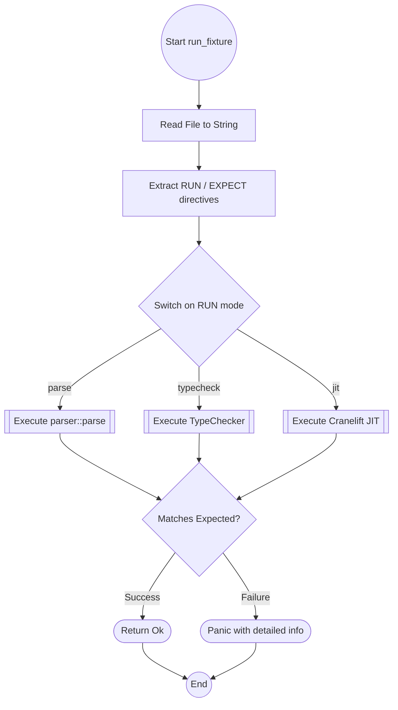

# Test Harness and CPython Test Integration

## Overview
<!-- type: overview lang: markdown -->

This specification defines the Mamba test harness (`fixture_tests.rs`) for robust
testing of Python 3.12 syntax, and the integration of CPython test cases into the
Mamba test suite. It covers multi-stage runner dispatch, enhanced diagnostic
reporting, recursive fixture discovery, and CPython syntax snippet verification.

Covers `tests/fixture_tests.rs` (in the `tests/` directory, not `src/`).

## Requirements
<!-- type: overview lang: markdown -->

### R1 - Directive Dispatch Logic

```yaml
id: R1
priority: high
```

The harness must correctly parse the `# RUN:` directive and dispatch the fixture
to the appropriate runner (parse, typecheck, or jit).

### R2 - Enhanced Error Reporting

```yaml
id: R2
priority: medium
```

Failure messages must include the fixture file path and detailed error context
from the Mamba diagnostic engine.

### R3 - Recursive Fixture Discovery

```yaml
id: R3
priority: medium
```

The harness must support recursive discovery of `.py` files within the
`tests/fixtures/` directory tree.

### R4 - CPython Fixture Directory Structure

```yaml
id: R4
priority: medium
```

CPython test snippets must be stored in
`crates/mamba/tests/fixtures/parse/cpython/` to separate them from
internal Mamba tests.

### R5 - Directive-based Snippet Format

```yaml
id: R5
priority: high
```

Each CPython fixture file must start with the `# RUN: parse` directive to ensure
it is processed by the parse-only runner.

### R6 - Syntax-focused Extraction

```yaml
id: R6
priority: high
```

Snippets must be extracted from CPython `test_grammar.py`, `test_syntax.py`, and
py312-specific test files, focusing on syntax constructs and omitting
CPython-specific test harness code.

## Acceptance Criteria
<!-- type: overview lang: markdown -->

### Scenario: Dispatch to Parse Runner

- **WHEN** A fixture with `# RUN: parse` is encountered.
- **THEN** The `run_parse` function should be called.

### Scenario: Report Detailed Failure

- **WHEN** A fixture fails to parse.
- **THEN** The error message should contain the file path and the specific
  syntax error.

### Scenario: Recursive Discovery

- **WHEN** A new `.py` file is added to a deeply nested directory under
  `tests/fixtures/`.
- **THEN** The harness should automatically find and run the file.

### Scenario: Run CPython Syntax Snippet

- **WHEN** A file `tests/fixtures/parse/cpython/fstring_pep701.py` with
  `# RUN: parse` is added.
- **THEN** The `fixture_tests.rs` harness should auto-discover the file and
  pass it to the Mamba parser.

### Scenario: Subdirectory Discovery

- **WHEN** A snippet is placed at
  `tests/fixtures/parse/cpython/pep695/generic_fn.py`.
- **THEN** The harness should discover and run snippets in nested subdirectories
  under `cpython/`.

## Diagrams
<!-- type: overview lang: markdown -->

### Harness Dispatch and Execution Flow



### CPython Fixture Execution Flow

```mermaid
sequenceDiagram
    participant Harness as fixture_tests.rs
    participant Filesystem as OS Filesystem
    participant Parser as Mamba Parser
    actor User as Test Runner
    Harness->>+Filesystem: Discover tests in fixtures/parse/cpython/
    Filesystem->>Harness: List of .py files
    Harness->>Filesystem: Read file content
    Filesystem->>Harness: Source with # RUN: parse
    Harness->>Parser: parse(src)
    Parser->>Harness: AST Module
    Harness->>-User: Report PASS
```
