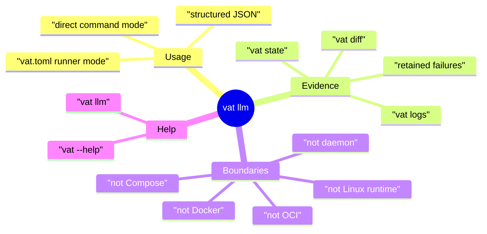
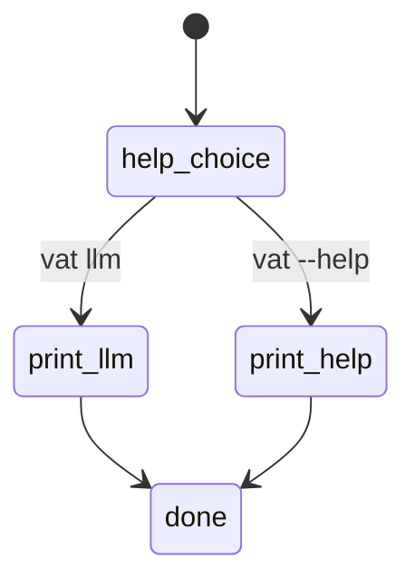
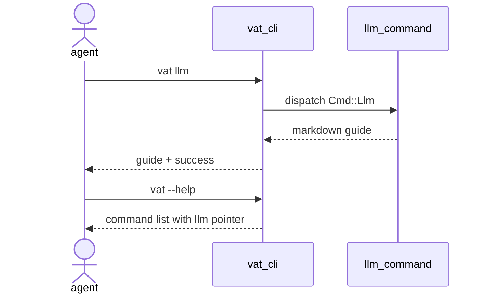
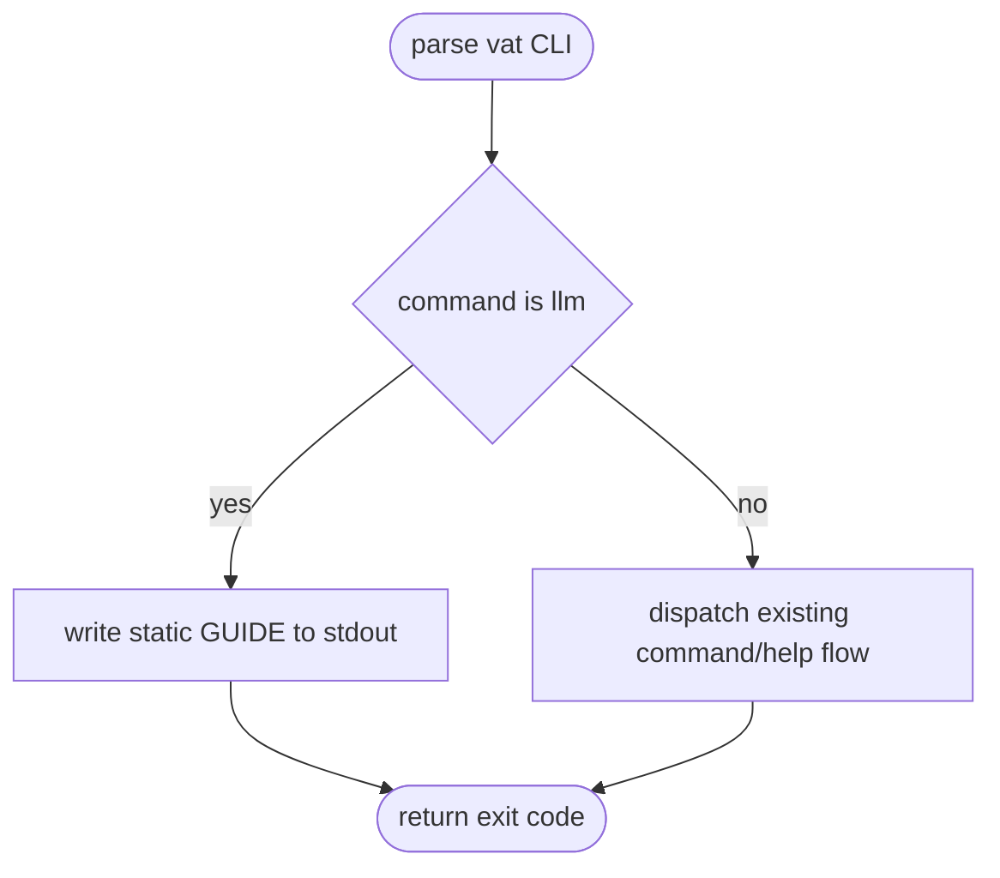
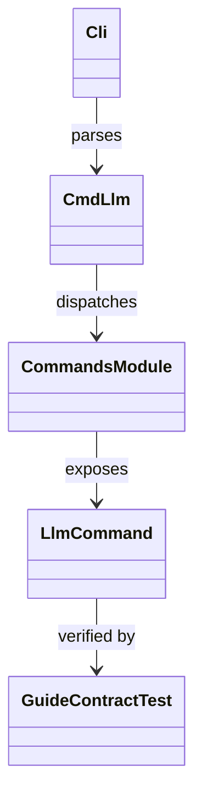
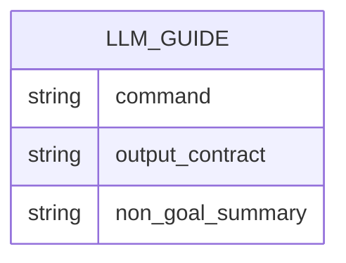

# Vat LLM Agent Usage Guide

## Scenarios
<!-- type: scenarios lang: yaml -->

```yaml
id: vat-llm-agent-usage-guide-scenarios
scenarios:
  - id: llm_reads_compact_usage_contract
    given:
      - "an agent needs to learn how to use vat from the CLI"
    when:
      - "the agent runs `vat llm`"
    then:
      - "vat prints a compact markdown guide"
      - "the guide explains `vat run <runner-id> --json` for vat.toml runner mode"
      - "the guide explains `vat run -- <command>` for direct command mode"
      - "the guide names `vat state`, `vat diff`, and `vat logs` as evidence commands"
      - "the guide states vat is not Docker, OCI, Compose, a Linux runtime, a VM, a daemon, or a long-lived process manager"
  - id: help_points_to_llm_guide
    given:
      - "an agent starts with ordinary command help"
    when:
      - "the agent runs `vat --help`"
    then:
      - "the help output lists `llm` as a command"
      - "the help output points agents to `vat llm` for the usage contract"
```
## Mindmap
<!-- type: mindmap lang: mermaid -->


## State Machine
<!-- type: state-machine lang: mermaid -->


## Interaction
<!-- type: interaction lang: mermaid -->


## Logic
<!-- type: logic lang: mermaid -->


## Dependency
<!-- type: dependency lang: mermaid -->


## Data Model
<!-- type: db-model lang: mermaid -->


## Schema
<!-- type: schema lang: yaml -->

```yaml
$schema: "https://json-schema.org/draft/2020-12/schema"
$id: "vat-llm-guide-contract.schema.json"
title: "Vat LLM guide observable contract"
type: object
required: [commands, evidence, boundaries]
properties:
  commands:
    type: array
    contains: { const: "vat run <runner-id> --json" }
  evidence:
    type: array
    items: { enum: ["vat state <id>", "vat diff <id>", "vat logs <id>"] }
  boundaries:
    type: array
    items:
      enum: ["not Docker", "not OCI", "not Compose", "not Linux runtime", "not VM", "not daemon"]
additionalProperties: false
```
## REST API
<!-- type: rest-api lang: yaml -->

```yaml
openapi: 3.1.0
info: { title: "No REST API change", version: "0.0.0" }
paths: {}
components: { schemas: {} }
x-aw-contract:
  surface: none
  reason: "Vat remains a local CLI tool for this slice."
```
## RPC API
<!-- type: rpc-api lang: yaml -->

```yaml
openrpc: 1.3.2
info: { title: "No JSON-RPC API change", version: "0.0.0" }
methods: []
x-aw-contract:
  surface: none
  reason: "No RPC surface is introduced."
```
## Async API
<!-- type: async-api lang: yaml -->

```yaml
asyncapi: 2.6.0
info: { title: "No async API change", version: "0.0.0" }
channels: {}
x-aw-contract:
  surface: none
  reason: "No pub-sub or streaming protocol is introduced."
```
## CLI
<!-- type: cli lang: yaml -->

```yaml
commands:
  - name: vat llm
    behavior:
      - "Print a stable markdown guide for LLM/tool agents."
      - "Exit successfully without requiring vat.toml or VAT_HOME."
      - "Mention runner mode, direct command mode, evidence commands, retention, and non-Docker boundaries."
  - name: vat --help
    behavior:
      - "Remain the clap-generated flag and command reference."
      - "Point agents to `vat llm` for the compact usage contract."
```
## Wireframe
<!-- type: wireframe lang: yaml -->

```yaml
layout:
  id: vat-llm-agent-usage-guide-wireframe
  surfaces: []
  note: "No graphical UI surface is added; stdout markdown is the only presentation."
```
## Component
<!-- type: component lang: yaml -->

```yaml
schemaVersion: "1.0.0"
readme: "No web component contract is changed."
modules: []
```
## Design Token
<!-- type: design-token lang: yaml -->

```yaml
$schema: "https://design-tokens.github.io/community-group/format/"
tokens: {}
metadata:
  reason: "No visual design token is introduced."
```
## Config
<!-- type: config lang: yaml -->

```yaml
configs: []
x-aw-contract:
  surface: none
  reason: "`vat llm` reads no vat.toml, environment variable, or external configuration."
```
## Manifest
<!-- type: manifest lang: yaml -->

```yaml
manifests: []
x-aw-contract:
  surface: none
  reason: "No Cargo manifest or package dependency change is required."
```
## Runtime Image
<!-- type: runtime-image lang: yaml -->

```yaml
images: []
build_contexts: []
x-aw-contract:
  surface: none
  reason: "Vat does not add Docker, OCI, or runtime image behavior."
```
## Deployment
<!-- type: deployment lang: yaml -->

```yaml
deployments: []
operations:
  - id: local-vat-cli
    action: "build and run the local vat binary"
    verification:
      - "cargo test -p vat llm_guide_mentions_core_agent_contract -- --nocapture"
      - "aw health vat --verify-traceability --verify-cb --verify-cold --verify-tests --verify-ec"
```
## Unit Test
<!-- type: unit-test lang: mermaid -->

```mermaid
---
id: vat-llm-agent-usage-guide-unit-tests
---
requirementDiagram
    requirement guide_contract {
      id: UT1
      text: "vat llm prints the core agent usage contract."
      risk: medium
      verifymethod: test
    }
    requirement help_pointer {
      id: UT2
      text: "vat --help exposes llm as the agent-facing guide command."
      risk: low
      verifymethod: test
    }
    test llm_guide_mentions_core_agent_contract {
      type: functional
      verifies: guide_contract
    }
```
## E2E Test
<!-- type: e2e-test lang: yaml -->

```yaml
e2e_tests:
  - id: vat-llm-agent-usage-guide
    name: "vat llm agent usage guide"
    capability_id: agent-native-gpu-native-dev-containers
    contract_id: agent-legible-state-and-diff-surface
    category: behavior
    command: "cargo test -p vat llm_guide_mentions_core_agent_contract -- --nocapture"
    assertions:
      - "`vat llm` exits successfully."
      - "The guide mentions vat.toml runner mode and direct command mode."
      - "The guide mentions state, diff, and logs evidence commands."
      - "The guide preserves non-Docker and non-daemon boundaries."
```
## Changes
<!-- type: changes lang: yaml -->

```yaml
changes:
  - path: projects/vat/src/commands/llm.rs
    action: create
    section: scenarios
    impl_mode: hand-written
    reason: "Implements the `llm_reads_compact_usage_contract` scenario with a stable stdout guide."
  - path: projects/vat/src/cli.rs
    action: modify
    section: source
    impl_mode: hand-written
    reason: "Register `vat llm` and make root help point agents to it."
  - path: projects/vat/src/commands/mod.rs
    action: modify
    section: source
    impl_mode: hand-written
    reason: "Expose the new llm command module."
  - path: projects/vat/src/commands/llm.rs
    action: create
    section: source
    impl_mode: hand-written
    reason: "Print the stable LLM usage guide."
  - path: projects/vat/tests/vat_toml_runner.rs
    action: modify
    section: source
    impl_mode: hand-written
    reason: "Add a binary smoke test for the LLM guide contract."
  - path: projects/vat/tests/vat_toml_runner.rs
    action: validate
    section: e2e-test
    impl_mode: hand-written
    reason: "Verifies the `vat llm` guide mentions the core agent commands and non-Docker boundaries."
  - path: projects/vat/README.md
    action: modify
    section: cli
    impl_mode: hand-written
    reason: "Document `vat llm` for operators and agents."
```

# Reviews

### Review 1
**Verdict:** approved

- [cli] The contract correctly adds `vat llm` as a read-only stdout guide and keeps `vat --help` as the standard clap reference.
- [logic] The implementation path is bounded to command dispatch and static guide printing; it does not alter runner execution, retention, or process management semantics.
- [e2e-test] The specified gate proves the agent-visible command contract and non-Docker/non-daemon boundaries from the compiled `vat` binary.
