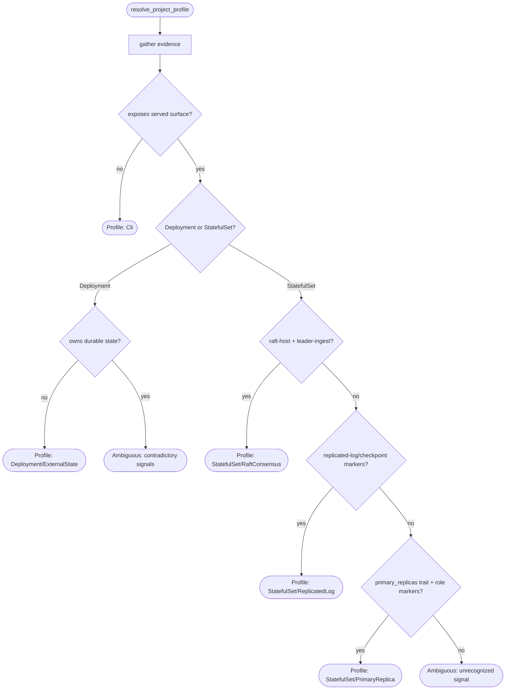

## Logic
<!-- type: logic lang: mermaid -->



The resolution walks five orthogonal dimensions (kind/surface, primary
workload, state ownership, replication/consensus, serving role) as a single
evidence-gathering pass over `aw.toml` (`[[projects]]` row, including
`[capability.profile].traits` such as `kubernetes_native` and
`primary_replicas` from the #1546 workload-profile-derivation trait
registry) plus project-tree signals (Dockerfile/k8s manifest presence,
`Cargo.toml` dependency graph for `raft-host`/`service-http`/`transport-*`,
and source-module naming conventions for replicated-log/checkpoint vs
leader-ingest vs primary/replica roles). Every decision branch that cannot
find a positive signal for its dimension falls through toward the
`Ambiguous` terminal rather than guessing a default profile -- an explicit
unknown/ambiguous result (with the evidence collected so far attached) is a
valid, first-class resolution outcome, not an error path. This is
deliberately orthogonal to `CapabilityType` (which EC dimensions are
production-required for a *capability*) and to the existing
`service`/`StatefulSet`/`Deployment` *capability-profile trait* baseline
derivation from #1546 (which drives generated `CONTRIBUTING.md`
obligations): `resolve_project_profile` reuses the same trait/evidence
inputs where they overlap (`kubernetes_native`, `primary_replicas`,
Dockerfile/k8s manifest presence) but produces a distinct
architecture-review-facing model (state ownership, replication/consensus
shape, serving role) that neither existing concept encodes.
## Changes
<!-- type: changes lang: yaml -->

```yaml
changes:
  - path: apps/agentic-workflow/src/cli/review.rs
    action: create
    impl_mode: hand-written
    section: logic
    description: |
      New module: `ProjectProfile` model (kind_surface, primary_workload,
      state_ownership, replication, serving_role dimensions, each carrying an
      explicit Unknown/Ambiguous variant per R1), `resolve_project_profile(project)`
      walking the evidence-gathering decision flow described in `## Logic`
      (aw.toml `[capability.profile].traits` from the #1546 workload-profile
      trait registry, Dockerfile/k8s manifest presence, `Cargo.toml`
      dependency graph, source-module naming conventions), plus
      `ReviewArgs`/`ReviewReport` and `run_review(args)` wiring the
      read-only `aw review --project <project>` verb's stdout envelope
      (resolved profile + evidence, or an explicit ambiguous-profile
      finding) following the runnable-or-terminal stdout contract.
      Hand-written: evidence-signal classification across five reference
      profiles is domain judgment no existing generator primitive covers
      yet (gap: project-profile-evidence-classifier, tracker: #2165,
      reason: no generator primitive maps aw.toml/source-tree evidence
      signals to a project-profile classification decision tree yet).
  - path: apps/agentic-workflow/src/cli/commands.rs
    action: modify
    impl_mode: hand-written
    section: logic
    anchor: Commands
    description: |
      Register `Review(review::ReviewArgs)` on `Commands` (mirroring the
      `Health`/`Goal` registration pattern) and add the
      `Commands::Review(args) => review::run_review(args)` dispatch arm in
      `run_command`, plus a `mod review;` import in `cli/mod.rs`.
      Hand-written because `commands.rs` is itself SPEC-MANAGED by
      apps/agentic-workflow/tech-design/surface/interfaces/src/commands.md;
      this anchor-based insertion lands the new variant, and `aw td lock
      --project agentic-workflow` resyncs commands.md's `## Source` mirror
      afterward (gap: review-command-registration, tracker: #2165, reason:
      cross-spec registration insertion into an already-CODEGEN file owned
      by a sibling TD, not this TD's own source-mirror).
```
## Unit Test

```mermaid
---
id: aw-review-project-profile-conformance-verification
requirements:
  cli_verb_stdout_contract:
    id: R7
    text: "`aw review --project <project>` is read-only (no filesystem/tracker mutation), emits the resolved/effective profile plus evidence (or the explicit ambiguous-profile finding) in its stdout envelope, and satisfies this repo's runnable-next-command-or-terminal-marker stdout convention."
    kind: functional
    risk: high
    verify: test_review_cli_read_only_stdout_contract
  resolves_ambiguous_profile:
    id: R6
    text: "A fixture with contradictory or insufficient evidence (e.g. StatefulSet manifest with no recognized replication signal, or a Deployment manifest carrying owned-state evidence) resolves to an explicit Ambiguous finding carrying the collected evidence, never a guessed default profile."
    kind: functional
    risk: high
    verify: test_resolve_ambiguous_profile_fixture
  resolves_cli_profile:
    id: R1
    text: "A pure-CLI project fixture (e.g. an aw/jet/mamba-shaped tree with no Dockerfile/k8s manifest/service surface) resolves to Profile{kind_surface: Cli} with no workload/replication/serving-role dimensions populated."
    kind: functional
    risk: high
    verify: test_resolve_cli_profile_fixture
  resolves_primary_replica_profile:
    id: R3
    text: "A primary-write/replica-read fixture (Lumen-like: StatefulSet manifest, primary_replicas trait, primary/replica role markers) resolves to Profile{workload: StatefulSet, replication: PrimaryReplica}."
    kind: functional
    risk: high
    verify: test_resolve_primary_replica_fixture
  resolves_raft_leader_ingest_profile:
    id: R5
    text: "A leader-ingest/Raft-coordinated fixture (Relay/Defer-like: StatefulSet manifest, raft-host Cargo dependency, leader-ingest source markers) resolves to Profile{workload: StatefulSet, replication: RaftConsensus, serving_role: LeaderIngest}."
    kind: functional
    risk: high
    verify: test_resolve_raft_leader_ingest_fixture
  resolves_replicated_log_profile:
    id: R4
    text: "A replicated-ordered-log-with-checkpoints fixture (Tape-like: StatefulSet manifest, segment/WAL/checkpoint source markers, no raft-host dependency) resolves to Profile{workload: StatefulSet, replication: ReplicatedLog}."
    kind: functional
    risk: high
    verify: test_resolve_replicated_log_fixture
  resolves_stateless_deployment_profile:
    id: R2
    text: "A stateless/external-state Deployment fixture (Pgpool-like: served surface, Deployment manifest, no PVC/raft-host/db dependency) resolves to Profile{workload: Deployment, state: ExternalState}."
    kind: functional
    risk: high
    verify: test_resolve_deployment_external_state_fixture
---
flowchart TD
    r1[R1 resolves cli profile] --> test_resolve_cli_profile_fixture[test_resolve_cli_profile_fixture]
    r2[R2 resolves stateless deployment profile] --> test_resolve_deployment_external_state_fixture[test_resolve_deployment_external_state_fixture]
    r3[R3 resolves primary replica profile] --> test_resolve_primary_replica_fixture[test_resolve_primary_replica_fixture]
    r4[R4 resolves replicated log profile] --> test_resolve_replicated_log_fixture[test_resolve_replicated_log_fixture]
    r5[R5 resolves raft leader ingest profile] --> test_resolve_raft_leader_ingest_fixture[test_resolve_raft_leader_ingest_fixture]
    r6[R6 resolves ambiguous profile] --> test_resolve_ambiguous_profile_fixture[test_resolve_ambiguous_profile_fixture]
    r7[R7 cli verb stdout contract] --> test_review_cli_read_only_stdout_contract[test_review_cli_read_only_stdout_contract]
```

<!-- type: unit-test lang: mermaid -->


