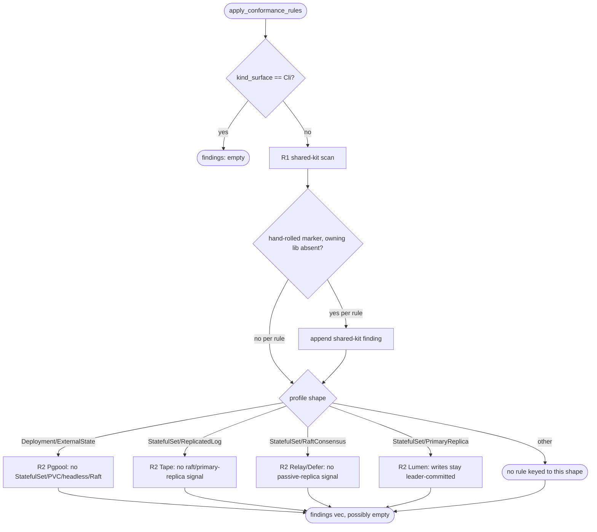

## Logic
<!-- type: logic lang: mermaid -->



`apply_conformance_rules(project_dir, profile)` runs after `#2165`'s `resolve_project_profile` and never changes `ProjectProfile`/`ProfileResolution` -- it is a second, additive read-only pass over the same evidence sources (`aw.toml` `capability.profile.traits`, `Cargo.toml` dependency graph, `src/**/*.rs` naming-convention markers) plus one new evidence source this WI adds: a k8s-manifest content scan (`k8s`/`deploy`/`kubernetes` dir, or `Dockerfile*`-adjacent manifests) for `PersistentVolumeClaim`/`volumeClaimTemplates`/`clusterIP: None`/`kind: StatefulSet` literals, needed to detect a Pgpool-like Deployment inheriting StatefulSet-shaped manifest content.

R1 (mandatory shared-service-kit adoption review) walks a small rule table -- one row per `libs/*` kit crate (`server-tcp`/`server-http`/`transport-h2c`/`service-http` for served-surface setup, `server-lifecycle` for retry/backoff and health-check plumbing, `service-observability` for structured logging/metrics, `raft-core`/`raft-runtime` for consensus) -- each row pairing a source-level hand-rolled heuristic marker (e.g. direct `TcpListener::bind`/`hyper::Server::bind` calls, a hand-rolled retry-loop shape, a literal `/healthz`/`/health` route strung together without `service-http`, a hand-rolled `mod logging`/metrics-registry setup, or raft-shaped leader-ingest source markers) with the Cargo dependency that would make the marker redundant. A finding fires only when the marker is present AND the owning dependency is absent, so a project that already adopted the shared crate produces no finding. The rule table is heuristic (substring/marker-based, matching the existing `scan_source_markers` style from `#2165`), not a semantic diff -- false negatives (a differently-named hand-rolled pattern) are possible and documented as a known limitation, not overclaimed precision. The `raft-core`/`raft-runtime` row additionally requires raft-shaped source markers (leader-ingest co-occurrence) before it fires, and every row is skipped outright for `Cli` profiles -- this is what keeps AC3's "without demanding irrelevant libraries from CLI/Deployment profiles" true by construction: CLI profiles get zero rows evaluated, and a Deployment profile only ever sees a raft-related finding if its own source already contains raft-shaped markers, never as a blanket profile-level demand.

R2 (profile-specific negative assertions) is one rule per one of the four served-surface reference profiles from `#2165` (`Cli` has no workload dimension, so it has no negative-assertion rule): a `Deployment/ExternalState` (Pgpool-like) profile must not carry StatefulSet-manifest/PVC/headless-service/raft-dependency evidence; a `StatefulSet/ReplicatedLog` (Tape-like) profile must not carry raft-dependency or primary/replica-role evidence (that would mean its ordering/checkpoint semantics were silently reinterpreted); a `StatefulSet/RaftConsensus` (Relay/Defer-like) profile must not carry `primary_replicas`-trait or primary/replica-role evidence (that would mean its consensus-owned claim/ack/retry/DLQ state was silently reduced to a passive read replica); and a `StatefulSet/PrimaryReplica` (Lumen-like) profile must not carry raft-dependency-plus-leader-ingest evidence (that would mean writes were silently rerouted off the project's own leader-committed primary path instead of staying leader-committed via the primary role). Each rule is a structural contradiction check over freshly gathered evidence, independent of any cached profile object, so it also acts as a regression detector if a project's source drifts without its declared `aw.toml` traits changing. `Unknown`/`Ambiguous`-shaped profiles have no negative-assertion rule keyed to them (the ambiguity itself is already `#2165`'s finding).

Findings carry a stable `id` (rule-name-scoped, so the same violation on the same project always reproduces the same id), a `severity`, a human-readable `summary`, the `affected_paths` evidence trail (Cargo.toml/aw.toml/source-file/manifest-file paths, mirroring `#2165`'s `ProfileEvidence.source`/`detail` shape), and an executable `remediation` string that always names the owning `libs/*` crate or the specific structural fix -- never a bare "needs review" terminal marker, per the parent epic #2163 R3 finding-shape requirement. `findings` is appended as a new top-level field on the existing `aw review` envelope (alongside the unchanged `profile`/`evidence`/`outcome` fields from `#2165`) rather than replacing or restructuring any of that output.
## Changes
<!-- type: changes lang: yaml -->

```yaml
changes:
  - path: apps/agentic-workflow/src/cli/review_rules.rs
    action: create
    section: logic
    impl_mode: hand-written
    description: |
      New module implementing R1 (mandatory shared-service-kit adoption review) and R2
      (profile-specific negative assertions) as `pub(crate) fn apply_conformance_rules(project_dir: &Path, resolution: &review::ProfileResolution) -> Vec<Finding>`.

      Types:
        - `pub(crate) struct Finding { id: String, severity: FindingSeverity, summary: String, affected_paths: Vec<String>, remediation: String }`
          (mirrors `apps/agentic-workflow/src/cli/td_check_section_type.rs::Finding` shape/field-naming
          conventions and reuses `crate::validate::Severity`-style ordering, but is its own
          review-domain type -- never a re-export of the td-check Finding).
        - `pub(crate) enum FindingSeverity { High, Medium, Low }` (serde-serializable, lowercase).

      R1 rule table (const array of rows), one row per libs/* kit crate: server-tcp/server-http/
      transport-h2c/service-http (served-surface setup: direct TcpListener::bind/hyper::Server::bind
      source markers without the corresponding dependency), server-lifecycle (hand-rolled retry/backoff
      loop shape without the dependency), service-observability (hand-rolled `mod logging`/metrics-registry
      setup without the dependency), raft-core/raft-runtime (raft-shaped leader-ingest source markers
      without the dependency -- this row additionally requires raft-shaped markers via reused
      `review::scan_source_markers` output before it fires, and every row is skipped outright when
      `resolution.profile.kind_surface == review::KindSurface::Cli`). Each row is evaluated by reusing
      `review::read_cargo_dependencies(project_dir)` for the dependency check and
      `review::scan_source_markers(project_dir)` plus a small local substring/regex marker scan
      (`TcpListener::bind`, `hyper::Server::bind`, literal `/healthz`/`/health` route strings, `mod logging`)
      for the source-marker check. A finding fires only when the marker is present AND the owning
      dependency is absent.

      R2 negative-assertion rules, one function per #2165 reference profile shape, each taking
      `&review::ProfileResolution` plus fresh evidence and returning `Option<Finding>`:
        - `pgpool_negative_assertion` (Deployment/ExternalState): flags StatefulSet/PVC/headless-service
          k8s-manifest content or a raft-core/raft-runtime Cargo dependency.
        - `tape_negative_assertion` (StatefulSet/ReplicatedLog): flags a raft dependency or
          primary/replica-role source markers (via `review::scan_source_markers().primary_replica_role`).
        - `relay_defer_negative_assertion` (StatefulSet/RaftConsensus): flags the `primary_replicas`
          capability.profile trait or primary/replica-role source markers.
        - `lumen_negative_assertion` (StatefulSet/PrimaryReplica): flags a raft dependency combined with
          leader-ingest source markers (`review::scan_source_markers().leader_ingest`) absent the project's
          own primary-role marker.
      A private `scan_k8s_manifests(project_dir: &Path) -> KitManifestMarkers { has_pvc, has_headless_service,
      has_statefulset_kind }` helper reads `k8s/`, `deploy/`, or `kubernetes/` subdirectories (mirroring
      `review::has_dockerfile_or_manifest`'s directory-probing style) for the literals
      `PersistentVolumeClaim`/`volumeClaimTemplates`/`clusterIP: None`/`kind: StatefulSet`; this is the one
      new evidence source this WI adds beyond the #2165 evidence set.

      `apply_conformance_rules` dispatches R2 by `resolution.profile.primary_workload`/`state_ownership`
      (Unknown/Ambiguous profiles produce no R2 finding) and always runs R1 first, then R2, concatenating
      results into one `Vec<Finding>`. Every `Finding.id` is deterministic and rule-scoped (e.g.
      `"shared-kit:server-http"`, `"negative-assertion:pgpool:raft-dependency"`) so the same violation on
      the same project reproduces the same id across runs. Includes a `#[cfg(test)] mod tests` with one
      `#[test]` fn per Unit Test requirement id below, using `tempfile::TempDir`-backed fixture project
      directories (matching `review.rs`'s existing `#[cfg(test)]` fixture style) to construct minimal
      Cargo.toml/aw.toml/src/k8s content per scenario.

      gap: shared-service-kit-conformance-rule-heuristics
      tracker: "#2166"

  - path: apps/agentic-workflow/src/cli/review.rs
    action: modify
    section: logic
    impl_mode: hand-written
    anchor: ReviewReport
    description: |
      Additive-only extension of the existing #2165 `aw review` output, never altering
      `ProjectProfile`/`ProfileResolution`/`ProfileEvidence`:
        - Add a new field `pub findings: Vec<crate::cli::review_rules::Finding>` to
          `ReviewReport { project, resolution, findings }`.
        - In `run_review()`, after `resolve_project_profile` produces `resolution`, call
          `review_rules::apply_conformance_rules(project_dir, &resolution)` and place the result on
          `ReviewReport.findings` before returning/emitting the report.
        - In `review_envelope()`, add a `"findings"` key to the emitted JSON envelope alongside the
          existing unchanged `"profile"`/`"evidence"`/`"outcome"` keys, serializing the same
          `Vec<Finding>` (empty array when no findings, never an omitted key, so downstream consumers can
          rely on the key always being present per the parent epic #2163 R3 stable-shape requirement).
        - Add a small `pub(crate) fn project_dir_for(project: &str) -> PathBuf` helper (or reuse an
          existing equivalent already private to this file, widening its visibility to `pub(crate)` only
          if one already exists) so `review_rules` tests and `run_review()` share one project-root
          resolution path instead of duplicating it.
        - Widen any of `read_cargo_dependencies`, `read_project_traits`, `scan_source_markers`,
          `has_dockerfile_or_manifest`, and the `SourceMarkers` struct's fields actually consumed by
          `review_rules.rs` from private to `pub(crate)`, with no behavior change to any of them.
        - Deliberately excluded from this change: `apps/agentic-workflow/src/cli/mod.rs` module
          registration, capability-status flips, and doc-mirror `## Source` snapshot sync. These follow
          the same two-phase precedent #2165 used (module wiring landed in the separate manual commit
          `2c504f98d`, not inside any TD Changes[] entry) and are deferred to the follow-up aw-dev
          implementation/wiring pass for this WI.

      gap: review-command-findings-wiring
      tracker: "#2166"
```
## Unit Test

```mermaid
---
id: aw-review-shared-service-conformance-rules-verification
requirements:
  cli_profile_produces_no_findings:
    id: AC3b
    text: "A Cli kind_surface profile short-circuits apply_conformance_rules with zero R1 shared-kit rows evaluated and zero R2 negative-assertion rules applied, so aw itself and other CLI projects never receive a served-surface finding."
    kind: functional
    risk: medium
    verify: cli_profile_produces_no_findings
  envelope_contract_is_additive_only:
    id: R4
    text: "review_envelope() output after this change still contains the unchanged #2165 profile/evidence/outcome keys plus one new findings key (always present, empty array when there are no findings), so the #2165 envelope contract is extended, never broken."
    kind: regression
    risk: high
    verify: envelope_contract_is_additive_only
  finding_shape_is_stable_and_executable:
    id: R3
    text: "Every emitted Finding carries a stable rule-scoped id, a severity, a human-readable summary, a non-empty affected_paths evidence trail, and a remediation string that names either an owning libs/* crate or a concrete structural fix, never a bare needs-review placeholder."
    kind: functional
    risk: high
    verify: finding_shape_is_stable_and_executable
  lumen_negative_assertion:
    id: R2d
    text: "A StatefulSet/PrimaryReplica (Lumen-like) profile whose evidence shows a raft dependency plus leader-ingest source markers without its own primary-role marker produces a lumen negative-assertion finding, since writes would be silently rerouted off the project's own leader-committed primary path."
    kind: functional
    risk: high
    verify: lumen_negative_assertion
  pgpool_negative_assertion:
    id: R2
    text: "A Deployment/ExternalState (Pgpool-like) profile whose evidence shows StatefulSet/PVC/headless-service k8s-manifest content, or a raft-core/raft-runtime dependency, produces a pgpool negative-assertion finding, since a stateless Deployment must not inherit StatefulSet/PVC/headless/Raft requirements."
    kind: functional
    risk: high
    verify: pgpool_negative_assertion
  relay_defer_negative_assertion:
    id: R2c
    text: "A StatefulSet/RaftConsensus (Relay/Defer-like) profile whose evidence shows the primary_replicas trait or primary/replica-role source markers produces a relay/defer negative-assertion finding, since its consensus-owned claim/ack/retry/DLQ executors must stay active, not be downgraded to passive read replicas."
    kind: functional
    risk: high
    verify: relay_defer_negative_assertion
  shared_kit_no_finding_when_adopted:
    id: R1b
    text: "A project whose source contains a server-http-style route marker AND already depends on libs/service-http produces no R1 shared-kit finding for that rule row, so adoption suppresses the finding rather than the marker alone triggering it."
    kind: regression
    risk: medium
    verify: shared_kit_no_finding_when_adopted
  shared_kit_raft_rule_gated_on_raft_shaped_markers:
    id: AC3
    text: "The raft-core/raft-runtime R1 rule row fires only when raft-shaped leader-ingest source markers are present without the dependency; a plain Deployment/ExternalState profile with no raft-shaped markers never receives a raft-adoption finding, keeping shared-kit review from demanding irrelevant libraries from CLI/Deployment profiles."
    kind: functional
    risk: high
    verify: shared_kit_raft_rule_gated_on_raft_shaped_markers
  shared_kit_reimplementation_detected:
    id: R1
    text: "A served-surface project whose source contains a hand-rolled TcpListener::bind/hyper::Server::bind marker and does not depend on the owning libs/* crate (server-tcp/server-http/transport-h2c/service-http) produces a shared-kit finding routing remediation to that owning crate."
    kind: functional
    risk: high
    verify: shared_kit_reimplementation_detected
  tape_negative_assertion:
    id: R2b
    text: "A StatefulSet/ReplicatedLog (Tape-like) profile whose evidence shows a raft dependency or primary/replica-role source markers produces a tape negative-assertion finding, since its ordering/checkpoint semantics must be preserved, not silently reinterpreted as raft or primary/replica."
    kind: functional
    risk: high
    verify: tape_negative_assertion
---
flowchart TD
    r1[R1 shared kit reimplementation detected] --> shared_kit_reimplementation_detected[shared_kit_reimplementation_detected]
    r2[R2 pgpool negative assertion] --> pgpool_negative_assertion[pgpool_negative_assertion]
    ac3[AC3 shared kit raft rule gated on raft shaped markers] --> shared_kit_raft_rule_gated_on_raft_shaped_markers[shared_kit_raft_rule_gated_on_raft_shaped_markers]
    r3[R3 finding shape is stable and executable] --> finding_shape_is_stable_and_executable[finding_shape_is_stable_and_executable]
    r4[R4 envelope contract is additive only] --> envelope_contract_is_additive_only[envelope_contract_is_additive_only]
    ac3b[AC3b cli profile produces no findings] --> cli_profile_produces_no_findings[cli_profile_produces_no_findings]
    r1b[R1b shared kit no finding when adopted] --> shared_kit_no_finding_when_adopted[shared_kit_no_finding_when_adopted]
    r2b[R2b tape negative assertion] --> tape_negative_assertion[tape_negative_assertion]
    r2c[R2c relay defer negative assertion] --> relay_defer_negative_assertion[relay_defer_negative_assertion]
    r2d[R2d lumen negative assertion] --> lumen_negative_assertion[lumen_negative_assertion]
```

<!-- type: unit-test lang: mermaid -->


