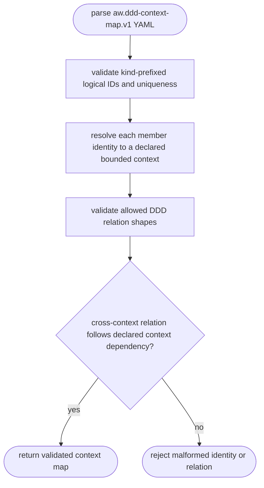

# DDD Context-Map Contract

## Logic
<!-- type: logic lang: mermaid -->



The canonical key grammar is intentionally logical rather than locational:

- `context:<bounded-context>` identifies one bounded context.
- `aggregate:<context>/<name>`, `use-case:<context>/<name>`,
  `port:<context>/<name>`, `adapter:<context>/<name>`, and
  `artifact:<context>/<name>` identify its members.

Every segment is lowercase kebab case. A slash has only the semantic
`<context>/<name>` meaning; a filesystem path, `.md` suffix, or `#anchor` is
invalid as an ID. `projections.paths` and `projections.markdown_anchors` remain
optional location hints and are deliberately excluded from identity and relation
validation, so a TD move or heading rename cannot change the product promise.

The allowed relation vocabulary is deliberately small: a context `contains`
members of the same context; a use case `uses` an aggregate or port; an adapter
`implements` a port; an artifact `realizes` an aggregate, use case, port, or
adapter; and one context `depends-on` another context. A non-containment
cross-context `uses`, `implements`, or `realizes` relation is permitted only in
the declared source-to-target `context depends-on` direction. Duplicate identity
ownership, undeclared contexts, relation-shape mismatches, and reverse
cross-context dependencies fail closed.

This contract is only the stable DDD join point. It does not project META docs,
rewrite capability prose, compile Python AST, generate source, or integrate
Mamba/mambalibs.

## Unit Test

```mermaid
---
id: aw-ddd-context-map-unit-tests
requirements:
  stable_projections:
    id: R1
    text: "The same DDD IDs and relations survive path and Markdown-heading projection changes."
    kind: contract
    risk: high
    verify: "cargo test -p agentic-workflow --test ddd_context_map_test ddd_context_map_keeps_logical_identity_when_projections_move -- --nocapture"
  relation_direction:
    id: R2
    text: "A reverse cross-context implementation is rejected unless its own source context declares the dependency."
    kind: regression
    risk: high
    verify: "cargo test -p agentic-workflow --test ddd_context_map_test ddd_context_map_rejects_cross_context_dependency_in_the_wrong_direction -- --nocapture"
  identity_ownership:
    id: R3
    text: "Duplicate IDs and path or Markdown-anchor-shaped IDs are rejected."
    kind: regression
    risk: high
    verify: "cargo test -p agentic-workflow --test ddd_context_map_test -- --nocapture"
elements:
  ddd_context_map_keeps_logical_identity_when_projections_move: { kind: test, type: "rs/#[test]" }
  ddd_context_map_rejects_cross_context_dependency_in_the_wrong_direction: { kind: test, type: "rs/#[test]" }
  ddd_context_map_rejects_duplicate_identity_ownership: { kind: test, type: "rs/#[test]" }
  ddd_context_map_rejects_paths_and_markdown_anchors_as_identity: { kind: test, type: "rs/#[test]" }
relations:
  - { from: ddd_context_map_keeps_logical_identity_when_projections_move, verifies: stable_projections }
  - { from: ddd_context_map_rejects_cross_context_dependency_in_the_wrong_direction, verifies: relation_direction }
  - { from: ddd_context_map_rejects_duplicate_identity_ownership, verifies: identity_ownership }
  - { from: ddd_context_map_rejects_paths_and_markdown_anchors_as_identity, verifies: identity_ownership }
---
requirementDiagram
  requirement R1 {
    id: R1
    text: "stable identity across projections"
    risk: high
    verifymethod: test
  }
  requirement R2 {
    id: R2
    text: "directed cross-context dependency"
    risk: high
    verifymethod: test
  }
  requirement R3 {
    id: R3
    text: "unique non-locational identity"
    risk: high
    verifymethod: test
  }
  element ddd_context_map_keeps_logical_identity_when_projections_move {
    type: "rs/#[test]"
  }
  element ddd_context_map_rejects_cross_context_dependency_in_the_wrong_direction {
    type: "rs/#[test]"
  }
  element ddd_context_map_rejects_duplicate_identity_ownership {
    type: "rs/#[test]"
  }
  element ddd_context_map_rejects_paths_and_markdown_anchors_as_identity {
    type: "rs/#[test]"
  }
```

<!-- type: unit-test lang: mermaid -->



## Changes
<!-- type: changes lang: yaml -->

```yaml
changes:
  - path: apps/agentic-workflow/src/context_map/mod.rs
    action: create
    section: logic
    impl_mode: hand-written
    description: "Expose the bounded-context map model and validation facade."
  - path: apps/agentic-workflow/src/context_map/model.rs
    action: create
    section: logic
    impl_mode: hand-written
    description: "Serialize logical DDD identities, relations, and non-canonical location projections."
  - path: apps/agentic-workflow/src/context_map/validate.rs
    action: create
    section: logic
    impl_mode: hand-written
    description: "Fail-closed identity grammar, ownership, allowed-relation, and cross-context-direction validator."
  - path: apps/agentic-workflow/src/lib.rs
    action: modify
    section: source
    impl_mode: codegen
    description: "Register the context-map bounded context in the library facade."
  - path: apps/agentic-workflow/tech-design/core/logic/lib.md
    action: modify
    section: source
    impl_mode: hand-written
    description: "Synchronize the authoritative lib.rs source snapshot."
  - path: apps/agentic-workflow/tests/ddd_context_map_test.rs
    action: create
    section: unit-test
    impl_mode: hand-written
    description: "Prove projection stability plus direction and ownership failures."
  - path: apps/agentic-workflow/tests/fixtures/ddd_context_map
    action: create
    section: unit-test
    impl_mode: hand-written
    description: "Static valid, moved-projection, reversed-dependency, duplicate-ID, and path-identity context maps."
```
