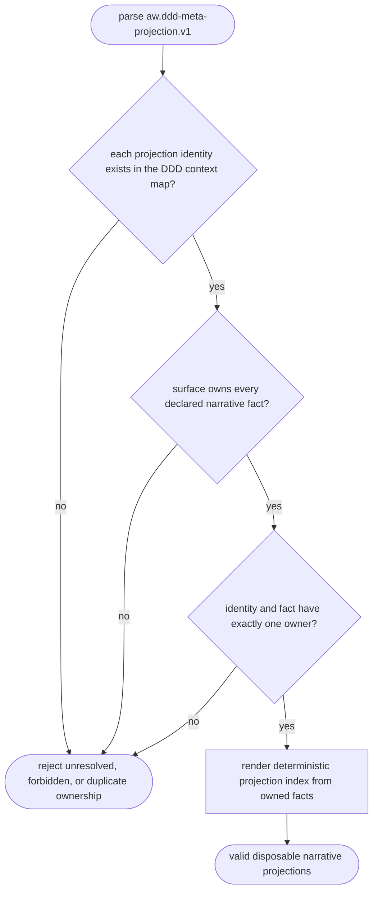

# DDD Meta-Projection Contract

## Logic
<!-- type: logic lang: mermaid -->



The DDD meta-projection contract has six fixed narrative surfaces. The ownership
matrix is canonical and also supplies the forbidden examples: CAPABILITIES owns
`promise`; README owns `overview` and `journey`; CONTRIBUTING owns `boundary`
and `authoring-rule`; EC owns `external-truth`; TD owns
`executable-construction`; and `src/*` owns `implementation` and `unit-test`.
No surface may claim another surface's fact, and the tuple `(stable identity,
fact)` has one owner only.

Each projection must reference an identity already validated by
`aw.ddd-context-map.v1`. A `rendered_markdown` value is intentionally
non-canonical: validation and `render_projection_index` ignore it, then render a
stable index from declared ownership. Consequently a document move, heading
rename, or regenerated wording is disposable; it cannot become a second source
of truth or redefine a DDD identity.

This contract defines narrative ownership without rewriting existing meta docs,
compiling Python AST, generating source, or changing Mamba/mambalibs. Later
adapters may materialize each surface only from these validated facts and their
domain-specific payloads.

## Unit Test

```mermaid
---
id: aw-ddd-meta-projection-unit-tests
requirements:
  role_matrix:
    id: R1
    text: "All six surfaces expose one declared narrative role and accept only their owned fact types."
    kind: contract
    risk: high
    verify: "cargo test -p agentic-workflow --test ddd_meta_projection_test ddd_meta_projection_assigns_each_surface_its_declared_narrative_role -- --nocapture"
  one_owner:
    id: R2
    text: "Duplicate ownership and unresolved stable IDs fail validation."
    kind: regression
    risk: high
    verify: "cargo test -p agentic-workflow --test ddd_meta_projection_test ddd_meta_projection_rejects_duplicate_ownership -- --nocapture"
  disposable_rendering:
    id: R3
    text: "Changed Markdown renders reproduce the same deterministic ownership index."
    kind: contract
    risk: medium
    verify: "cargo test -p agentic-workflow --test ddd_meta_projection_test ddd_meta_projection_regenerates_the_same_index_after_markdown_changes -- --nocapture"
elements:
  ddd_meta_projection_assigns_each_surface_its_declared_narrative_role: { kind: test, type: "rs/#[test]" }
  ddd_meta_projection_rejects_duplicate_ownership: { kind: test, type: "rs/#[test]" }
  ddd_meta_projection_rejects_unresolved_stable_identity_references: { kind: test, type: "rs/#[test]" }
  ddd_meta_projection_rejects_forbidden_surface_ownership: { kind: test, type: "rs/#[test]" }
  ddd_meta_projection_regenerates_the_same_index_after_markdown_changes: { kind: test, type: "rs/#[test]" }
relations:
  - { from: ddd_meta_projection_assigns_each_surface_its_declared_narrative_role, verifies: role_matrix }
  - { from: ddd_meta_projection_rejects_duplicate_ownership, verifies: one_owner }
  - { from: ddd_meta_projection_rejects_unresolved_stable_identity_references, verifies: one_owner }
  - { from: ddd_meta_projection_rejects_forbidden_surface_ownership, verifies: role_matrix }
  - { from: ddd_meta_projection_regenerates_the_same_index_after_markdown_changes, verifies: disposable_rendering }
---
requirementDiagram
  requirement R1 {
    id: R1
    text: "single role per narrative surface"
    risk: high
    verifymethod: test
  }
  requirement R2 {
    id: R2
    text: "one owner and resolved stable ID"
    risk: high
    verifymethod: test
  }
  requirement R3 {
    id: R3
    text: "Markdown is disposable projection output"
    risk: medium
    verifymethod: test
  }
  element ddd_meta_projection_assigns_each_surface_its_declared_narrative_role {
    type: "rs/#[test]"
  }
  element ddd_meta_projection_rejects_duplicate_ownership {
    type: "rs/#[test]"
  }
  element ddd_meta_projection_rejects_unresolved_stable_identity_references {
    type: "rs/#[test]"
  }
  element ddd_meta_projection_rejects_forbidden_surface_ownership {
    type: "rs/#[test]"
  }
  element ddd_meta_projection_regenerates_the_same_index_after_markdown_changes {
    type: "rs/#[test]"
  }
```

<!-- type: unit-test lang: mermaid -->



## Changes
<!-- type: changes lang: yaml -->

```yaml
changes:
  - path: apps/agentic-workflow/src/context_map/mod.rs
    action: modify
    section: logic
    impl_mode: hand-written
    description: "Expose narrative projection parsing, validation, model, and deterministic rendering."
  - path: apps/agentic-workflow/src/context_map/narrative_projection.rs
    action: create
    section: logic
    impl_mode: hand-written
    description: "Own the six-surface narrative-role matrix and stable-ID projection validator."
  - path: apps/agentic-workflow/tests/ddd_meta_projection_test.rs
    action: create
    section: unit-test
    impl_mode: hand-written
    description: "Prove roles, forbidden ownership, unresolved IDs, duplicates, and reproducible rendering."
  - path: apps/agentic-workflow/tests/fixtures/ddd_meta_projection
    action: create
    section: unit-test
    impl_mode: hand-written
    description: "Static valid, rerendered, duplicate, unresolved, and forbidden narrative projections."
```
