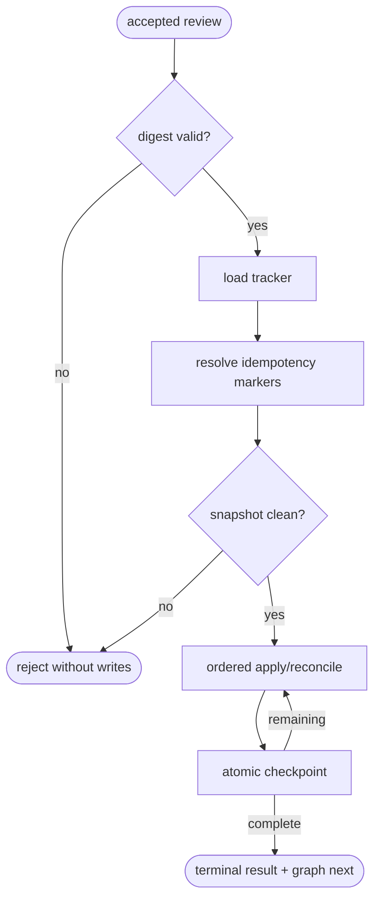

# Digest-Bound Project Planning Transaction

## Overview
<!-- type: overview lang: markdown -->

An eligible `aw.wi.project-plan.v2` stage is published through one
`aw.wi.project-plan-transaction.v2` manifest. The manifest binds the plan,
the exact project tracker snapshot, every ordered mutation, the executable
apply command, and the terminal graph command into the review digest.

`aw wi plan-review` records review evidence only and never touches tracker
state. `aw wi plan-answer` records digest-bound human decisions only.
`aw wi plan-apply` is the sole tracker mutation verb. Each returns the same
`aw.cli.v1` project-plan root envelope and its next current node.

The transaction never deletes work items. Duplicate and supersession decisions
are recorded as reviewed labels and body evidence so tracker history remains
available. Every create/update has a stable idempotency key stored on the issue;
a local checkpoint is audit evidence, while tracker markers are the recovery
authority after an ambiguous transport failure.

Normalize is the only stage that can apply without review or HITL. Its apply
path recompiles the complete plan and manifest from the live configured
project inventory and requires exact structural equality with the supplied
artifacts; self-declared `deterministic` metadata is never authorization.

Every checkpoint filename includes the exact plan/manifest source digest.
Retries of one authorization unit reuse its checkpoint, while a later
iteration of the same stage receives a distinct checkpoint and cannot deadlock
on stale digest evidence.

The transaction does not write a provenance-only update to an already clean
issue. A post-publication plan therefore converges to an empty mutation set;
re-running unchanged inventory preserves that plan digest.

Every proposed epic carries its reviewed planning horizon. The active and
deferred transaction-marked siblings of a mixed source epic are durable
publication evidence: subsequent planning retains the original for history but
uses its siblings instead of proposing the same split again. Existing changes
of the source are relabelled to the matching sibling only after that sibling
exists, preserving complete reconciliation across the transition. The same
update replaces every legacy body parent declaration with one canonical parent,
so strict graph verification never observes both old and new owners.

The transaction marker also makes the generated `## Requirements` section
authoritative on subsequent planning reads. Scope and acceptance list items are
evidence, not additional backlog leaves, which keeps an unchanged replan at
zero mutations.

Every proposed change may use a compact tracker title, but its generated Scope
contains the complete authoritative parent Requirement text for every covered
Requirement id. Capability Alignment inherits the parent epic's declared
Capability value; neither title truncation nor a planner-default capability may
weaken the published child contract. Requirement-specific gates and oracles
from the epic Verification Inventory are rendered into a distinct
`## Verification` section.

Requirement dependencies from that same inventory are rendered as symbolic
`depends-on:<proposal-id>` labels in the reviewed manifest. Create mutations
are ordered by dependency depth, and the apply transaction resolves each
symbolic proposal id to the real tracker id before creating a dependent issue.
Resolution is token-safe for prefix-overlapping ids such as `requirement-1`
and `requirement-10`: the complete longest symbolic id is replaced first.
On retry, a transaction-marker-owned create whose managed graph labels differ
from the exact reviewed mutation is repaired in place and checkpointed instead
of being accepted as reconciled or duplicated.

## Requirements
<!-- type: requirements lang: yaml -->

```yaml
requirements:
  - id: R1
    text: One independent review covers the complete normalized project plan.
  - id: R2
    text: The review digest binds the exact tracker snapshot, mutation manifest, apply command, and terminal command.
  - id: R3
    text: Stale evidence, same-agent review, incomplete checklists, unsupported commands, and tracker drift fail before the first mutation.
  - id: R4
    text: needs_revision publishes nothing and explicit human-only review remains an opt-in policy.
  - id: R5
    text: Apply epic creates, change creates, epic updates, and change updates in a stable dependency-safe order.
  - id: R6
    text: Duplicate and superseded issues are retained; the transaction records recommendations without deleting or closing them.
  - id: R7
    text: Retry reconciles tracker idempotency markers and converges without duplicate issues or conflicting labels.
  - id: R8
    text: A clean post-publication inventory produces no provenance-only mutation, no duplicate proposal, and the same digest on unchanged reread.
  - id: R9
    text: Stage allowlists reject create or close outside atomize and reject mutations whose required review or HITL evidence is incomplete.
  - id: R10
    text: Review and answer commands never mutate tracker state; only plan-apply owns issue-platform writes.
  - id: R11
    text: Unreviewed normalize apply recompiles the canonical live-inventory plan and manifest and rejects any artifact mismatch before tracker mutation.
  - id: R12
    text: Checkpoints are keyed by stage and exact source digest so later iterations never collide with stale completed evidence.
  - id: R13
    text: Explicit human-only review records its native approve or revise verdict through an executable plan-review command and accepted human evidence may authorize the same digest.
  - id: R14
    text: Every proposed change mutation covers at least one authoritative Requirement id; generic empty-coverage replacement responsibility is forbidden.
  - id: R15
    text: Proposed change bodies preserve complete parent Requirement text and inherit the parent epic Capability even when their tracker titles are compacted.
  - id: R16
    text: Proposed change bodies preserve every requirement-specific runnable gate and observable oracle from the epic Verification Inventory.
  - id: R17
    text: Proposed change mutations preserve requirement dependency edges, create prerequisites first, and resolve symbolic proposal ids to real tracker labels.
  - id: R18
    text: Prefix-overlapping symbolic proposal ids resolve longest-first, and retry repairs transaction-marker-owned creates to the exact reviewed managed graph labels without creating duplicates.
```

## Behavior
<!-- type: behavior lang: gherkin -->

```gherkin
Feature: publish one reviewed project planning transaction

  Scenario: accepted review applies its exact manifest
    Given aw wi plan wrote one project plan and transaction manifest
    And an independent reviewer accepted the exact source digest
    When aw wi plan-review records the evidence
    And aw wi plan-apply applies the eligible manifest
    Then tracker snapshot preflight completes before the first write
    And proposed epics are created before proposed changes
    And canonical epic and change graph labels are updated afterward
    And the result names every reviewed mutation and one executable terminal command

  Scenario: tracker drift aborts before mutation
    Given a project issue changed after the review digest was authored
    When aw wi plan-apply preflights the tracker
    Then it fails before the first mutation
    And the diagnostic names the changed issue

  Scenario: ambiguous transport failure resumes
    Given a create reached the tracker but its response failed before checkpointing
    When the same reviewed evidence is retried
    Then the transaction resolves the create through its tracker marker
    And it applies only remaining mutations
    And no duplicate work item is created

  Scenario: complete transaction reapplies as a no-op
    Given every reviewed mutation is already present on the tracker
    When the same accepted review is applied again
    Then the result is complete with no_op true and applied_count zero

  Scenario: retry repairs a corrupted marker-owned dependency
    Given a prior apply created requirement-1 and requirement-10 changes
    And the requirement-10 marker-owned issue carries a prefix-corrupted dependency label
    When the same accepted review is applied again
    Then symbolic proposal ids are resolved longest-first
    And the existing issue is repaired to the exact reviewed managed graph labels
    And no duplicate work item is created

  Scenario: forged deterministic normalize evidence is rejected
    Given a normalize manifest was edited to add a self-declared deterministic update
    When aw wi plan-apply receives the edited manifest without review evidence
    Then it recompiles normalize from the configured live inventory
    And it rejects the structural mismatch before the first tracker write

  Scenario: later stage iteration receives a fresh checkpoint
    Given one reconcile digest already has a completed checkpoint
    When a later reconcile iteration produces a different source digest
    Then its checkpoint path differs from the completed iteration
    And retry remains scoped to the exact digest

  Scenario: explicit human-only atomize review completes
    Given planning_review_backing is human
    And atomize emits a native user question for the exact source digest
    When the human runs its approve resume command
    Then plan-review records accepted human evidence and no tracker writes
    And plan-answer records the final publication confirmation
    And plan-apply accepts the same policy-compliant digest

  Scenario: local publication converges before draft promotion
    Given a local backend stores a created plan change as draft
    And the change carries its reviewed planning transaction marker
    When aw wi plan rereads the unchanged inventory
    Then the draft satisfies existing coverage
    And the next manifest has no mutation for it

  Scenario: mixed-horizon publication converges
    Given a mixed source epic produced reviewed active and deferred siblings
    And the transaction published both siblings with their planning horizons
    When aw wi plan rereads the unchanged inventory
    Then it uses the published siblings as the source representation
    And each existing source change belongs to exactly one horizon sibling
    And aw wi graph is valid with no stale body parent declaration
    And it does not propose another sibling pair or mutation
```

## Logic
<!-- type: logic lang: mermaid -->



## CLI
<!-- type: cli lang: yaml -->

```yaml
producer:
  command: aw wi plan --project <project> --json
  manifest: /tmp/aw/workspaces/<workspace>/workitems/<project>/project-plan/project-plan.manifest.json
  evidence: /tmp/aw/workspaces/<workspace>/workitems/<project>/project-plan/project-plan.review-payload.json
review:
  command: aw wi plan-review --evidence-file <evidence> --json
answer:
  command: aw wi plan-answer --payload <payload> --question <id> --choice <id> --json
apply:
  command: aw wi plan-apply --evidence-file <evidence> --json
  checkpoint: /tmp/aw/workspaces/<workspace>/workitems/<project>/project-plan/project-plan.<stage>.<source-digest>.transaction.json
  terminal_next: aw wi plan --project <project> --stage verify --json
mutation_order:
  - create_epic
  - create_change
  - update_epic
  - update_change
```

## Unit Test
<!-- type: unit-test lang: yaml -->

```yaml
gate: cargo test -p agentic-workflow --lib planning_transaction::tests -- --nocapture
proof:
  - tracker drift fails before checkpoint creation
  - a create that succeeds before transport failure is reconciled on retry
  - a third application is a clean no-op
  - post-publication lifecycle metadata may advance while graph-label drift is rejected
  - unchanged graph-clean issues receive no provenance-only update mutation
  - transaction-marked active and deferred siblings suppress a duplicate
    mixed-source split on replan
  - existing mixed-source changes are reparented only after their sibling epic
    create is resolved
  - a reparent update removes stale legacy body parents before strict graph
    verification
  - checkpoint paths differ for different source digests in the same stage
```

## E2E Test
<!-- type: e2e-test lang: yaml -->

```yaml
gate: cargo test -p agentic-workflow --test wi_project_plan_transaction_cli_test -- --nocapture
proof:
  - compiled aw binds snapshot, mutations, and apply command into one manifest
  - accepted review creates and updates local issue-platform artifacts
  - durable accepted evidence reapplies without duplicate issues
  - a post-publication local plan has zero mutations and preserves its digest on an unchanged rerun
  - published mixed-horizon siblings reparent existing source changes, leave a valid strict graph, and prevent duplicate split-epic creation on replan
  - post-review tracker drift names the issue and writes nothing
  - plan-review and plan-answer leave tracker bytes unchanged
  - every apply result returns the next project-plan root envelope
  - a forged normalize mutation with self-declared deterministic metadata is
    rejected before tracker mutation
  - explicit human-only review records approve, proceeds through plan-answer
    and plan-apply, and reaches verify
  - no create mutation is emitted for a proposed change with empty Requirement
    coverage
```

## Changes
<!-- type: changes lang: yaml -->

```yaml
changes:
  - path: apps/agentic-workflow/src/issues/planning_transaction.rs
    action: modify
    section: logic
    impl_mode: handwrite
    description: "DDD transaction aggregate, snapshot preflight, minimal ordered mutation manifest, idempotent apply, checkpoint reconciliation, and read-only published-graph admission verification."
  - path: apps/agentic-workflow/src/cli/issues.rs
    action: modify
    section: cli
    impl_mode: handwrite
    description: "Bind project-plan review to the transaction manifest and apply it after accepted evidence."
  - path: apps/agentic-workflow/tests/wi_project_plan_transaction_cli_test.rs
    action: create
    section: e2e-test
    impl_mode: handwrite
    description: "Compiled CLI coverage for apply, no-op retry, and pre-write drift rejection."
```
